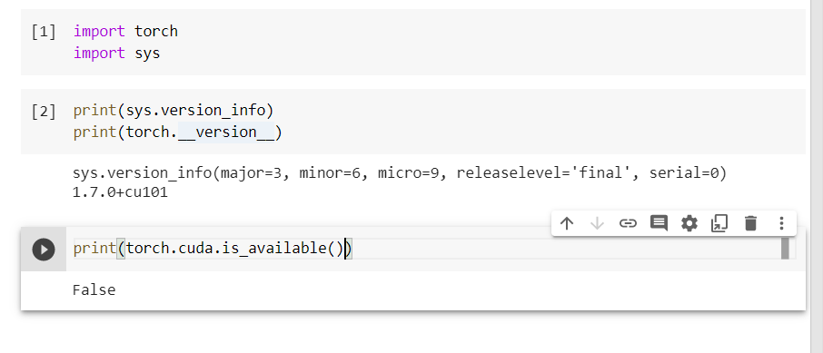

# Introduction to deep learning and Pytorch library

 Deep learning, on the other hand, deals with finding such representations automatically, from raw data, in order to successfully perform a task

 Pytorch has a lot of C++ and Cuda code

 Pytorch provides a torch.utils.data as Dataset, so that different types of data can be stored into a unified format.

 Since data storage is slow, we want to paralelize data loading, we need multiple processes to load our data, in order to assemble them into batches: tensors that encompass several samples. we use dataloader class

 loss function in torch.nn

 optimiser for updates torch.optim

 distributed computing through torch.nn.parallel.Distributed-DataParallel and torch.distributed

