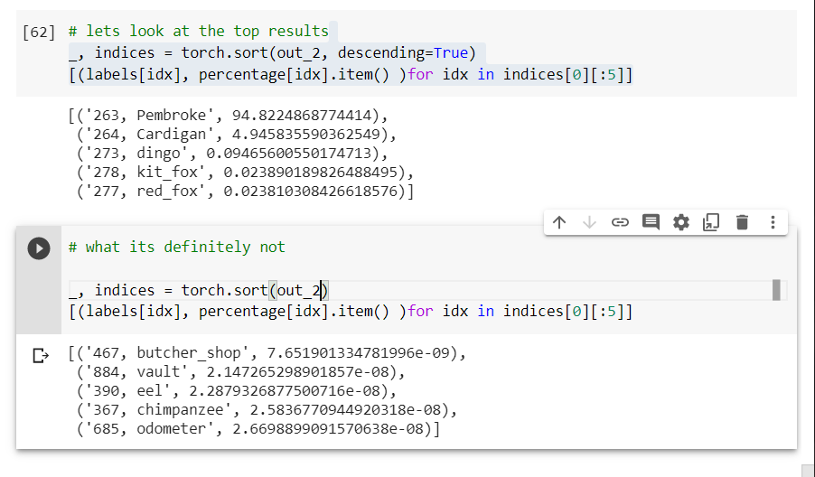
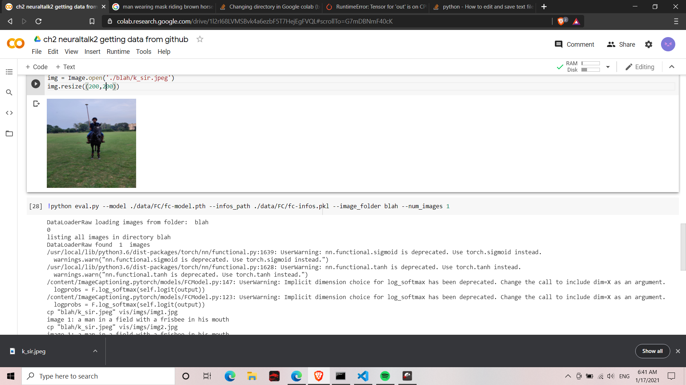

# pretrained networks

We run pretrained models here.

1. training image on imagenet

Classifying this doggo

The result of imagenet

2. GAN

The overarching aim is to fake an image close to original. 

https://colab.research.google.com/drive/1H2nqTAjUVGlBGqj1nItlarirUAO8SfBw#scrollTo=OBb8JTQFyWJ1

page 64

3. Image captioning using NeuralTalk2

Man with frisbee in his mouth, apparrently

This also tells us how to utilise jupyter notebooks for emulating github projects.

https://colab.research.google.com/drive/1l2rI68LVMSBvk4a6ezbF5T7HejEgFVQL

4. TorchHub a mechanism through which authors can publish a model on Github, with or without pretrained model from a thrid pparty as easy as loading a TorchVision model.

and then using a hubconfy file, if hubconf.py is there we can load it into the notebook.

"""python
import torch
from torch import hub

resnet18_model = hub.load('pytorch/vision:master', 'resnet18', pretrained =True)
"""

to look for repos you can use search them online:
`github.com hubconf.py`

