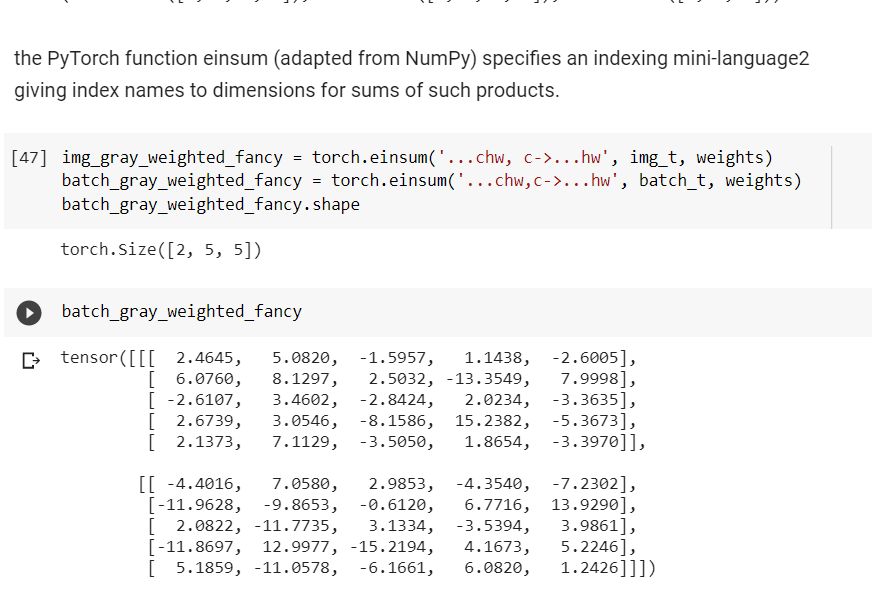
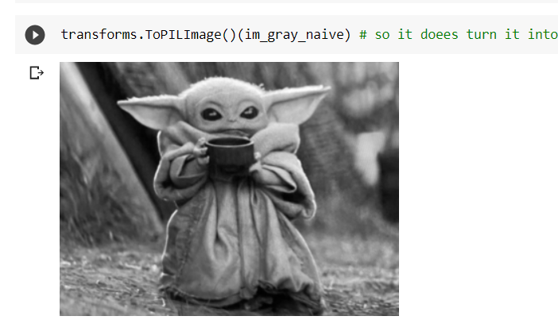
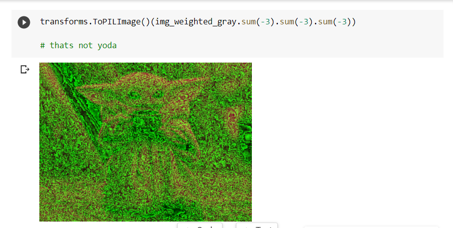
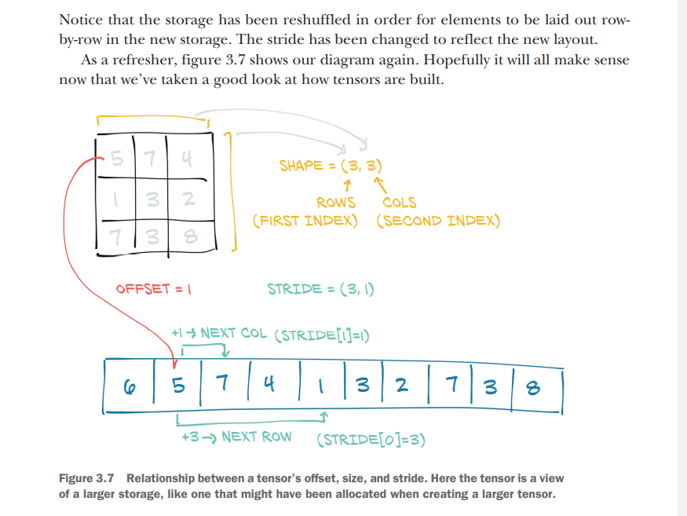
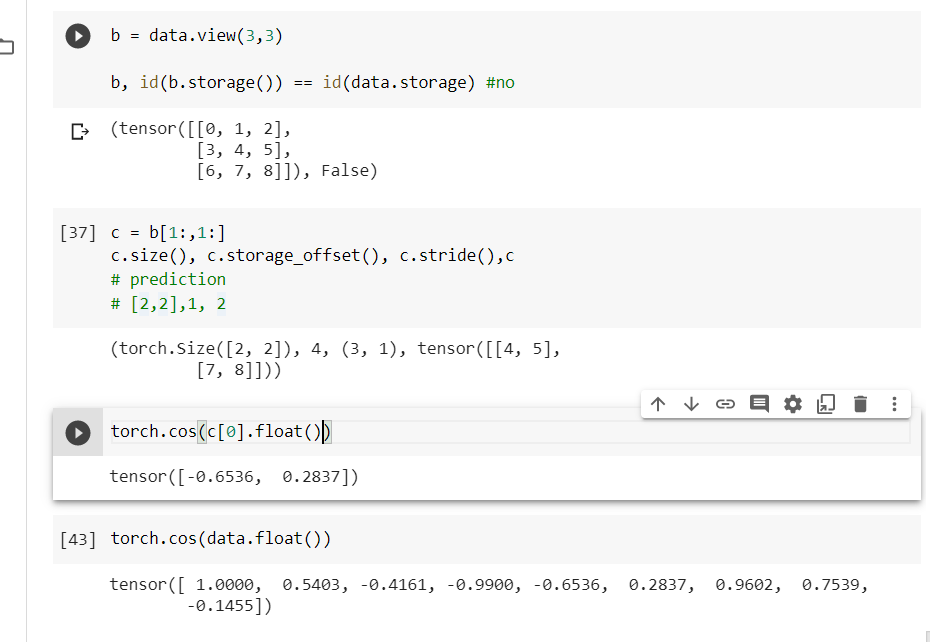

# It starts with a tensor

Multi dimensional array. But numpy was here first so interopeability. But pytorch tensors have gpu.

Pytjon lists are assinged individually while pytorch and numpy both are storedin conguous space.

### Tensor operations

https://colab.research.google.com/drive/1FPnkacQHYArsQ3lkVceuMhGibR_uBJ9M#scrollTo=cIkRpfC2Ml1J

Unsqueeze helps indent each individual element in a larger array

Einsum are fancy

page 78.

Trying to greyscale picture:

Trying too much:

Named Tensors
using names for dimensions

### Tensor element types

Why numbers are suboptimal in python.

Numbers in python are objects. While a floating point number may just need 32bits in python it needs full fledged object.

List in python are meant for sequential collection of objects. There are no concept of embedding

Python interpreter is slow compared to optimized, compiled code. 

`dtype` argumentto tensor constructors specifies the numerical data type that will be contained in the tensor

 torch.float32 or torch.float: 32-bit floating-point
 torch.float64 or torch.double: 64-bit, double-precision floating-point
 torch.float16 or torch.half: 16-bit, half-precision floating-point
 torch.int8: signed 8-bit integers
 torch.uint8: unsigned 8-bit integers
 torch.int16 or torch.short: signed 16-bit integers
 torch.int32 or torch.int: signed 32-bit integers
 torch.int64 or torch.long: signed 64-bit integers
 torch.bool: Boolean

default is 32 bit floating point

A `torch.tensor([2,2])` will create an integer tensor by defualt

Multuple tensors can index the same storage even if they index into the data differently.

Tensor dp indexing into the same storage even thoough they refer to different datatype

### shifting tensors on GPUS

using device attribute. accessing gpu:

points.cuda(), points.cuda(0), points_gpu.cpu()`

To look at various operations on a tensor:

