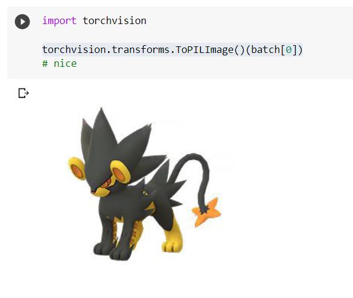
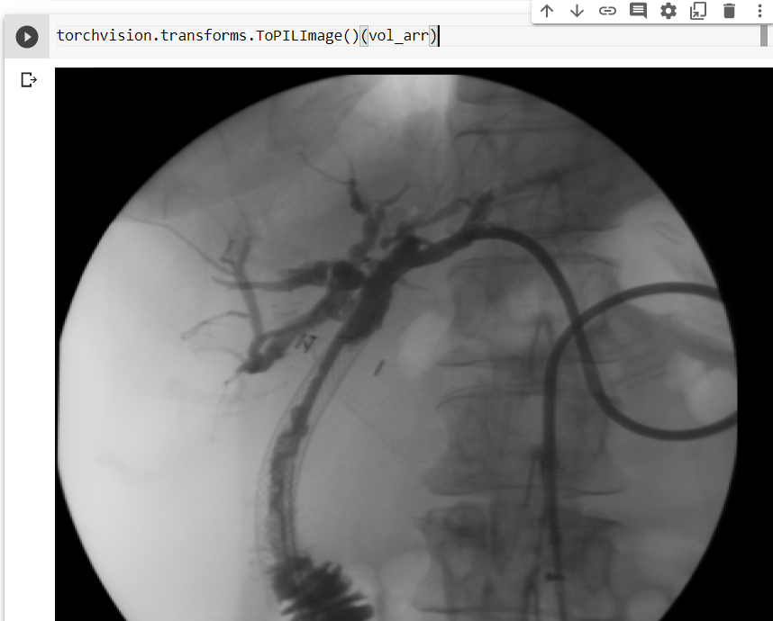
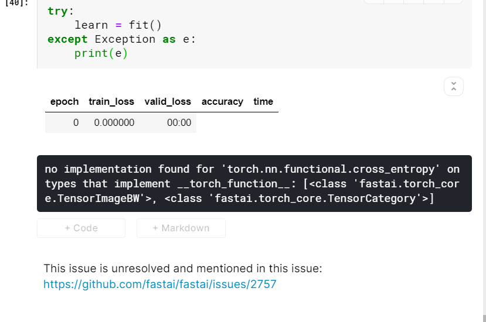
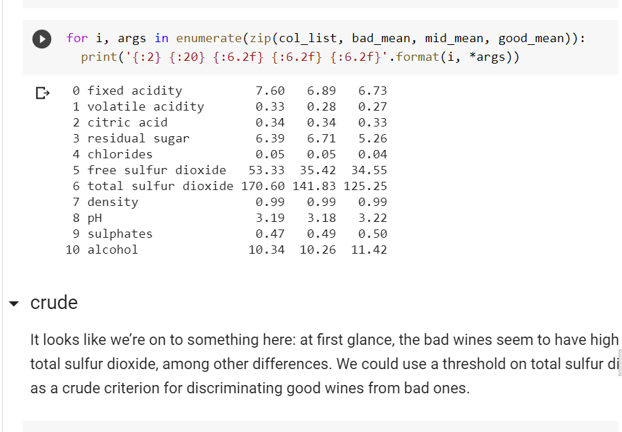
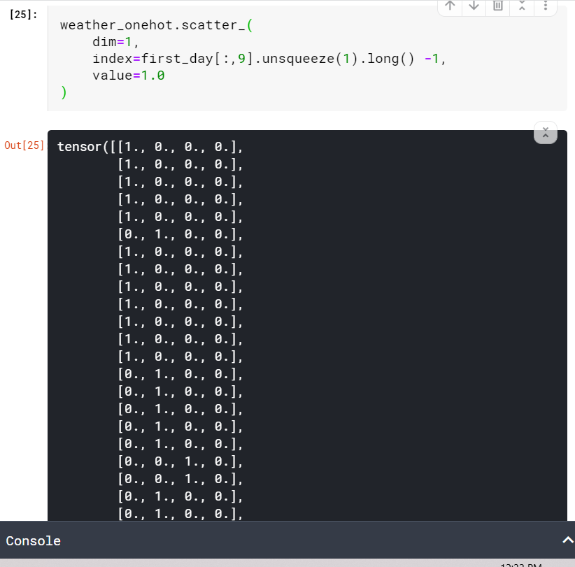

# Real World Data representation using tensors

Wroking with imageio. 

Getting image from a pytorch tensor

# Three kinds of values

1. Continous - continous values
2. ordinal -  numerical but still categorical
3. categorical- string categories

Reading different format images

Next objective : 
do mnist > done
then malware as image PE > 
microsoft challenge

Vision error during preprocessing:

chp_13: https://colab.research.google.com/github/fastai/fastbook/blob/master/13_convolutions.ipynb#scrollTo=caRLUjcYgHmp

trying again:

https://www.kaggle.com/fanbyprinciple/fastai-v4-mnist-again/

Resolvingscatter function it takes long tensors:

### Crude classifier for wine :

https://colab.research.google.com/drive/1NsBwWpz-R8-Aonx_S7T0RPwkW_Ym8BAI

### Using time series:

https://www.kaggle.com/fanbyprinciple/time-series-bikesusing-pytorch/

### Word processing :

https://www.kaggle.com/fanbyprinciple/pride-and-prejudice-text-encoding/
