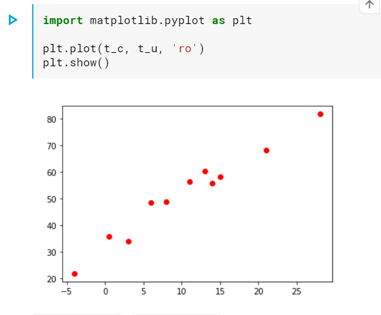
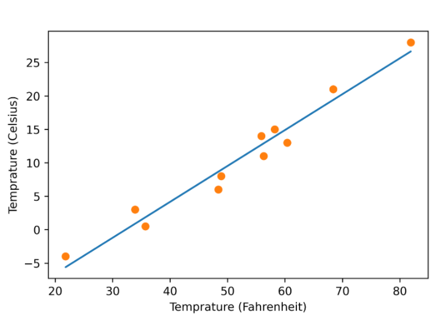
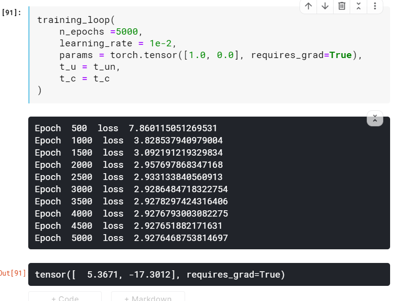
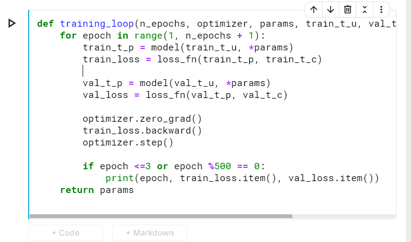

# The mechanics of Learning

## Timeless lessons in modelling

In this book, we’re interested in models that are not engineered for solving a specific narrow task, but that can be automatically adapted to specialize themselves for
any one of many similar tasks using input and output pairs—in other words, general
models trained on data relevant to the specific task at hand. 

## Learning is a parameter estimation

In order to optimize the parameter of the model—its weights—the change in
the error following a unit change in weights (that is, the gradient of the error with
respect to the parameters) is computed using the chain rule for the derivative of a
composite function (backward pass). The value of the weights is then updated in the
direction that leads to a decrease in the error. The procedure is repeated until the
error, evaluated on unseen data, falls below an acceptable level

## simple prediction model

After modelling :

## Pytorch autograd

we just saw a simple example of backpropagation: we computed the gradient of a composition of functions—the model and the loss—with
respect to their innermost parameters (w and b) by propagating derivatives backward
using the chain rule

## Computing gradient automatically

This is when PyTorch tensors come to the rescue, with a PyTorch component called
autograd

## optimisers ala carte

https://www.kaggle.com/fanbyprinciple/simplest-model-parameter-estimation/edit

## Excercises 

## Summary

 Linear models are the simplest reasonable model to use to fit data.
 Convex optimization techniques can be used for linear models, but they do not
generalize to neural networks, so we focus on stochastic gradient descent for
parameter estimation.
 Deep learning can be used for generic models that are not engineered for solving a specific task, but instead can be automatically adapted to specialize themselves on the problem at hand.
 Learning algorithms amount to optimizing parameters of models based on
observations. A loss function is a measure of the error in carrying out a task,
such as the error between predicted outputs and measured values. The goal is
to get the loss function as low as possible.
 The rate of change of the loss function with respect to the model parameters
can be used to update the same parameters in the direction of decreasing loss.
 The optim module in PyTorch provides a collection of ready-to-use optimizers
for updating parameters and minimizing loss functions.
 Optimizers use the autograd feature of PyTorch to compute the gradient for
each parameter, depending on how that parameter contributes to the final output. This allows users to rely on the dynamic computation graph during complex forward passes.
 Context managers like with torch.no_grad(): can be used to control autograd’s behavior.
 Data is often split into separate sets of training samples and validation samples.
This lets us evaluate a model on data it was not trained on.
 Overfitting a model happens when the model’s performance continues to
improve on the training set but degrades on the validation set. This is usually
due to the model not generalizing, and instead memorizing the desired outputs
for the training set