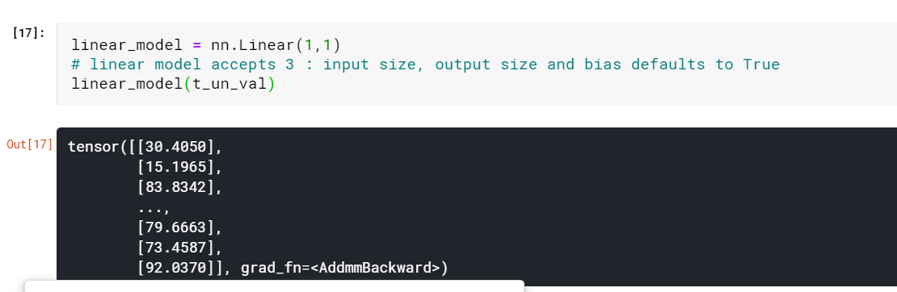

# Using a neural network to fit the data

## Artificial Neurons 

 Mathematically, we can write this out as o = f(w * x + b), with x as our input, w our
weight or scaling factor, and b as our bias or offset. f is our activation function, set to
the hyperbolic tangent, or tanh function here. In general, x and, hence, o can be simple scalars, or vector-valued (meaning holding many scalar values); 

## Composing a multilayer network

A multilayer neural network, is made up of a composition
of functions like those we just discussed
x_1 = f(w_0 * x + b_0)
x_2 = f(w_1 * x_1 + b_1)
...
y = f(w_n * x_n + b_n)
where the output of a layer of neurons is used as an input for the following layer.
Remember that w_0 here is a matrix, and x is a vector! Using a vector allows w_0 to
hold an entire layer of neurons, not just a single weight. 

## Understanding the error function

An important difference between our earlier linear model and what we’ll actually be
using for deep learning is the shape of the error function. Our linear model and
error-squared loss function had a convex error curve with a singular, clearly defined
minimum. If we were to use other methods, we could solve for the parameters minimizing the error function automatically and definitively. 

A big part of the reason neural networks have non-convex error surfaces is due to
the activation function. The ability of an ensemble of neurons to approximate a very
wide range of useful functions depends on the combination of the linear and nonlinear behavior inherent to each neuron. 

## All we need is activation

As we have seen, the simplest unit in (deep) neural networks is a linear operation
(scaling + offset) followed by an activation function. We already had our linear operation in our latest model—the linear operation was the entire model. The activation

function plays two important roles:
 In the inner parts of the model, it allows the output function to have different
slopes at different values—something a linear function by definition cannot do.
By trickily composing these differently sloped parts for many outputs, neural
networks can approximate arbitrary functions, as we will see in section 6.1.6.2
 At the last layer of the network, it has the role of concentrating the outputs of
the preceding linear operation into a given range

Remember that under the hood, it’s all sums of (w*x+b) matrix multiplications, and those won’t naturally limit themselves to a specific range of outputs.

### CAPPING THE OUTPUT RANGE

We want to firmly constrain the output of our linear operation to a specific range so
that the consumer of this output doesn’t have to handle numerical inputs of puppies
at 12/10, bears at –10, and garbage trucks at –1,000.
 One possibility is to just cap the output values: anything below 0 is set to 0, and anything above 10 is set to 10

### COMPRESSING THE OUTPUT RANGE

Another family of functions that work well is torch.nn.Sigmoid, which includes 1 /
(1 + e ** -x), torch.tanh, and others that we’ll see in a moment. These functions
have a curve that asymptotically approaches 0 or –1 as x goes to negative infinity,
approaches 1 as x increases, and have a mostly constant slope at x == 0. Conceptually,
functions shaped this way work well because there’s an area in the middle of our linear function’s output that our neuron (which, again, is just a linear function followed
by an activation) will be sensitive to, while everything else gets lumped next to the
boundary values. As we can see in figure 6.4, our garbage truck gets a score of –0.97,
while bears and foxes and wolves end up somewhere in the –0.3 to 0.3 range.

## More activation functions

There are quite a few activation functions,
ReLU is one of the best-performing general activation functions; many state-of-the-art results
have used it. The Sigmoid activation function, also known as the logistic function, was
widely used in early deep learning work but has since fallen out of common use
except where we explicitly want to move to the 0…1 range: for example, when the output should be a probability. Finally, the LeakyReLU function modifies the standard
ReLU to have a small positive slope, rather than being strictly zero for negative inputs
(typically this slope is 0.01, but it’s shown here with slope 0.1 for clarity)

## Choosing the best activation function

Activation functions are curious, because with such a wide variety of proven successful
ones, it’s clear that there are few, if any, strict
requirements. As such, we’re going to discuss some generalities about activation functions that can probably be trivially disproved in the specific. That said, by definition,

activation functions:
1. Are nonlinear. Repeated applications of (w*x+b) without an activation function
results in a function of the same (affine linear) form. The nonlinearity allows
the overall network to approximate more complex functions.

2. Are differentiable, so that gradients can be computed through them. Point discontinuities, as we can see in Hardtanh or ReLU, are fine.

Without these characteristics, the network either falls back to being a linear model or
becomes difficult to train.

The following are true for the functions:

1. They have at least one sensitive range, where nontrivial changes to the input
result in a corresponding nontrivial change to the output. This is needed for
training.

2. Many of them have an insensitive (or saturated) range, where changes to the
input result in little or no change to the output. It owuld consist of lower bound and an upper bound.

 Put together, all this results in a pretty powerful mechanism: we’re saying that in a
network built out of linear + activation units, when different inputs are presented to
the network, 

(a) different units will respond in different ranges for the same inputs,

(b) the errors associated with those inputs will primarily affect the neurons operating in the sensitive range, leaving other units more or less unaffected by the learning process.

In addition, thanks to the fact that derivatives of the activation with
respect to its inputs are often close to 1 in the sensitive range, estimating the parameters of the linear transformation through gradient descent for the units that operate
in that range will look a lot like the linear fit we have seen previously.

We are starting to get a deeper intuition for how joining many linear + activation
units in parallel and stacking them one after the other leads us to a mathematical
object that is capable of approximating complicated functions. Different combinations of units will respond to inputs in different ranges, and those parameters for
those units are relatively easy to optimize through gradient descent, since learning will
behave a lot like that of a linear function until the output saturates.

## What learning meansfor a neural network

Building models out of stacks of linear transformations followed by differentiable activations leads to models that can approximate highly nonlinear processes and whose
parameters we can estimate surprisingly well through gradient descent. This remains
true even when dealing with models with millions of parameters. What makes using
deep neural networks so attractive is that it saves us from worrying too much about the
exact function that represents our data—whether it is quadratic, piecewise polynomial, or something else. With a deep neural network model, we have a universal
approximator and a method to estimate its parameters. This approximator can be customized to our needs, in terms of model capacity and its ability to model complicated
input/output relationships, just by composing simple building blocks

Deep neural networks, on the other hand, are families of functions that have
the ability to approximate a wide range of input/output relationships without necessarily requiring us to come up with an explanatory model of a phenomenon.

 PyTorch has a whole submodule dedicated to neural networks, called torch.nn. It
contains the building blocks needed to create all sorts of neural network architectures. Those building blocks are called modules in PyTorch parlance (such building
blocks are often referred to as layers in other frameworks). A PyTorch module is a
Python class deriving from the nn.Module base class

## Python nn module

start with a simple linear module

https://www.kaggle.com/fanbyprinciple/c-to-f-with-pytorch-nn/edit

page 187

