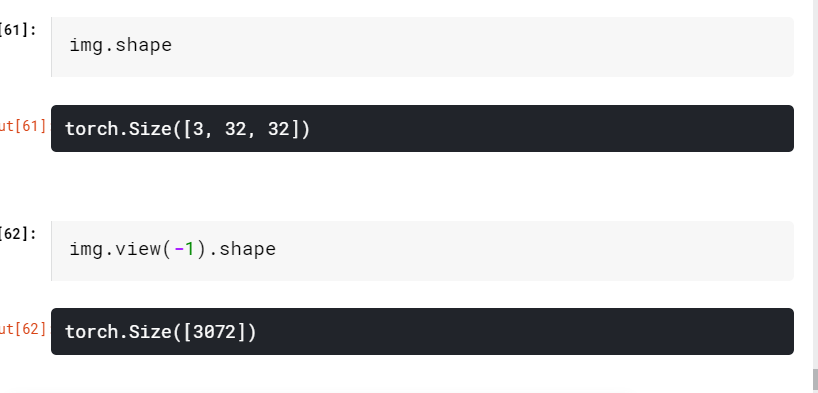
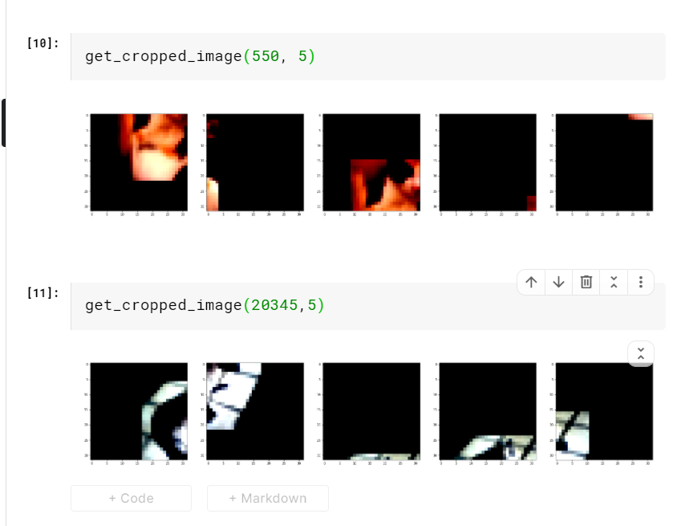
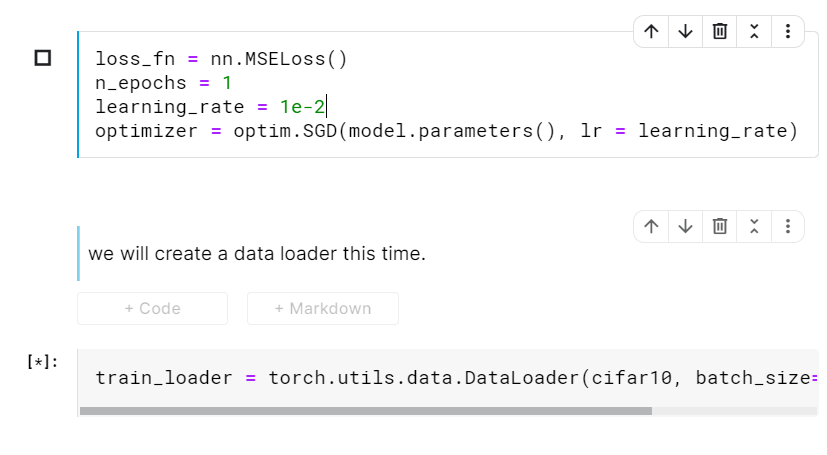

# Tellingbirds from airplanes : learning from images

page 209

https://www.kaggle.com/fanbyprinciple/cifar10-explanation-with-pytorch/edit

Working with cifar dataset

Using image.view function

## Conclusion

In this chapter, we have solved a simple classification problem from dataset, to model,
to minimizing an appropriate loss in a training loop. All of these things will be standard tools for your PyTorch toolbelt, and the skills needed to use them will be useful
throughout your PyTorch tenure.
 We’ve also found a severe shortcoming of our model: we have been treating 2D
images as 1D data. Also, we do not have a natural way to incorporate the translation
invariance of our problem. In the next chapter, you’ll learn how to exploit the 2D
nature of image data to get much better results.9
 We could use what we have learned right away to process data without this translation
invariance. For example, using it on tabular data or the time-series data we met in chapter 4, we can probably do great things already. To some extent, it would also be possible
to use it on text data that is appropriately represented.

PAge 221

Excercise:
https://www.kaggle.com/fanbyprinciple/cifar10-exploration-using-pytorch/edit

1. randomcrop:

2. Mseloss:

3. One way to reduce overfitting is:
creating a simplified model

