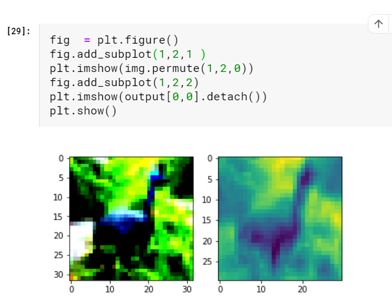
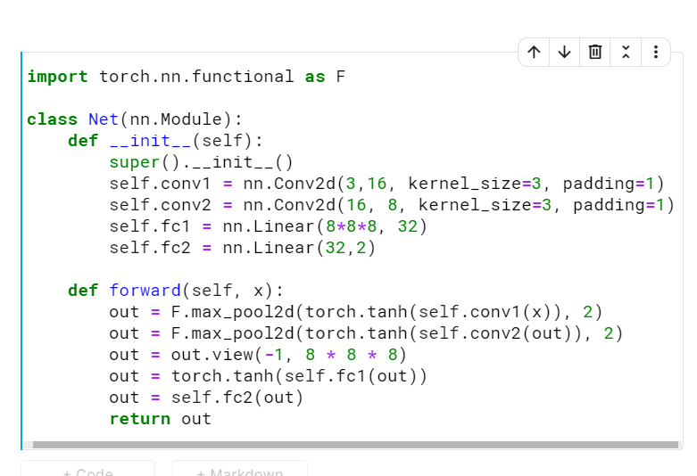
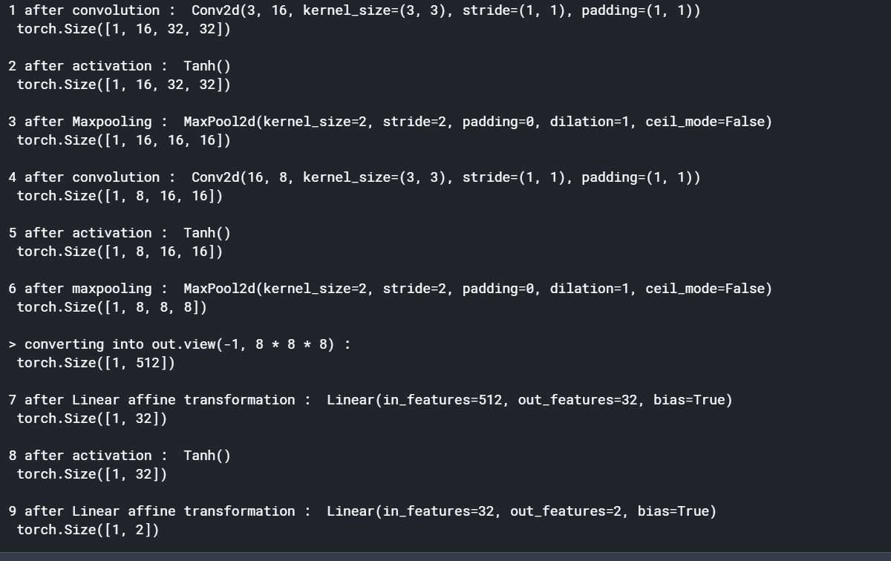
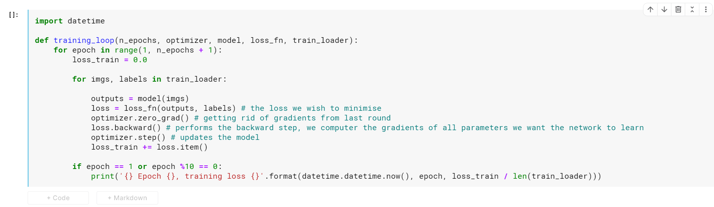
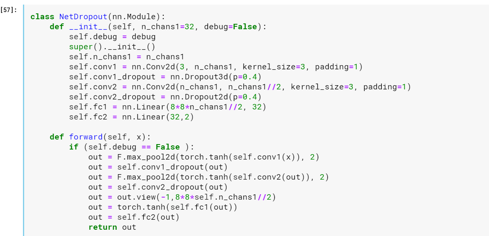
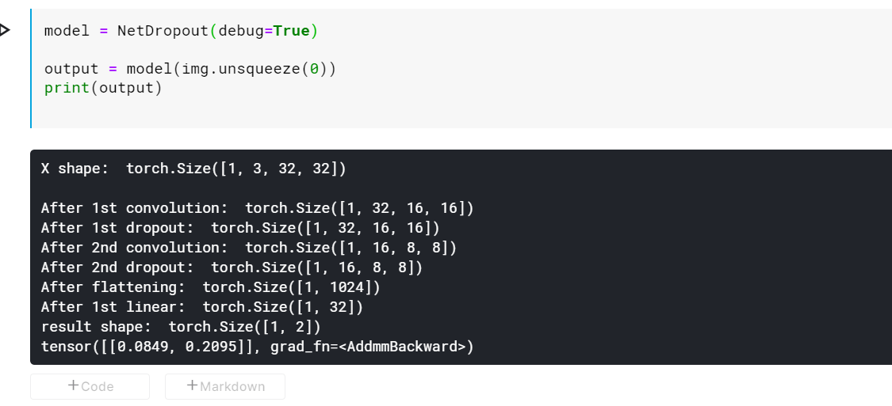

# Using convolutions to generalize

## Why and how concolutions

Previously we were taking a 1D view of our input image and multiplying it by an
n_output_features × n_input_features weight matrix, as is done in nn.Linear,
means for each channel in the image, computing a weighted sum of all the pixels multiplied by a set of weights, one per output feature.

We also said that, if we want to recognize patterns corresponding to objects, like an
airplane in the sky, we will likely need to look at how nearby pixels are arranged, and
we will be less interested in how pixels that are far from each other appear in combination. Essentially, it doesn’t matter if our image of a Spitfire has a tree or cloud or
kite in the corner or not.

m, we could compute the
weighted sum of a pixel with its immediate neighbors, rather than with all other pixels
in the image. This would be equivalent to building weight matrices, one per output
feature and output pixel location, in which all weights beyond a certain distance from
a center pixel are zero. This will still be a weighted sum: that is, a linear operation.

We identified one more desired property earlier: we would like these localized patterns
to have an effect on the output regardless of their location in the image: that is, to be
translation invariant

we would have to find a way to keep
entries in sync that correspond to the same relative position of input and output pixels.
This means we would need to initialize them to the same values and ensure that all these
tied weights stayed the same while the network is updated during training

Fortunately, there is a readily
available, local, translation-invariant linear operation on the image: a convolution

Convolution, or more precisely, discrete convolution1
 (there’s an analogous continuous version that we won’t go into here), is defined for a 2D image as the scalar product of a weight matrix, the kernel, with every neighborhood in the input. Consider a
3 × 3 kernel (in deep learning, we typically use small kernels; we’ll see why later on) as
a 2D tensor

It’s now possible to see the connection to what we were stating earlier: a convolution is
equivalent to having multiple linear operations whose weights are zero almost everywhere except around individual pixels and that receive equal updates during training.
 Summarizing, by switching to convolutions, we get
- Local operations on neighborhoods
- Translation invariance
- Models with a lot fewer parameters
The key insight underlying the third point is that, with a convolution layer, the number of parameters depends not on the number of pixels in the image, as was the case
in our fully connected model, but rather on the size of the convolution kernel (3 × 3,
5 × 5, and so on) and on how many convolution filters (or output channels) we decide
to use in our model

The torch.nn module provides convolutions for 1, 2, and 3 dimensions: nn.Conv1d for time series, nn.Conv2d for images,
and nn.Conv3d for volumes or videos

creating convolutions:

https://www.kaggle.com/fanbyprinciple/cifar10-with-simple-convolutions-in-pytorch/edit

page 230

Using Modules to build our own neural network

page 242

need to cut the jargon

done

The models layers intermediate shape:

page 246

Steps to train a model:

Using dropout

Dropout shape of mode

