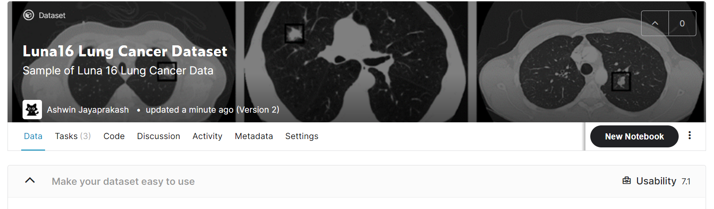

# Using pytorch to fight Cancer

1. Load our raw CT scan data into a form that we can use with PyTorch

2. Identify the voxels of potential tumoirs in the lungs using PyTorch to implement a technique called segmentation

3. Group interesting voxels into lumps

4. Classify candidate nodules as actual nodules or non-nodules using 3D convolution

5. Diagnose the patient using the combined per nodule classification

### Nodule

bumps and lumps in a chest. May or maynot be malignant. 

### Dataset

Uploaded my own first ever dataset to kaggle

https://www.kaggle.com/fanbyprinciple/luna-lung-cancer-dataset

