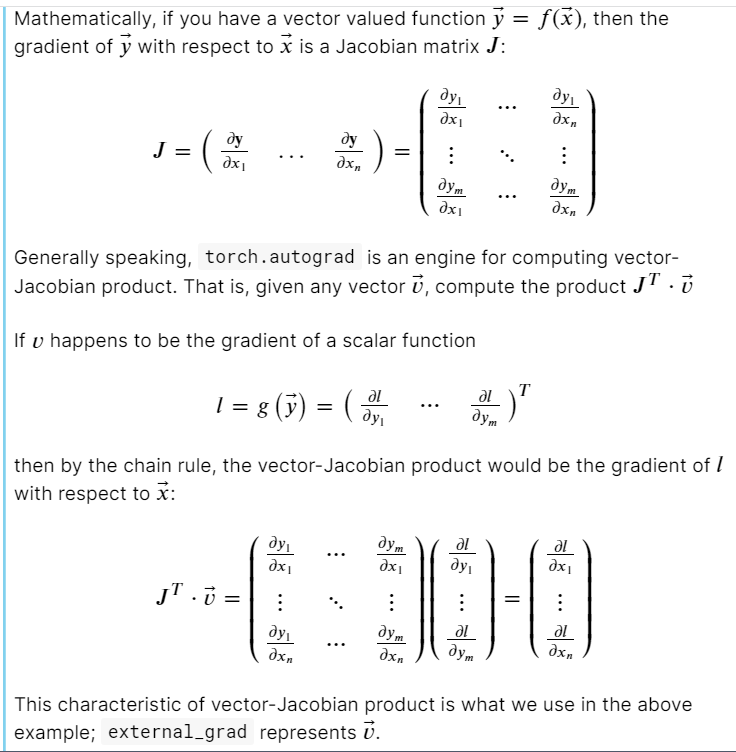

# Deep Learning with Python
end of part 1, we’ll be ready to tackle a 

Chapter 1 introduces PyTorch as a library and its place in the deep learning revolution, and touches on what sets PyTorch apart from other deep learning frameworks.

Chapter 2 shows PyTorch in action by running examples of pretrained networks; it
demonstrates how to download and run models in PyTorch Hub.
 
Chapter 3 introduces the basic building block of PyTorch—the tensor—showing
its API and going behind the scenes with some implementation details.
 
Chapter 4 demonstrates how different kinds of data can be represented as tensors
and how deep learning models expects tensors to be shaped.
 
Chapter 5 walks through the mechanics of learning through gradient descent and
how PyTorch enables it with automatic differentiation.
 
Chapter 6 shows the process of building and training a neural network for regression in PyTorch using the nn and optim modules.
 
Chapter 7 builds on the previous 
Chapter to create a fully connected model for
image classification and expand the knowledge of the PyTorch API.
 
Chapter 8 introduces convolutional neural networks and touches on more advanced
concepts for building neural network models and their PyTorch implementation.
 
Chapter 9 describes the end-to-end strategy we’ll use for lung tumor classification,
starting from computed tomography (CT) imaging.
 
Chapter 10 loads the human annotation data along with the images from CT scans
and converts the relevant information into tensors, using standard PyTorch APIs.
 
Chapter 11 introduces a first classification model that consumes the training data
introduced in 
Chapter 10. We train the model and collect basic performance metrics.
We also introduce using TensorBoard to monitor training.
 
Chapter 12 explores and implements standard performance metrics and uses
those metrics to identify weaknesses in the training done previously. We then mitigate
those flaws with an improved training set that uses data balancing and augmentation.
 
Chapter 13 describes segmentation, a pixel-to-pixel model architecture that we use
to produce a heatmap of possible nodule locations that covers the entire CT scan.
This heatmap can be used to find nodules on CT scans for which we do not have
human-annotated data.
 
Chapter 14 implements the final end-to-end project: diagnosis of cancer patients
using our new segmentation model followed by classification.

Extra 

1. Pytorch 60min blitz official tutorial

https://www.kaggle.com/fanbyprinciple/pytorch-blitz-tutorial/

