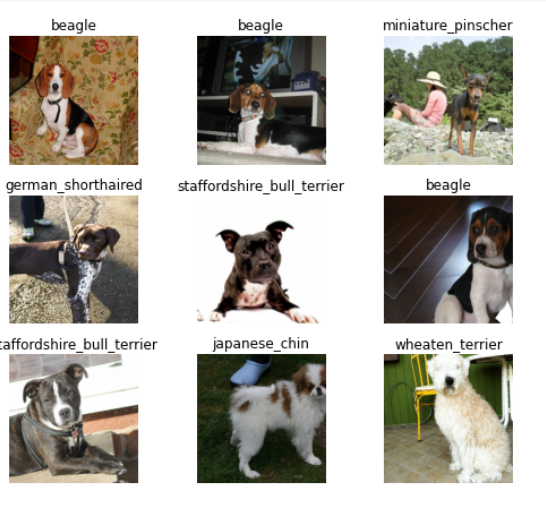
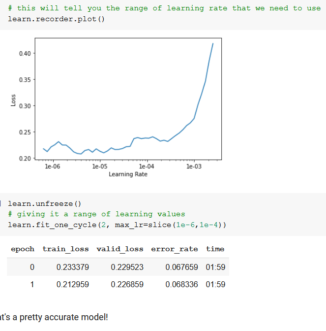
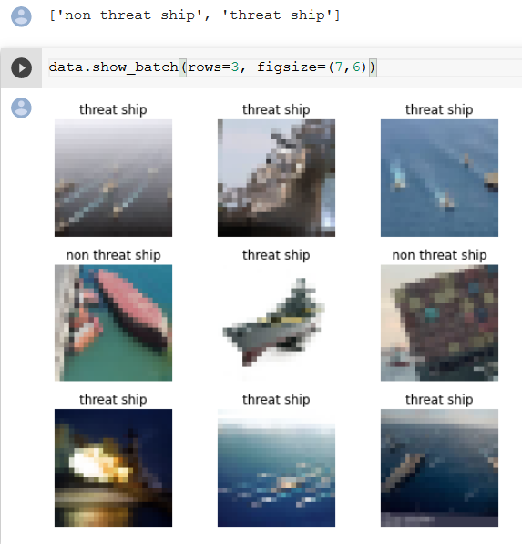
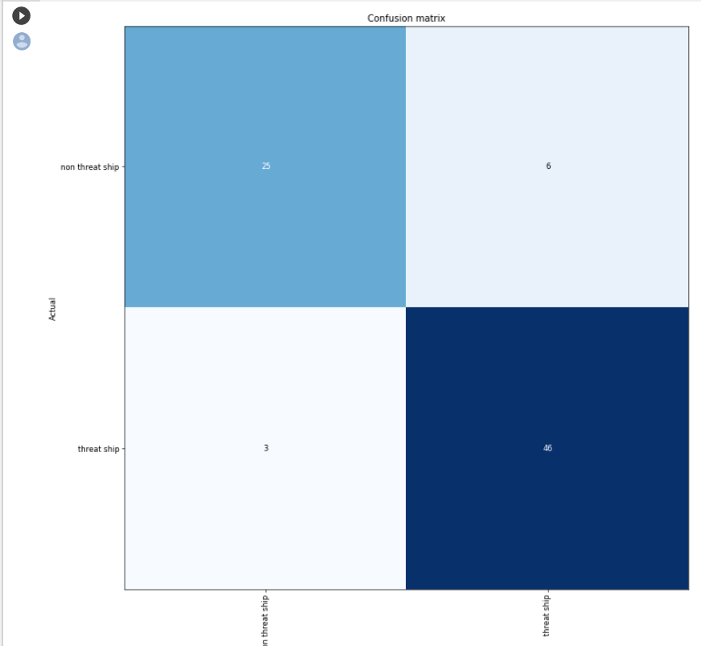
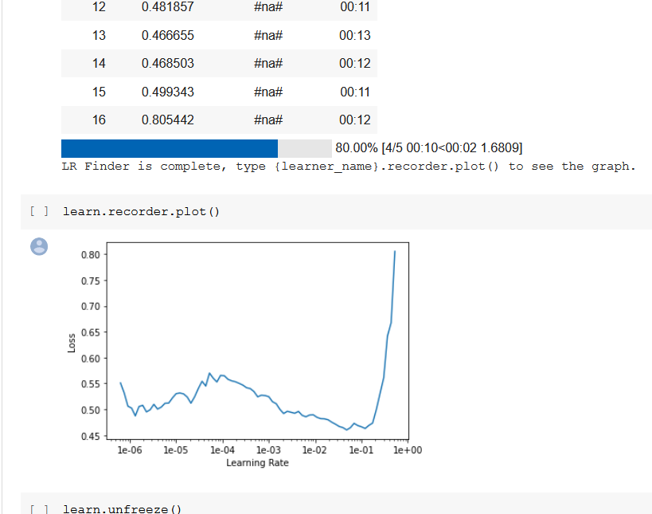
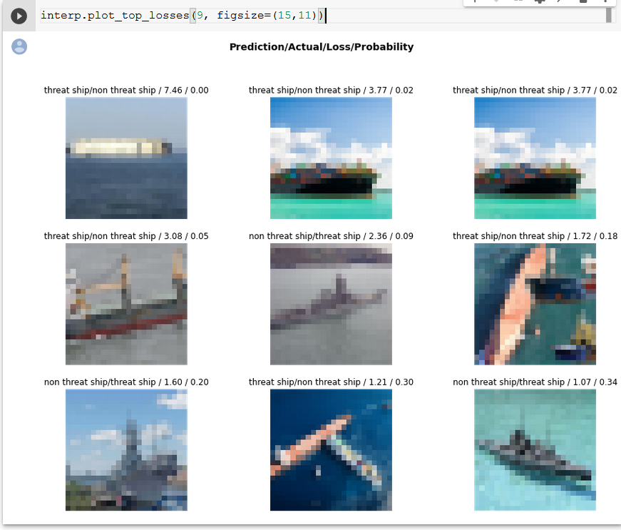

Starts with introduction to course.
Fine grain classification: classification between various categories.

First neural network was created in 1943

On the dataset :

The reson why we cant have different images is because we want the gpu to apply the exact same instruction on all shapes and sizes.Typically its a square.

ImageDataBunch returns an ImageDataBunch object whcih contains validation , test and training data

The dataset need to be of the same size so we use data.normlaise. Normalise means normaliseing according to pixel value.

The wys in which we can extract data form the image samples

1. using the folder name
2. using an excel sheet or csv format
3. using regex of the on the image path all three are demonstrated in the fast ai

TODO exercises suggested
1. create your own dataset and apply the first notebook to create a custom classifier

I created a warship classification for threat and non threat ships.

2. look through splunnk with tensorflow article

It was about creating user behavior patterns through profiling by mouse clicks

3. Can you run resnet 50 dataset on colab 

Didn't try yet.

4. Submitted Dogs vs cat kernel redux competition at practice folder.