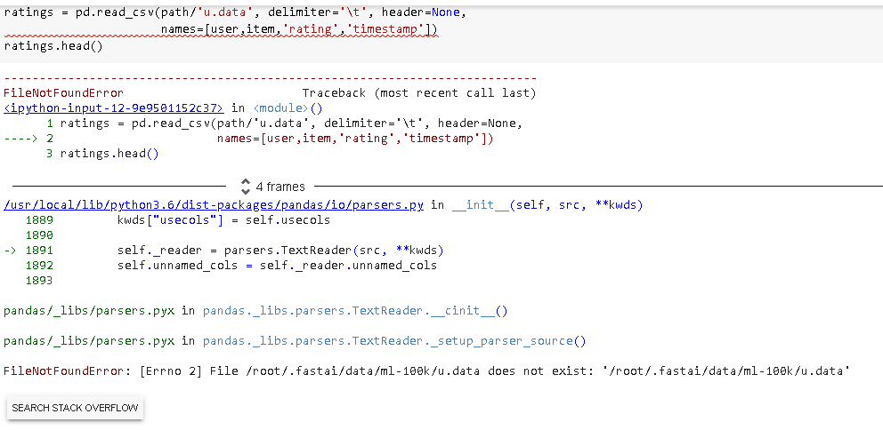

# NLP Tabular data collaborative filtering and embeddings

Language model is used to predict the next word ina sentence

Good datsets:
Wikitext 103 > model for transfer learning
IMDb

### Tabular data

Using neural nets for tabular data

Tabular data seems easy enough to understand and has lots of potential.

### Collaborative filtering
for collaborative filtering we are using a dataset called movielens

Coldstart problem : lack of data 

# Homework

1. GO through the lesson 4 notes : https://github.com/hiromis/notes/blob/master/Lesson4.md
2. Lesson 3 homework
3. Try somthing with nlp