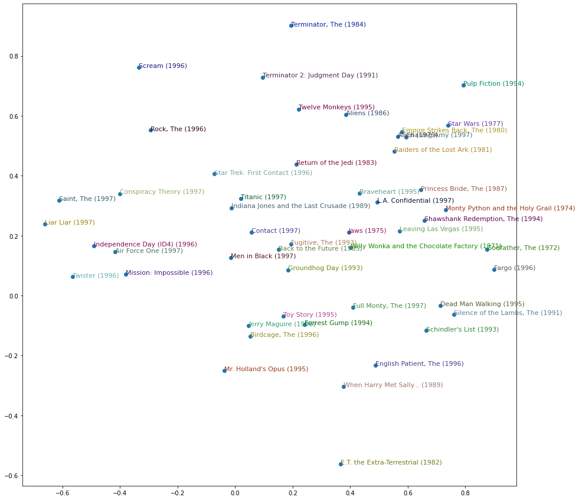
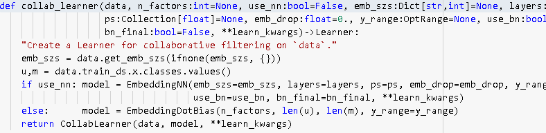
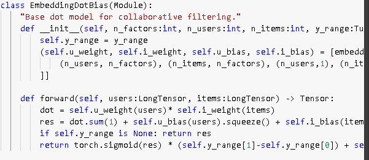
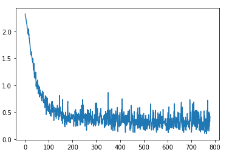
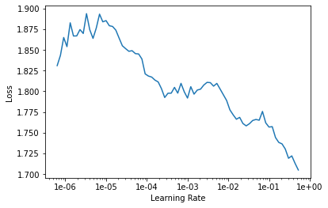

# Foundations of neural networks
https://www.youtube.com/watch?v=CJKnDu2dxOE&vl=en

1 hour 28 min

https://github.com/hiromis/notes/blob/master/Lesson5.md

There are two kinfs of layers

1. Parameter + weights layer
2. activations layer
its an element wise function like relu

Followed by gradient descent - this is true in back propagation

## Fine tuning

In imagenet the target vetor is 1000. 
So what we do in fine tuning is unfreeze the pretrained layers and use discriminative learning rates for handling the pretrained and our own data.

when we say slice(1e-3) it means that top layers get lr of 1e-3 and other layer get the lr /3

Affine function is something very close to deep learning

### Embedding

multiplying by a one hot encoded matrix is identical to doing an array lookup. Therefore we should always do the array lookup version, and therefore we have a specific way of saying I want to do a matrix multiplication by a one hot encoded matrix without ever actually creating it. I'm just instead going to pass in a bunch of integers and pretend they're one not encoded. And that is called an embedding.

 embedding means look something up in an array. But it's interesting to know that looking something up in an array is mathematically identical to doing a matrix product by a one hot encoded matrix. And therefore, an embedding fits very nicely in our standard model of our neural networks work.

Now suddenly it's as if we have another whole kind of layer. It's a kind of layer where we get to look things up in an array. But we actually didn't do anything special. We just added this computational shortcut - this thing called an embedding which is simply a fast memory efficient way of multiplying by hot encoded matrix.

So this is really important. Because when you hear people say embedding, you need to replace it in your head with "an array lookup" which we know is mathematically identical to matrix multiply by a one hot encoded matrix.

### latent features
 the only way that this gradient descent could possibly come up with a good answer is if it figures out what the aspects of movie taste are and the corresponding features of movies are. So those underlying kind of features that appear that are called latent factors or latent features. 

### bias
Neural network can work without bias however they are not as efficient
 it's better because it's giving both more flexibility and it also just makes sense semantically that you need to be able to say whether I'd like the movie is not just about the combination of what actors it has, whether it's dialogue-driven, and how much action is in it but just is it a good movie or am i somebody who rates movies highly.

 the first argument to fit_one_cycle or fit is number of epochs. In other words, an epoch is looking at every input once. If you do 10 epochs, you're looking at every input ten times.

## Colab notebook discussion

movie weight mapping:

In pytorch all classes are essentially functions

when you call a class it actually calls the forward method of the class defined inside the class

The details of the movie lens data set is int he collab notebook in lesson 4

## Collab learner 

Here is the collab_learner function. The collab learner function as per usual takes a data bunch. And normally learners also take something where you ask for particular architectural details. In this case, there's only one thing which does that which is basically do you want to use a multi-layer neural net or do you want to use a classic collaborative filtering

Well basically we create an EmbeddingDotBias model, and then we pass back a learner which has our data and that model. So obviously all the interesting stuff is happening here in EmbeddingDotBias, so let's take a look at that.

 It is a nn.Module, so in PyTorch, to remind you, all PyTorch layers and models arenn.Module's. They are things that, once you create them, look exactly like a function. You call them with parentheses and you pass them arguments. But they're not functions. They don't even have __call__. Normally in Python, to make something look like a function, you have to give it a method called dunder call. Remember that means __call__, which doesn't exist here. The reason is that PyTorch actually expects you to have something called forward and that's what PyTorch will call for you when you call it like a function.

 When I read the forward in a PyTorch module, I tend to ignore in my head the fact that there's a mini batch. And I pretend there's just one. Because PyTorch automatically handles all of the stuff about doing it to everything in the mini batch for you. So let's pretend there's just one user. So grab that user and what is this self.u_weight? self.u_weight is an embedding. We create an embedding for each of users by factors, items by factors, users by one, items by one. That makes sense, right? So users by one is the user's bias. Then users by factors is feature/embedding. So users by factors is the first tuple, so that's going to go in u_weight and (n_users,1) is the third, so that's going to go in u_bias.

 nn.Module, it calls dunder init. So this is where we have to create our weight matrices. We don't normally create the actual weight matrix tensors. We normally use PyTorch's convenience functions to do that for us, and we're going to see some of that after the break. For now, just recognize that this function is going to create an embedding matrix for us. It's going to be a PyTorch nn.Module as well, so therefore to actually pass stuff into that embedding matrix and get activations out, you treat it as if it was a function - stick it in parentheses. So if you want to look in the PyTorch source code and find nn.Embedding, you will find there's something called .forward in there which will do this array lookup for us.

### weight decay
It is the regularisation

### subclassing
When you define a new class using an existing class

### kwargs
Concept of **kwargs in Python which is basically parameters that are going to get passed up the chain to the next thing that we call. So basically all of the learners will call eventually this constructor

### Adam optimiser

Adam uses something like momentum. 1/10 is the derivative and 9/10 is the momentum in the same direction.Adam is an imporvement on rmsprop.

You need learning rate annealing with adam

### cross entropy loss

predicting the wrong thing confidently should have a lot of loss than wrong thing without confidence

it kind of a lookup for the log of the activation of the correcct answer.

### softmax activation
 activation so that all the prediction again activations add upto 1

 It is just activation / sum of all the activation

multiplw label models you need crossentropy as your loss
 and softmax as your activation

 In pytorch it actually does the softmax activation after cross_entropy loss

If the loss is negative then we need to call cross entropy function ourselves.

# home work

1. Try embedding model in movie lens latest dataset
 Done:
 

2. lesson 2 sgd add momentum

3. do lesson 2 Mnist sgd

4. Look at the tabular notebook