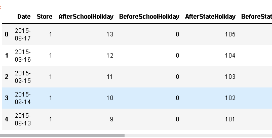
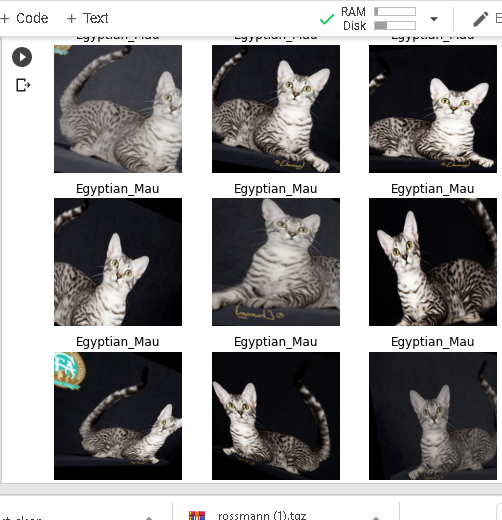

# Computer vision deep dive

check out the website: platform.ai

After looking at tabular dataset we can actually tackle the Rossman store sakes dataset at kaggle.

Video : https://www.youtube.com/watch?v=hkBa9pU-H48
notes : https://github.com/hiromis/notes/blob/master/Lesson6.md

## Lesson6 rossemann notebook

In competition, It uses Root mean squared percent error

`add_datepart` adds extra columns in the data based on the date column

Transforms are bits of code that run every time something is grabbed from a data set 

 Preprocesses are like transforms, but they're a little bit different which is that they run once before you do any training. Really importantly, they run once on the training set and then any kind of state or metadata that's created is then shared with the validation and test set.

Categorify does basically the same thing that .classes thing for image recognition does for a dependent variable. 

Fillmissing This will create, for anything that has a missing value, it'll create an additional column with the column name underscore na (e.g. CompetitionDistance_na) and it will set it for true for any time that was missing

And normalize

You don't have to manually call preprocesses yourself. When you call any kind of item list creator, you can pass in a list of pre processes

Categorical vs continuos variables
 categorical variables are not just strings and things, but also I include things like day of week and month and day of month. Even though they're numbers, I make them categorical variables. Because, for example, day of month, I don't think it's going to have a nice smooth curve. I think that the fifteenth of the month and the first of the month and the 30th of the month are probably going to have different purchasing behavior to other days of the month. Therefore, if I make it a categorical variable, it's going to end up creating an embedding matrix and those different days of the month can get different behaviors.

 if in doubt and there are not too many levels in your category (that's called the cardinality), if your cardinality is not too high, I would put it as a categorical variable. 

 label class (label_cls=FloatList). This is our dependent variable (df[dep_var].head() above), and as you can see, this is sales. It's not a float. It's int64. If this was a float, then fast.ai would automatically guess that you want to do a regression. But this is not a float, it's an int. So fast.ai is going to assume you want to do a classification. So when we label it, we have to tell it that the class of the labels we want is a list of floats, not a list of categories (which would otherwise be the default). So this is the thing that's going to automatically turn this into a regression problem for us. Then we create a data bunch.

 doc(floatlist ) will give you more information

 Dropout ar 30:02

## Lesson6 pets revisted notebook

1. The notebook showcases various transforms

2. We can use the notebook features for heatmap generation

https://setosa.io/ev/image-kernels/

hook : They came from something called a hook. A hook is a really cool, more advanced PyTorch feature that lets you (as the name suggests) hook into the PyTorch machinery itself, and run any arbitrary Python code you want to. 

Average pooling converts a 11 by 11 by 512 to 512 by 1 vector.

# HOmework 
1. creating a minibatch without using data.ine_item
2. change the convolutional map network
3. do rosemann dataset
