Most of them are sourced from Aladdin Perrsons fantastic youtube channel!

# pytorch images captcha 
-------
https://www.kaggle.com/fanbyprinciple/pytorch-captcha/edit?rvi=1

# Using style transfer
-------
https://www.kaggle.com/fanbyprinciple/style-transfer-using-pytorch/edit

### at low epochs :
-------

### After 200 epochs :
-------

# Variational autoencoder
-------
https://www.kaggle.com/fanbyprinciple/creating-variational-autoencoders-in-pytorch/edit

taken from : https://www.youtube.com/watch?v=zp8clK9yCro

# Creating a chat application
-------
https://www.kaggle.com/fanbyprinciple/creating-a-chatbot-with-pytorch/

# Name predictor
-------
### Official tutorial:
-------

# Resnet from paper
-------
https://www.kaggle.com/fanbyprinciple/implementing-resnet-from-paper-in-pytorch/edit

# Yolo
-------
https://www.kaggle.com/fanbyprinciple/model-review-understanding-yolo-v3-with-pascal/edit

from youtube : https://www.youtube.com/watch?v=Grir6TZbc1M

# Learning Pytorch
-------
## creating a simple neural network
-------

Somehow this model seems biased towards number 7.

https://www.kaggle.com/fanbyprinciple/learning-pytorch-1-creating-a-simple-network/edit

## creating a Convolutional neural network
-------

I wonder why x expects a float while y should be long

https://www.kaggle.com/fanbyprinciple/learning-pytorch-2-creating-a-cnn/edit

I am also getting very low accuracy here.

The reason was a programmatical error while checking accuracy

## creating an RNN and GRU and LSTM
-------
created the basis

https://www.kaggle.com/fanbyprinciple/learning-pytorch-3-coding-an-rnn-gru-lstm/edit

implementing LSTM and GRU

## Implementing RNN iwth time series data
-------
https://www.youtube.com/watch?v=AvKSPZ7oyVg

https://www.kaggle.com/fanbyprinciple/learning-pytorch-4-time-sequence-with-lstm/edit

https://colab.research.google.com/drive/1vy9iY5q8EbgVjgatJic-azSpMHrc6Qz5#scrollTo=Y7rt93ysFOaB

## Implementing a bidirectional LSTM
-------
https://www.kaggle.com/fanbyprinciple/learning-pytorch-5-creating-a-bidirectional-lstm/edit

video:
https://www.youtube.com/watch?v=jGst43P-TJA&list=PLhhyoLH6IjfxeoooqP9rhU3HJIAVAJ3Vz&index=6

### saving model
-------

## Transfer learning
-------
https://www.youtube.com/watch?v=qaDe0qQZ5AQ&list=PLhhyoLH6IjfxeoooqP9rhU3HJIAVAJ3Vz&index=8

https://www.kaggle.com/fanbyprinciple/learning-pytorch-6-transfer-learning/edit

The thing to note here was when I used VGG with mnist, its images were too small. But this is a nice method to change the default models.

## Loading a dataset
-------https://www.youtube.com/watch?v=ZoZHd0Zm3RY&list=PLhhyoLH6IjfxeoooqP9rhU3HJIAVAJ3Vz&index=9

Its is showing an error right now.

https://www.kaggle.com/fanbyprinciple/learning-pytorch-7-custom-dataset/edit

After much code changing , it works!

## Loading a Text dataset
-------
https://www.youtube.com/watch?v=9sHcLvVXsns&list=PLhhyoLH6IjfxeoooqP9rhU3HJIAVAJ3Vz&index=10

getting the error

1. bad caption numbers
2. cannot display proper images - handled.

check code here :
https://github.com/aladdinpersson/Machine-Learning-Collection/blob/master/ML/Pytorch/Basics/custom_dataset_txt/loader_customtext.py

https://www.kaggle.com/fanbyprinciple/learning-pytorch-8-working-with-text-dataset/edit

## Augmenting dataset using torchvision
-------
https://www.youtube.com/watch?v=Zvd276j9sZ8&list=PLhhyoLH6IjfxeoooqP9rhU3HJIAVAJ3Vz&index=11

Image dataset loaded

https://www.kaggle.com/fanbyprinciple/learning-pytorch-9-data-augmentation-torchvision/edit

## Albumentations tutorial
-------
https://www.youtube.com/watch?v=rAdLwKJBvPM&list=PLhhyoLH6IjfxeoooqP9rhU3HJIAVAJ3Vz&index=12

https://www.kaggle.com/fanbyprinciple/learning-pytorch-10-albumentations-dataloader/edit

## Dealing with database imbalances
-------
Not quite up there:

https://github.com/aladdinpersson/Machine-Learning-Collection/blob/master/ML/Pytorch/Basics/Imbalanced_classes/main.py

https://www.kaggle.com/fanbyprinciple/learning-pytorch-11-dealing-with-data-imbalances/edit

It actually created too much compensation.

## Tips and tricks of training
-------
https://www.youtube.com/watch?v=O2wJ3tkc-TU&list=PLhhyoLH6IjfxeoooqP9rhU3HJIAVAJ3Vz&index=14

1. Overfit the batch first

>TO check wether the code is working or not

>use `next.iter(train_dataloader)` to extract a single batch and thentrain for 1000 at batch size 1, to check if loss is actually going down.

2. while checking use model.eval() and model.train()

>This removes stuff like batchnorma nd dropouts which is not required while doing inference

3. Dont forget to zero_grad() the optimizer

>Because you want ot delete the accumaulated gardients of previous batch

4. dont use softmax with crossentropy loss

>cross entropy loss in iteslef is two things its softmax followed by log liklihood

5. set bias =false with batchnorm

>gives equivalent performance

6. dont confuse view with permute

>they are not the same bro

7. Dont use wrong transformation for your dataset

>dont transpose.RandomHorizontalFlip(p=1.0) with MNIST because that is going to change the digit entirely

8. always put shuffle=true while making your dataloader

>except for in time based data like time series

9. NOrmalize the data

>with transform.Nomalize(mean=(), std=())

10. in LSTM, GRU and RNN use torch.nn.utils.clip_grad_norm(model.parameters(), max_norm=1)

>Because Alddin Perrson said so.

# LeNet implementation
-------
https://www.kaggle.com/fanbyprinciple/implementing-lenet-for-digit-recognizer

Trying to implement the following architecture:

ref: https://www.youtube.com/watch?v=fcOW-Zyb5Bo&list=PLhhyoLH6IjfxeoooqP9rhU3HJIAVAJ3Vz&index=16

Completed the implementation!

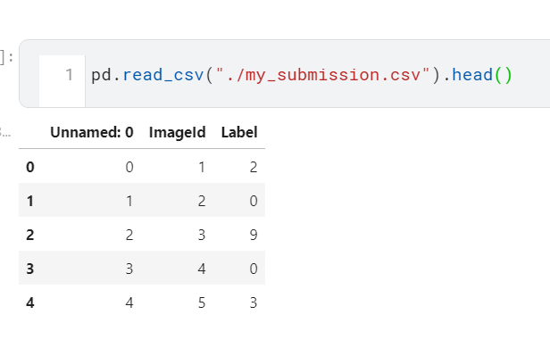

# VGG implementation
-------
ref: https://www.youtube.com/watch?v=ACmuBbuXn20&list=PLhhyoLH6IjfxeoooqP9rhU3HJIAVAJ3Vz&index=17

error with the dataset:

notebook : https://www.kaggle.com/fanbyprinciple/pytorch-yoga-pose-detection-using-vgg-from-scratch/edit

Implementing the vgg 16 architecture

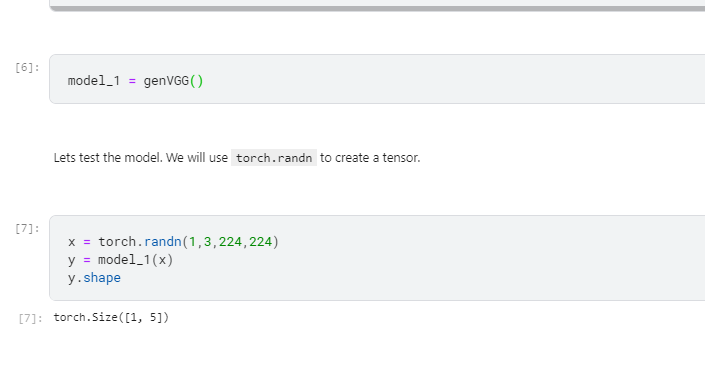

Error while makeing vgg from scratch, kaggle kernel cannot handle it.

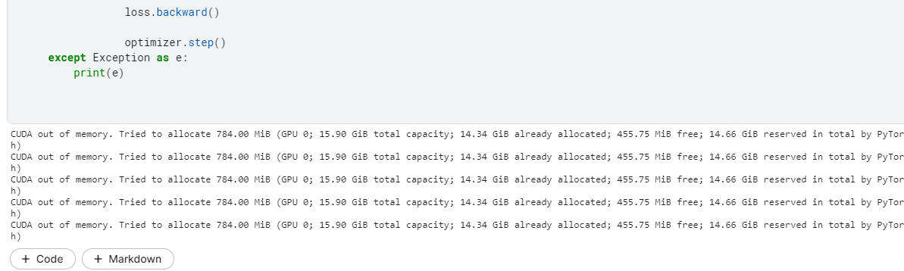

Creating the pretrained VGG model

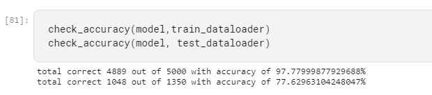

# GoogleNet/ InceptionNet
-------
https://www.kaggle.com/fanbyprinciple/pytorch-using-googlenet-to-see-flowers/edit

compiling model:

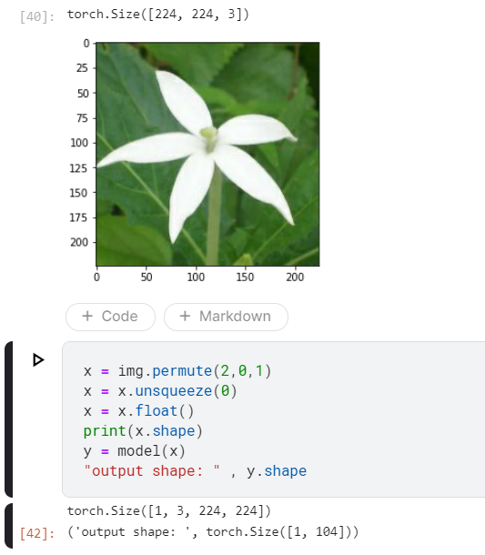

I realised that the size of images is important in the model implementation as the size of the image before the final linear layer matters,
This however can be changed.

Need to workon implementing the entire dataset.

On the entire dataset

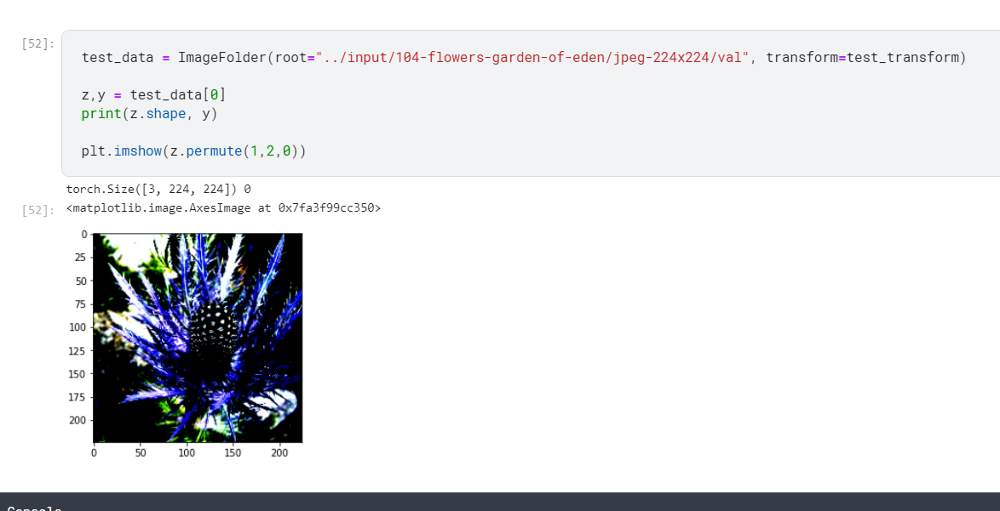

# Efficientnet
-------
Didnot understand

# Image captioning tutorial
-------
https://www.kaggle.com/fanbyprinciple/pytorch-image-captioning-with-flickr/edit/run/65215062

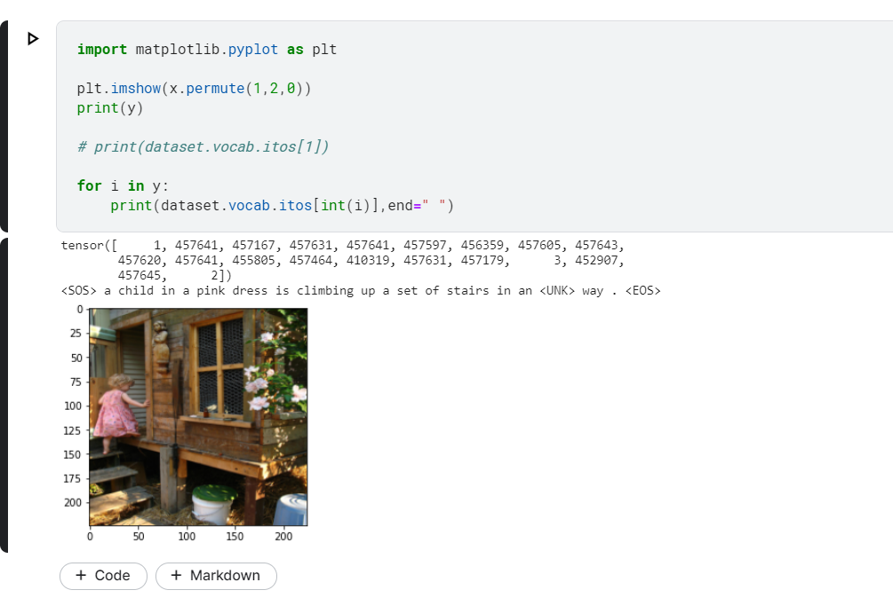

https://github.com/aladdinpersson/Machine-Learning-Collection/blob/master/ML/Pytorch/more_advanced/image_captioning/get_loader.py

Try training the dataset next. The strategy is to read understand implement.

# Kaggle competition Cats vs dogs redux
-------
https://www.kaggle.com/fanbyprinciple/pytorch-tackling-cats-and-dogs/edit

Getting error with tranform:

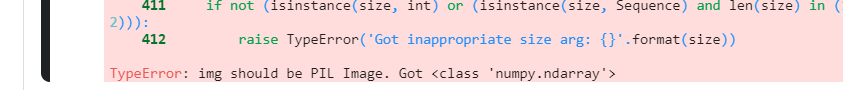

The error was because of wrong sequence of transforms.

Cats vs dogs barely successful!

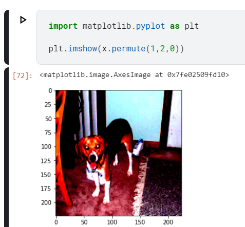

review what the my guy Alladin did to the dataset though

he trained an efficient net took the parameter to train a linear regression model here!

https://github.com/aladdinpersson/Machine-Learning-Collection/blob/master/ML/Kaggles/Dog%20vs%20Cat%20Competition/train.py

what is this sorcery?

# Kaggle competition Diabetic Retinopathy
-------
My solution: 
https://www.kaggle.com/fanbyprinciple/pytorch-diabetic-retinopathy/edit

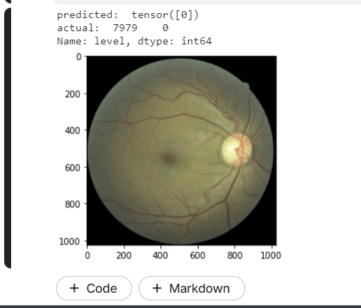

https://www.youtube.com/watch?v=YxQYvhap3kE&list=PLhhyoLH6IjfxkVb3Yx4mjLdwMWP5S_Hct

Looking at Alladins solution:

> He used Albumentations for transforms

> Single dataset class for botht training and validation

> used argmax as loss function

> Using efficientnet

> batch size 64, num epochs 100

> makes a baseline with 120 by 120 images, notes all validation values

> tried preprocessing the image to trim the images

> created modification to loss function

> Getting a balnced dataloader > didnt work for him

> heavy data augmentation

> left and right image augmentation by blending - didnt understand.

> image resolution increase

Thing he didnt try:

> training validation data

> larger model

> larger image resolution

> Ensemble of CNN models

> Tweaking loss values

# Neural net atyle transfer
-------
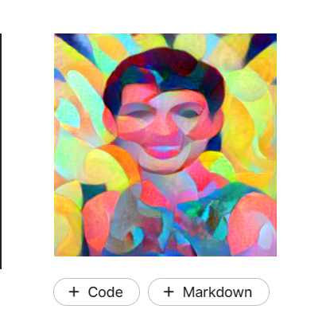

https://www.kaggle.com/fanbyprinciple/pytorch-neural-net-transfer/edit

# GAN 
-------
## Simple GAN
-------
things to try
1. make the code work
2. larger netwokr?
3. what if we code a CNN
4. differnet learning rates
5. normalisation with batchnorm

Simple GAN after first epoch:

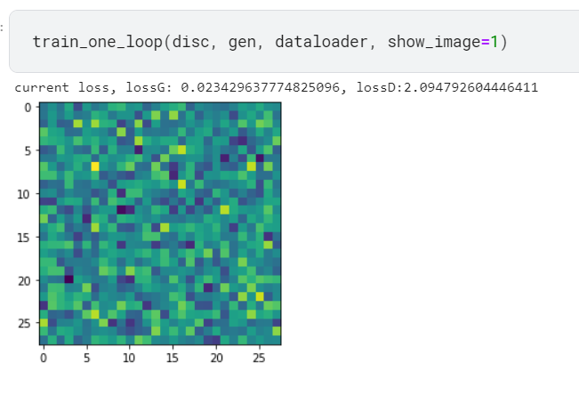

https://www.kaggle.com/fanbyprinciple/gans-for-sign-language-from-scratch-in-pytorch/edit

## DC GAN
-------
https://www.kaggle.com/fanbyprinciple/pytorch-implementing-dcgan/edit

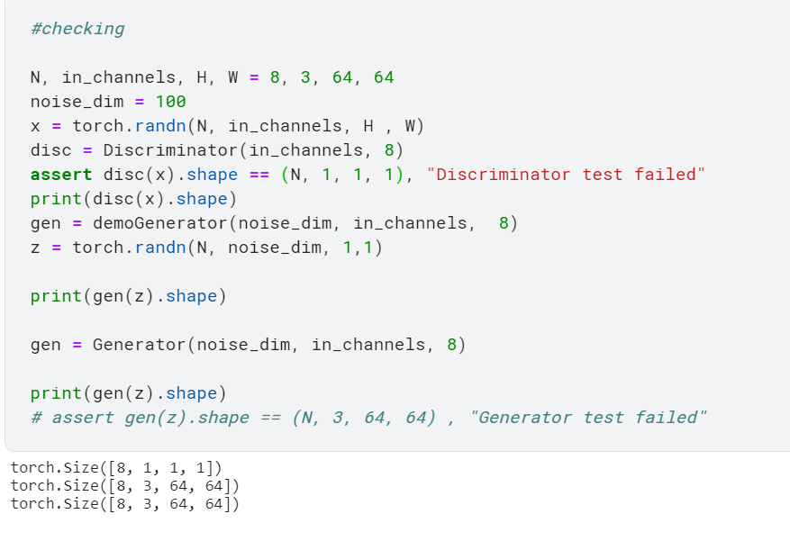

https://github.com/aladdinpersson/Machine-Learning-Collection/blob/master/ML/Pytorch/GANs/2.%20DCGAN/train.py

Need to adapt to new dataset.

## Tensorboard tutorial

## Pytorch Text generator with character level LSTM

https://www.youtube.com/watch?v=WujVlF_6h5A&list=PLhhyoLH6IjfxeoooqP9rhU3HJIAVAJ3Vz&index=33

