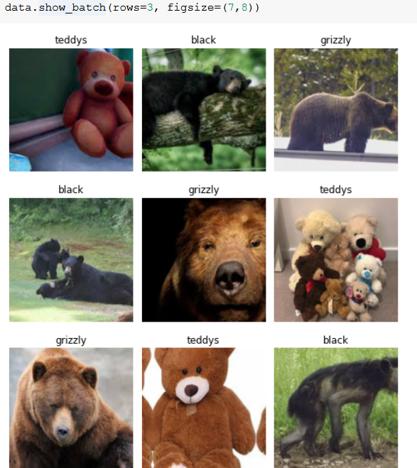
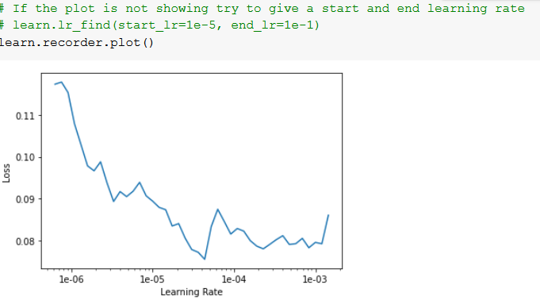
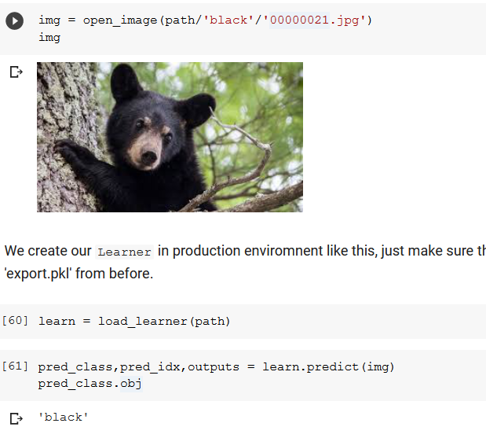
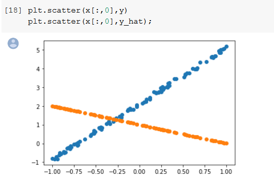
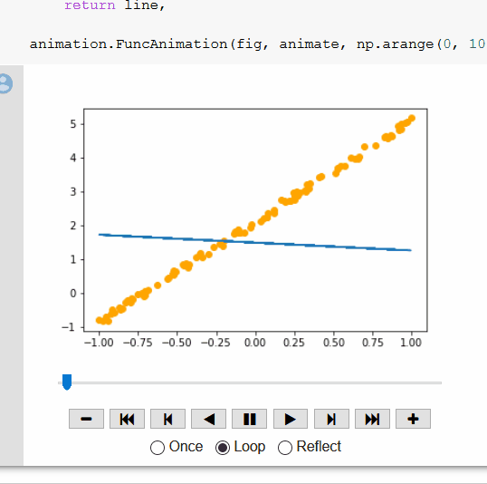

Computer vision - deeper appplication

Ideas discussed in first week:
1. Turning sound into picture and then applying fast ai

2. Turing lab results into picture and applying fast ai

3. whatsapp images discrimination based on spamand not spam

4. Using it to classify dog breeds as hairy and non hairy

5. using it to identify building that are complete or not complete

6. TO identify if a partiular place belongs to india
trhough sattelite image

If youre stuck KEep going.

This javascript code can be used to download all links and put it in a text file

urls=Array.from(document.querySelectorAll('.rg_i')).map(el=> el.hasAttribute('data-src')?el.getAttribute('data-src'):el.getAttribute('data-iurl'));
window.open('data:text/csv;charset=utf-8,' + escape(urls.join('\n')));

It is much better touse CPU in production than GPU. Since mostly you would be using online learning.

When you are using a web service we just need to ensure that the image input is in the same format as the images we predicted upon and then simply callthe predict function.

## Teddy Bear classification

Input data:

finding learning rate:

Output :

### Errata

This was not working because you need create directory first before downloading images in the notebook :

I found that ImageDataBunch wasonly picking up one folder when the actual required behavior was to pich from all subfolders, It is picking however the labels are all the same folder name

At 25 minutes
https://course.fast.ai/videos/?lesson=2

## Looking closely at whats going on

The resnet 34 is just an architecture the reason the model takes up so uch space is because of the parameter value

Using SGD on a random set of points generated:

Gradient descent is an algorithm that minimizes functions. Given a function defined by a set of parameters, gradient descent starts with an initial set of parameter values and iteratively moves toward a set of parameter values that minimize the function. This iterative minimization is achieved by taking steps in the negative direction of the function gradient.

Learning rate tells us how big a jump needs to be made in taking a gradient descent step

Epoch one complete run of our dataset

Minibatch is random set of points one uses to update the weights

SGD is stochastic gradient descent it updates the theta on every step

Architecture is the mathematical function

PArameters are the weight you predicted

"If people are smart they must be horrible human beings to make things okay"

# TODO 

1. Make a web application using falsk and fast ai

Tried wiht a mnist dataset but was not able to export the pickle file

2. practicing on mnist

Kaggle with 99.153 accuracy.

