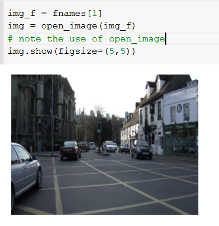
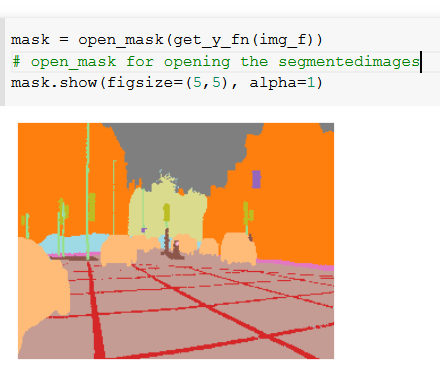
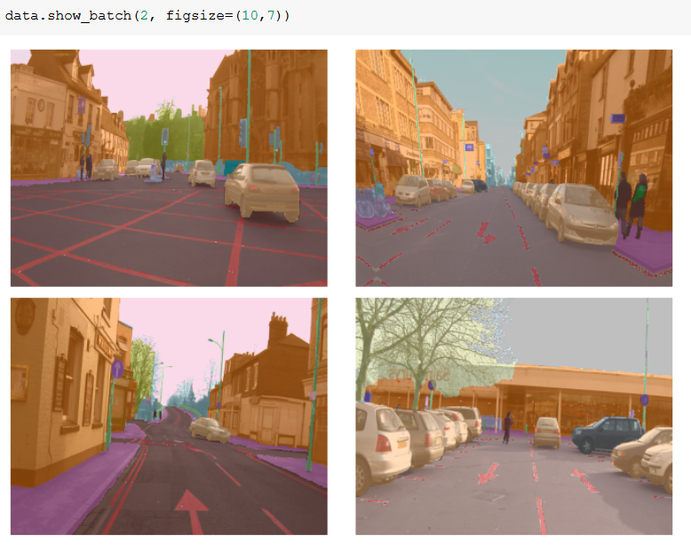
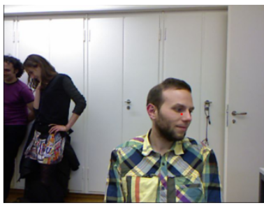
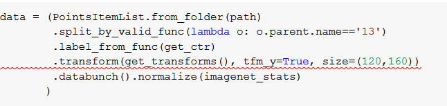

# reference

Notes : https://github.com/hiromis/notes/blob/master/Lesson3.md

Video : https://www.youtube.com/watch?v=MpZxV6DVsmM&list=PLfYUBJiXbdtSIJb-Qd3pw0cqCbkGeS0xn&index=3

### Topics covered

Getting datasets from kaggle on a dataset of sattelite images

A partial function is a new function made from an existing function with a parameter of the existing function set

In this sattelite example since it has multiple labels we don't use accuracy to measure the effectiveness since it uses argmax which selects maximum from a list of possibliities however in this case what we want is to select all the classes that are above a certain threshold acc_thresh

Currently facing problem with google clab upload errors
For lr after plotting the lr curve find the maximum slope and then use the learning rate used before unfreezing

### Camvid dataset

Thislooks more promising as datasets are available directly

decreasingthe learning rate ata theend is called learning rate annealing

gradually incrasing the learning rate is best to find the global minima

Teh approach of slowly increasing the image sizes and using using transfer learning has enabled the fastai people to get the state of the art restuly

### Biwi headpose dataset

Image regression

This gets you a center of the space
It uses a lotof conversion as the y used xbox to generate the numbers

Ituses a image regression model
Regression means a system of continous fucntion

loss function is the number that denote the accuracy i fthe model
Iam getting this error as run it:

### IMDB model

Classifiying document

All the text models are in fastai.text

Tokenisation:
anythong beginning with xx actually means unknown

Numericalisation :
we replace every token with a number 

When we get data from a csv file we use splifrom_df and specify the column for validation set , labelfrom_df and specify the column for labels and then databunch()

we are using a RNN here.

### Home work

1. Run Imdb and imagea head pose by yourself too 
2. apply on your own multilabel classification
3. or image regression or image segmentation
4. use it in a web app phew!

