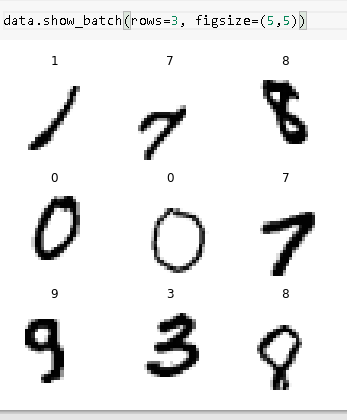
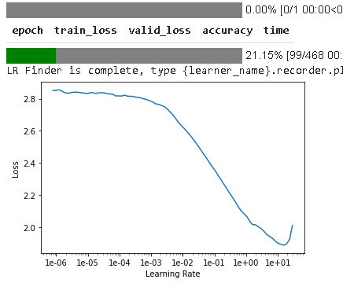
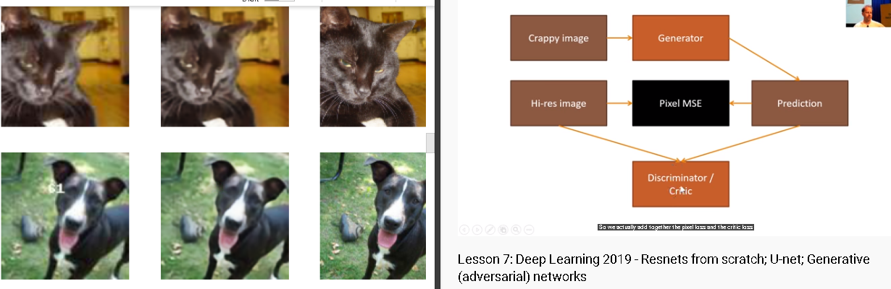
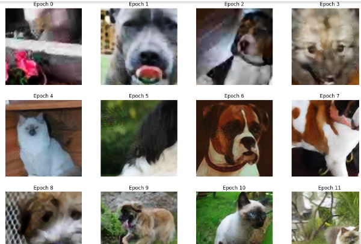
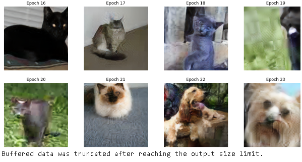
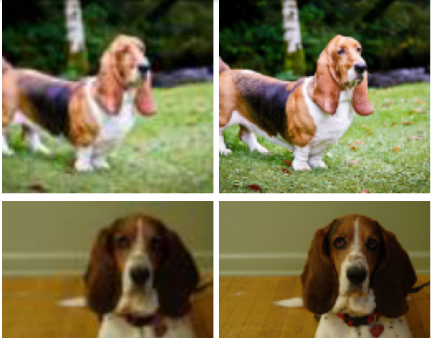
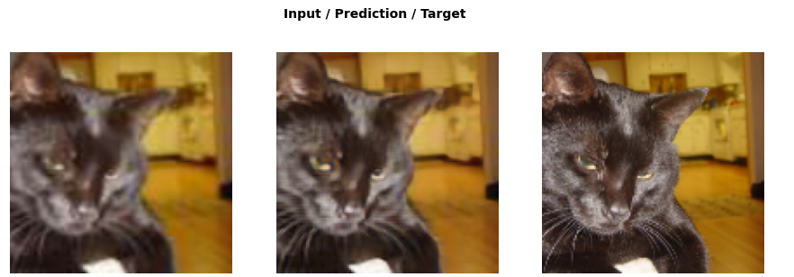

# GAN RNN etc

Jeremy starts witha n android app description, would be cool to try out.

Notes : https://github.com/hiromis/notes/blob/master/Lesson7.md

### MNIST CUSTOM RESNET

adding resblock to any model can work, that is less than 2 years old.

### Camvid notebook

Goes on to explain how each pixel is a class.
in order to get the original picture back we do a stride 1/2 convolution also known as a deconvolution. Can be done by a nearest neighbhor interpolation or even bilinear interpolation
Unet uses soemthing called skip connection to recreate the original picture, it has an encoder and decoder.
unetblock in fastai was created with hooks
We use UNET when size of output is similar to size of input

### Image restoration using GAN

Instead of Pixel MSE as loss function we use something called generative GAN.

Here we do something different as in we use pretrained models for both generator and critic.

### LSUN DATASET NOTEBOOK

It doesn't use pretrained models

### SUPERRES NOTEBOOK

We can use somthing called feature map to remove gan 
completely.

features are taken just before the activations

### Human numbers

Need to do

## Homework

1. Do resnet paper
2. Note what Jeremy says about creating new images in Image restration by looking thorugh hirmis notebook .
3. run rosemann with removing the non zero thing
4. at 1 hr mark in video
5. Look at delorify on github
6. medium blog
7. Dev project index
8. Human numbers

## Jeremy's advice

1. Avoid todo at all costs complete what you start...hmm
2. Recreate all notebooks can you do it.
