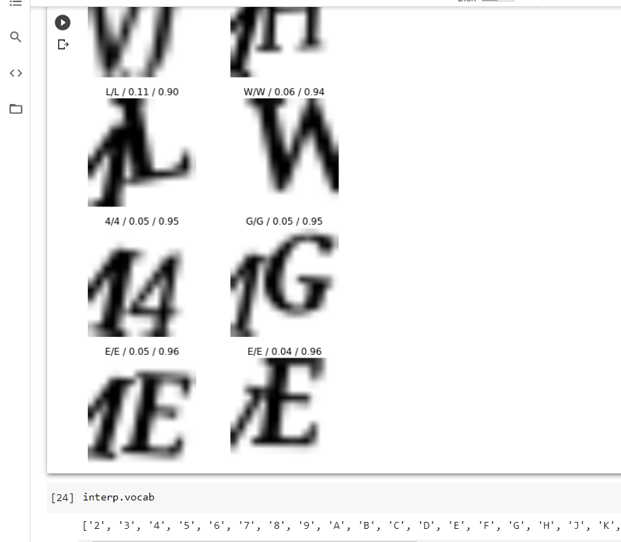

# DIRECT IMAGE FILES IN KAGGLE

### Using parent_label simple training

Barcode detection annotated dataset:
https://www.kaggle.com/whoosis/barcode-detection-annotated-dataset

../input/barcode-detection-annotated-dataset/1/20201211_100_rgb.png

regex to detect 1 = /\d.

## Captcha break

from adam gietgey : https://colab.research.google.com/drive/1KO-FMR2C6QPpYWl_BMiWBu9fXxkKnWFe#scrollTo=ZrEb_Jv77j9n

