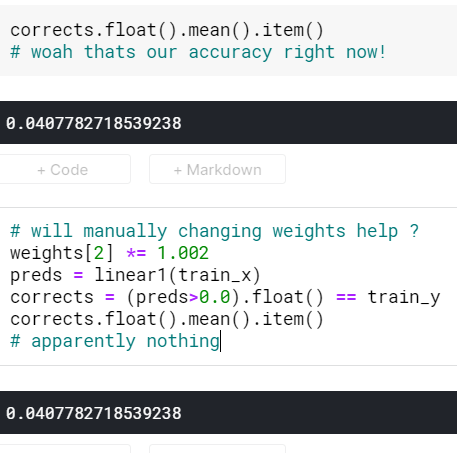
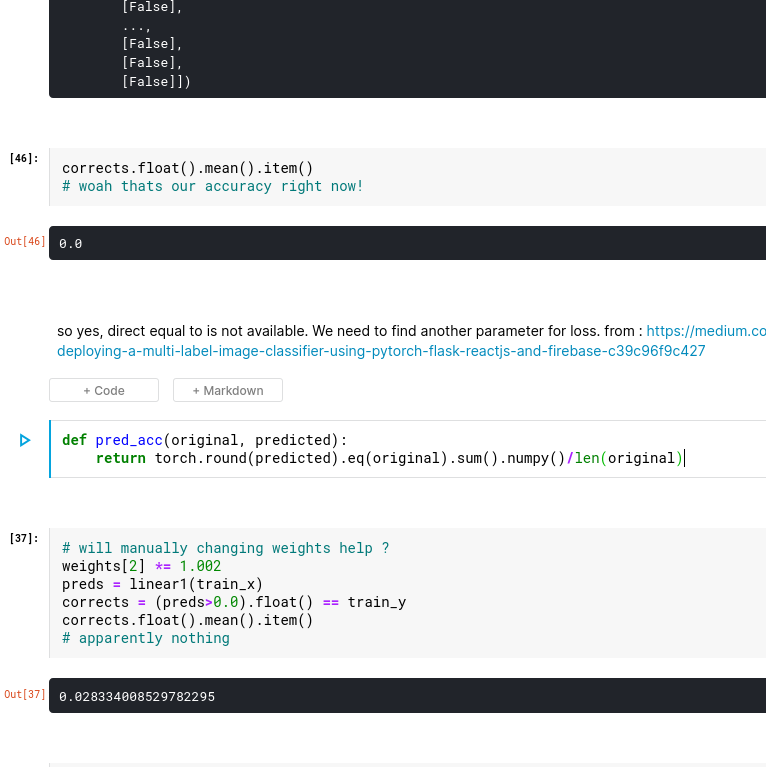
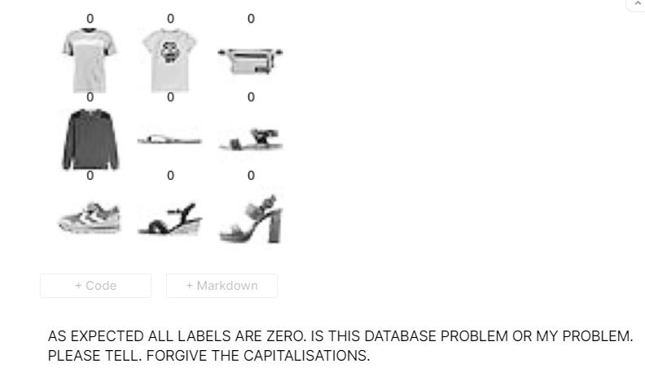
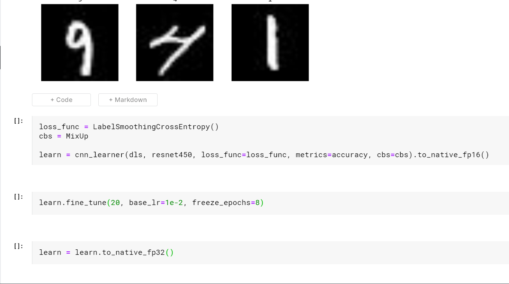
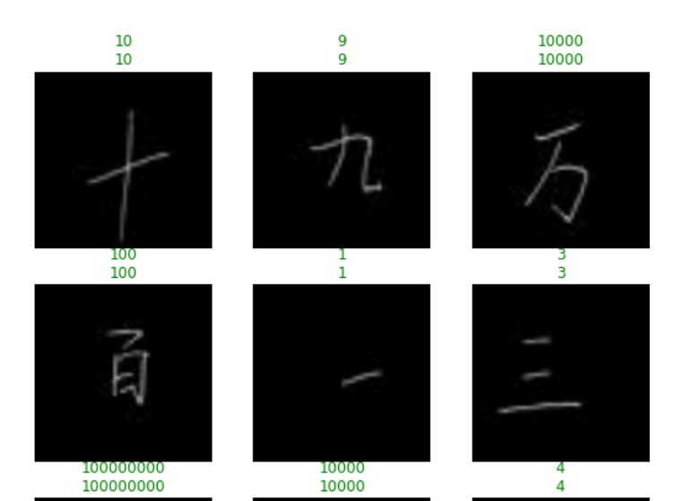

# Working with dataframe

In kaggle: 

1. converting them to image first.

## workingon handsign mnist

1. our initial accuracy XD.

1. multi class labelling by following through chapter 4:
<https://www.kaggle.com/fanbyprinciple/hand-sign-with-fastai-v4-hand-made-classifier/edit?rvi=1>

1. Fashion with fastai

illustrates another way to convert dataframes into png

but something wrong with the dataset itself.

https://www.kaggle.com/fanbyprinciple/fashion-with-fastai/

1. Fastai mnist revisited

https://www.kaggle.com/fanbyprinciple/fastai-v4-mnist-again/edit

1. chinese mnist

