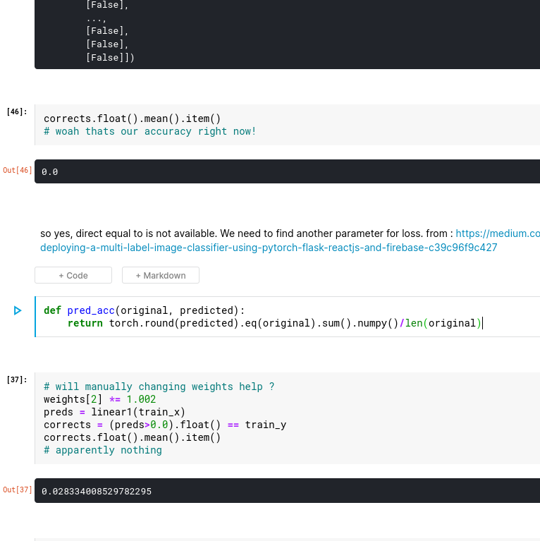

# Working with dataframe

In kaggle: 

1. converting them to image first.

1. multi class labelling by following through chapter 4:
<https://www.kaggle.com/fanbyprinciple/hand-sign-with-fastai-v4-hand-made-classifier/edit?rvi=1>
