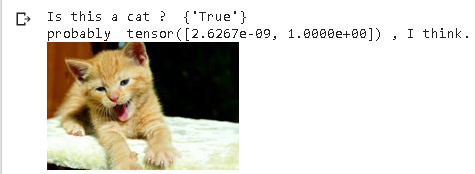
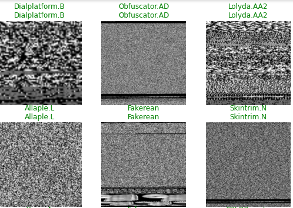
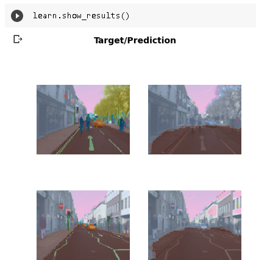
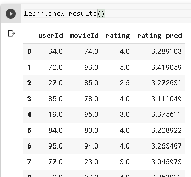
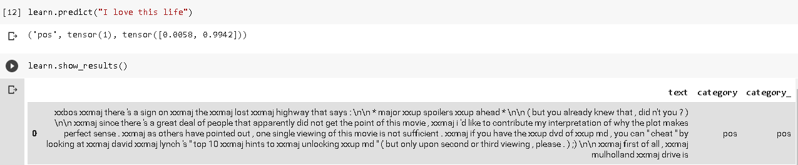
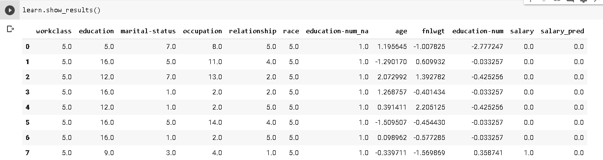
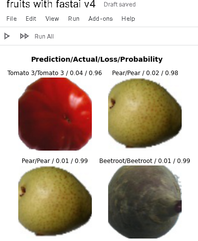
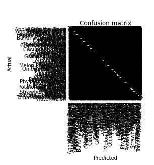
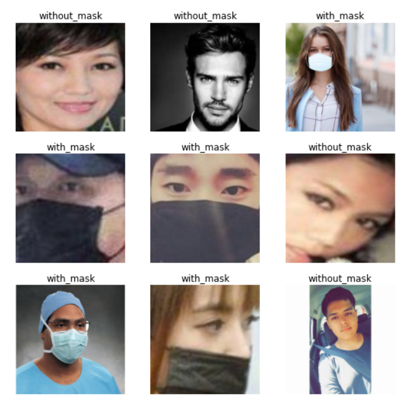

### Observations

1. I feel like this gives us the various applications we can actually incorporate using fastai

Here's a list of some of the thousands of tasks in different areas at which deep learning, or methods heavily using deep learning, is now the best in the world:

    1. Natural language processing (NLP):: Answering questions; speech recognition; summarizing documents; classifying documents; finding names, dates, etc. in documents; searching for articles mentioning a concept
    
    2. Computer vision:: Satellite and drone imagery interpretation (e.g., for disaster resilience); face recognition; image captioning; reading traffic signs; locating pedestrians and vehicles in autonomous vehicles
    
    3. Medicine:: Finding anomalies in radiology images, including CT, MRI, and X-ray images; counting features in pathology slides; measuring features in ultrasounds; diagnosing diabetic retinopathy
    
    4. Biology:: Folding proteins; classifying proteins; many genomics tasks, such as tumor-normal sequencing and classifying clinically actionable genetic mutations; cell classification; analyzing protein/protein interactions
    
    5. Image generation:: Colorizing images; increasing image resolution; removing noise from images; converting images to art in the style of famous artists
    Recommendation systems:: Web search; product recommendations; home page layout
    
    6. Playing games:: Chess, Go, most Atari video games, and many real-time strategy games
    Robotics:: Handling objects that are challenging to locate (e.g., transparent, shiny, lacking texture) or hard to pick up
    
    7. Other applications:: Financial and logistical forecasting, text to speech, and much more...

2. Fastai is not included by default in colab books. So we need to `!pip install fastai --upgrade`

3. ImageDataloader is nice to use

4. working on malware dataset can be really fun:
 for example data set available at: https://www.dropbox.com/s/ep8qjakfwh1rzk4/malimg_dataset.zip?dl=0

5. Working on camvid:

6. Simplest recommendation system:

in fastai.collab module there is no untar_data is this a worthy issue to notify creators? I wonder.

7. Simplest IMDB dataset:

8. Simplest tabular example:

9. If you are an organisation, then always hide test data from the clients.
_
10. Fruits example

Artistic confusion matrix

With and without mask dataset"
