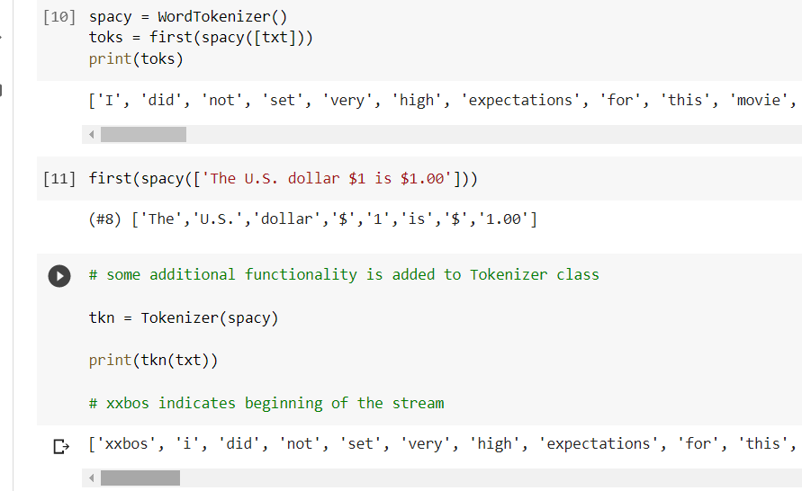
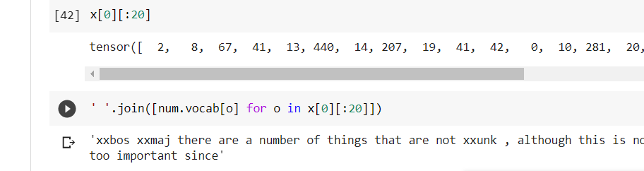
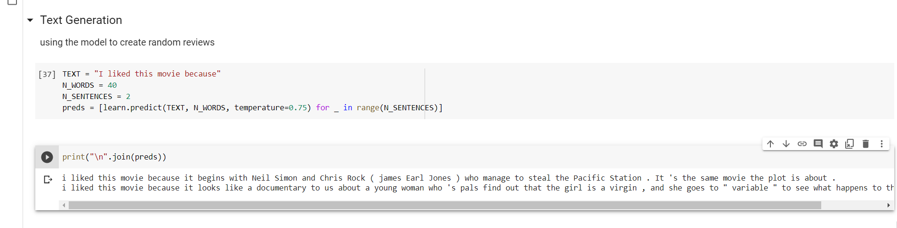

# Natural Language Processing

Uses pretrained WIkitext model and then IMDb to fine tune the model

It teaches two things :
	1. creating a dataloader for language model : this will generate the next word
	2. creating a dataloader for classifier : this is an external label like sentiment

## NLP introduction

nlp is about guessing the next word. for that the model needs to create its own labels. It uses self supervised learning.

The language model used to classify IMDb was pretrained on Wikipedia. 

why learn in detail ?

One reason, of course, is that it is helpful to understand the foundations of the models that you are using. But there is another very practical reason, which is that you get even better results if you fine-tune the (sequence-based) language model prior to fine-tuning the classification model

We will be finetuning the pretrained language model which was trained on wikipedia articles.

This is called ULMFit approach.

### text preprocessing

we already know how categorical variables can be used as independent variables for neural network

make a list of all possible levels of the variable (vocab)

Replace each level with its index in the vocab

create an embedding matrix for this contatining a row for each level i.e. for each item in the vocab

Use this embedding matrix as the first layer of a neural network.

we do the same thing with text. 

whats new is idea of sequence. first we concatenate all of the document in our dataset into onw big long string and split it into words giving us very long words or tokens. 

Our independent variable will be the entire string exect for the second last and last will be labe;

Our vocab would be mix of common words from wikipedia and new words specific to our corpus would be movie actors

for building embedding matrix: for words in vocabualary of pre trained modelwe will take corresponding row in the embedding matrix of the pretrained model but for new words we won't have anythong, we willjust initialize the corresponding row with a random vector

## jargon

tokenisation

Numericalisations - making list of unique words -vocab and convert each word to index to look up in vocab

Language model data loader creation -  LMDDataLoader class for seperating the last token as label

Language model creation - creating a model that handles the input list that are arbitaryily small or big.

Creating a language model result:

creating a classifier model result:

## Questions

1. What is "self-supervised learning"?

when there are no labels and th emodel itself tries to create a model

1. What is a "language model"?

A model that is supposed model the language and hence create language

1. Why is a language model considered self-supervised?

because the labels are genererated on the basis of input provided and are not given explicitly to the model

1. What are self-supervised models usually used for?

These models are used for tasks that have no label

1. Why do we fine-tune language models?

fine tuning is necessary because we need to unravel the layer a few layers at a time

1. What are the three steps to create a state-of-the-art text classifier?

getting a pretrained model
numericalisation
padding
finetuning

1. How do the 50,000 unlabeled movie reviews help us create a better text classifier for the IMDb dataset?

the help us to give a better language model

1. What are the three steps to prepare your data for a language model?
tokenisation
numericalisation
language model creation

1. What is "tokenization"? Why do we need it?

convert words to distinct semantic chunks

1. Name three different approaches to tokenization.

word based
subwordbased
character based

1. What is `xxbos`?

beginning of stream

1. List four rules that fastai applies to text during tokenization.

it saves the tokenised document in a temporary folder so that it doesn't need to tokenise more than once

it runs multiple tokenisation processes in parallel to take advantage of computer cpu

initial preprocessomg

padding

Actual answer:
repeated tokens, specialtokens, capitalisation token, embedding matrix only take the lower case

1. Why are repeated characters replaced with a token showing the number of repetitions and the character that's repeated?

or instance, the rules will replace a sequence of four exclamation points with a single exclamation point, followed by a special repeated character token, and then the number four. In this way, the model's embedding matrix can encode information about general concepts such as repeated punctuation rather than requiring a separate token for every number of repetitions of every punctuation mark.

1. What is "numericalization"?

converting the tokens to a number in a dictionary , and accessing it thorugh a number

1. Why might there be words that are replaced with the "unknown word" token?

xxunk

1. With a batch size of 64, the first row of the tensor representing the first batch contains the first 64 tokens for the dataset. What does the second row of that tensor contain? What does the first row of the second batch contain? (Careful—students often get this one wrong! Be sure to check your answer on the book's website.)

don't know

1. Why do we need padding for text classification? Why don't we need it for language modeling?

so that size is same

1. What does an embedding matrix for NLP contain? What is its shape?

no idea

1. What is "perplexity"?

dont wanna know

1. Why do we have to pass the vocabulary of the language model to the classifier data block?

you have decided it. so that comupted indexes dont change
1. What is "gradual unfreezing"?

unravelling 2 layers at a time

1. Why is text generation always likely to be ahead of automatic identification of machine-generated texts?

better classification will always lead to better generation algorithm