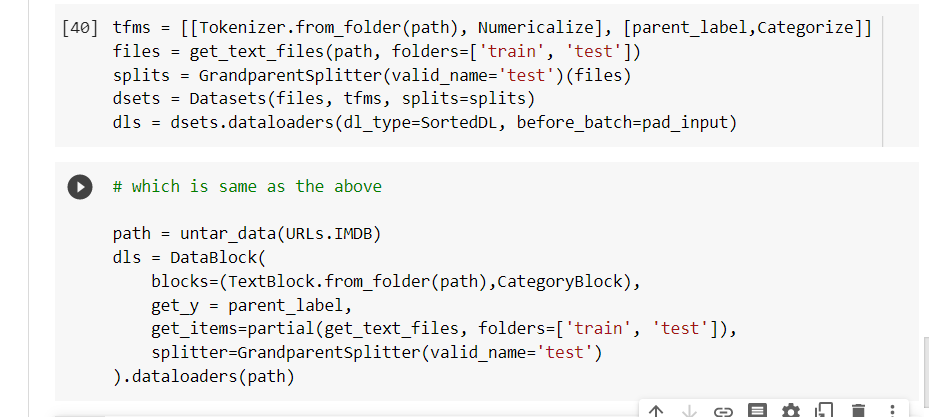

# Mid level data

How to use mid level api to deal with data when Textblock api doesnt work

Mid-Level API: The mid-level API does not only contain functionality for creating DataLoaders. It also has the callback system, which allows us to customize the training loop any way we like, and the general optimizer.

## learning value

1. tells howtransformers work by building our own transform

2. creating a pipeline, TfmdLists

## Chapter summary

fastai provides a layered API. It takes one line of code to grab the data when it's in one of the usual settings, making it easy for beginners to focus on training a model without spending too much time assembling the data. Then, the high-level data block API gives you more flexibility by allowing you to mix and match some building blocks. Underneath it, the mid-level API gives you greater flexibility to apply any transformations on your items. In your real-world problems, this is probably what you will need to use, and we hope it makes the step of data-munging as easy as possible.

## Running the noteboook

It tells us about customizing the api: 

## questions

1. Why do we say that fastai has a "layered" API? What does it mean?
1. Why does a `Transform` have a `decode` method? What does it do?
1. Why does a `Transform` have a `setup` method? What does it do?
1. How does a `Transform` work when called on a tuple?
1. Which methods do you need to implement when writing your own `Transform`?
1. Write a `Normalize` transform that fully normalizes items (subtract the mean and divide by the standard deviation of the dataset), and that can decode that behavior. Try not to peek!
1. Write a `Transform` that does the numericalization of tokenized texts (it should set its vocab automatically from the dataset seen and have a `decode` method). Look at the source code of fastai if you need help.
1. What is a `Pipeline`?
1. What is a `TfmdLists`? 
1. What is a `Datasets`? How is it different from a `TfmdLists`?
1. Why are `TfmdLists` and `Datasets` named with an "s"?
1. How can you build a `DataLoaders` from a `TfmdLists` or a `Datasets`?
1. How do you pass `item_tfms` and `batch_tfms` when building a `DataLoaders` from a `TfmdLists` or a `Datasets`?
1. What do you need to do when you want to have your custom items work with methods like `show_batch` or `show_results`?
1. Why can we easily apply fastai data augmentation transforms to the `SiamesePair` we built?

## future project ideas

1. Use the mid-level API to prepare the data in DataLoaders on your own datasets. Try this with the Pet dataset and the Adult dataset from Chapter 1.

2. Look at the Siamese tutorial in the fastai documentation to learn how to customize the behavior of show_batch and show_results for new type of items. Implement it in your own project.