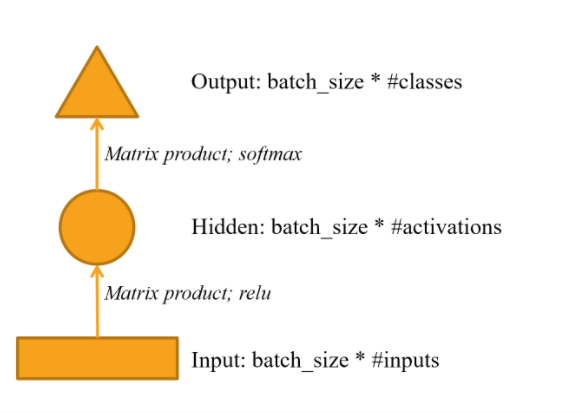
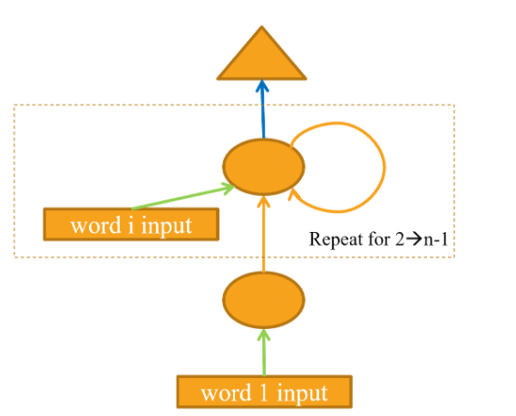

# NLP deep dive

## Objective 

1. creating our own model of human numbers
2. creating an RNN
3. it helps us to understand the RNN in detail

## rnn

Looping language model for creating rnn.

RNN architechture:

the loop :

