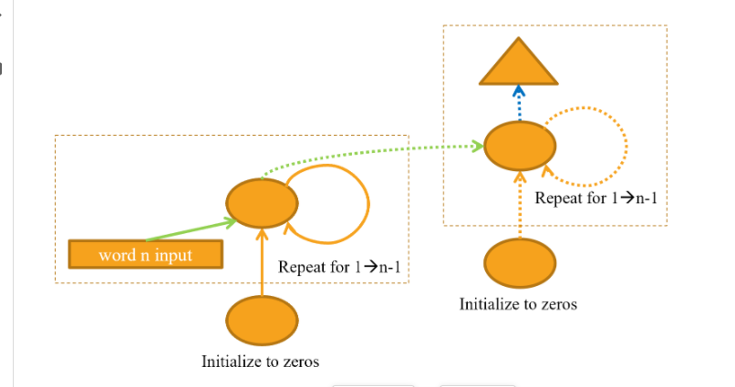
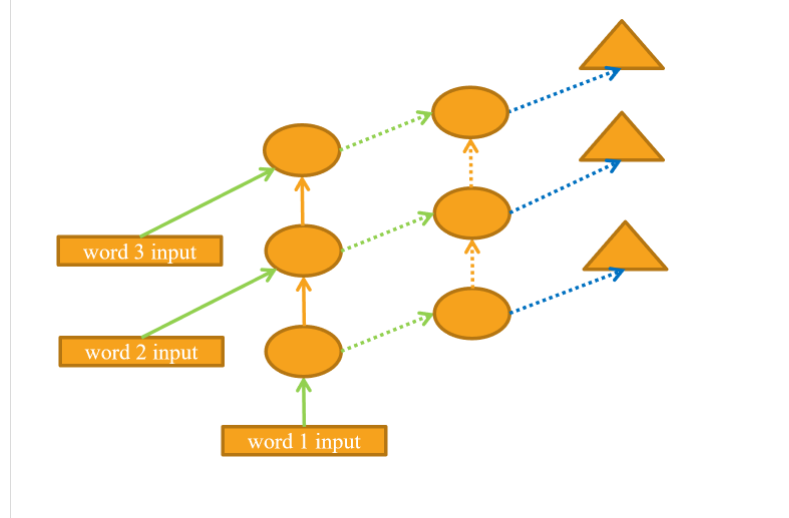
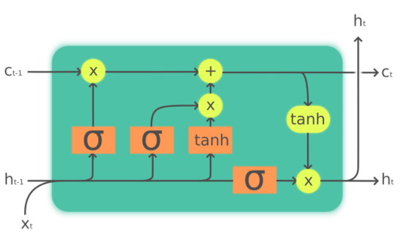
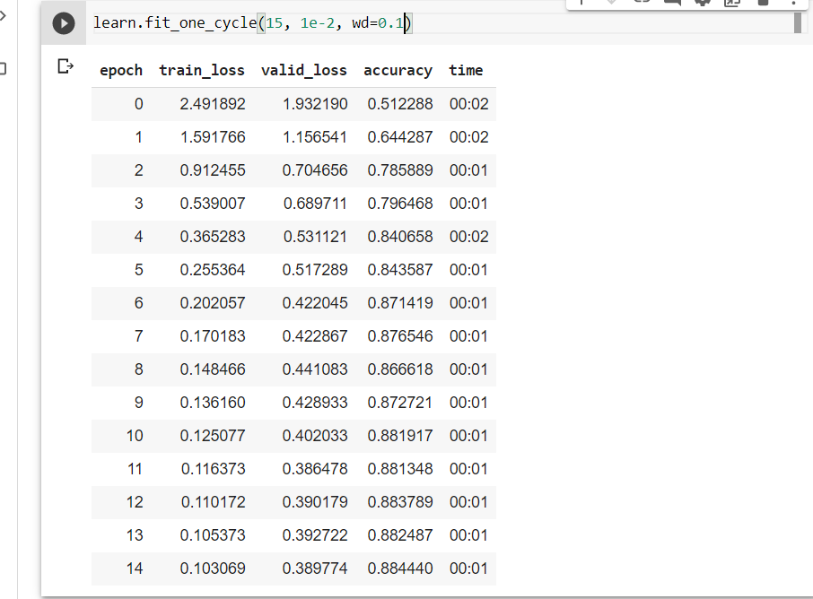

# NLP deep dive

## Objective 

1. creating our own model of human numbers
2. creating an RNN
3. it helps us to understand the RNN in detail
4. best explanationfor LSTM

## chapter summary

You have now seen everything that is inside the AWD-LSTM architecture we used in text classification in <<chapter_nlp>>. It uses dropout in a lot more places:

- Embedding dropout (just after the embedding layer)
- Input dropout (after the embedding layer)
- Weight dropout (applied to the weights of the LSTM at each training step)
- Hidden dropout (applied to the hidden state between two layers)

This makes it even more regularized. Since fine-tuning those five dropout values (including the dropout before the output layer) is complicated, we have determined good defaults and allow the magnitude of dropout to be tuned overall with the `drop_mult` parameter you saw in that chapter (which is multiplied by each dropout).

Another architecture that is very powerful, especially in "sequence-to-sequence" problems (that is, problems where the dependent variable is itself a variable-length sequence, such as language translation), is the Transformers architecture. You can find it in a bonus chapter on the [book's website](https://book.fast.ai/).

## rnn

Looping language model for creating rnn.

RNN architechture:

the loop :

Multi layer rnn:

Multi layer RNN unrolled:

LSTM:

LSTM is an architecture that was introduced back in 1997 by Jürgen Schmidhuber and Sepp Hochreiter. In this architecture, there are not one but two hidden states. In our base RNN, the hidden state is the output of the RNN at the previous time step. That hidden state is then responsible for two things:

Having the right information for the output layer to predict the correct next token
Retaining memory of everything that happened in the sentence
Consider, for example, the sentences "Henry has a dog and he likes his dog very much" and "Sophie has a dog and she likes her dog very much." It's very clear that the RNN needs to remember the name at the beginning of the sentence to be able to predict he/she or his/her.

In practice, RNNs are really bad at retaining memory of what happened much earlier in the sentence, which is the motivation to have another hidden state (called cell state) in the LSTM. The cell state will be responsible for keeping long short-term memory, while the hidden state will focus on the next token to predict. Let's take a closer look and how this is achieved and build an LSTM from scratch.

## Questions

to understand LSTMS :
<https://colah.github.io/posts/2015-08-Understanding-LSTMs/>

1. If the dataset for your project is so big and complicated that working with it takes a significant amount of time, what should you do?
1. Why do we concatenate the documents in our dataset before creating a language model?
1. To use a standard fully connected network to predict the fourth word given the previous three words, what two tweaks do we need to make to ou model?
1. How can we share a weight matrix across multiple layers in PyTorch?
1. Write a module that predicts the third word given the previous two words of a sentence, without peeking.
1. What is a recurrent neural network?
1. What is "hidden state"?
1. What is the equivalent of hidden state in ` LMModel1`?
1. To maintain the state in an RNN, why is it important to pass the text to the model in order?
1. What is an "unrolled" representation of an RNN?
1. Why can maintaining the hidden state in an RNN lead to memory and performance problems? How do we fix this problem?
1. What is "BPTT"?
1. Write code to print out the first few batches of the validation set, including converting the token IDs back into English strings, as we showed for batches of IMDb data in <<chapter_nlp>>.
1. What does the `ModelResetter` callback do? Why do we need it?
1. What are the downsides of predicting just one output word for each three input words?
1. Why do we need a custom loss function for `LMModel4`?
1. Why is the training of `LMModel4` unstable?
1. In the unrolled representation, we can see that a recurrent neural network actually has many layers. So why do we need to stack RNNs to get better results?
1. Draw a representation of a stacked (multilayer) RNN.
1. Why should we get better results in an RNN if we call `detach` less often? Why might this not happen in practice with a simple RNN?
1. Why can a deep network result in very large or very small activations? Why does this matter?
1. In a computer's floating-point representation of numbers, which numbers are the most precise?
1. Why do vanishing gradients prevent training?
1. Why does it help to have two hidden states in the LSTM architecture? What is the purpose of each one?
1. What are these two states called in an LSTM?
1. What is tanh, and how is it related to sigmoid?
1. What is the purpose of this code in `LSTMCell`: `h = torch.stack([h, input], dim=1)`
1. What does `chunk` do in PyTorch?
1. Study the refactored version of `LSTMCell` carefully to ensure you understand how and why it does the same thing as the non-refactored version.
1. Why can we use a higher learning rate for `LMModel6`?
1. What are the three regularization techniques used in an AWD-LSTM model?
1. What is "dropout"?
1. Why do we scale the weights with dropout? Is this applied during training, inference, or both?
1. What is the purpose of this line from `Dropout`: `if not self.training: return x`
1. Experiment with `bernoulli_` to understand how it works.
1. How do you set your model in training mode in PyTorch? In evaluation mode?
1. Write the equation for activation regularization (in math or code, as you prefer). How is it different from weight decay?
1. Write the equation for temporal activation regularization (in math or code, as you prefer). Why wouldn't we use this for computer vision problems?
1. What is "weight tying" in a language model?

## Further research

1. In ` LMModel2`, why can `forward` start with `h=0`? Why don't we need to say `h=torch.zeros(...)`?
1. Write the code for an LSTM from scratch (you may refer to <<lstm>>).
1. Search the internet for the GRU architecture and implement it from scratch, and try training a model. See if you can get results similar to those we saw in this chapter. Compare you results to the results of PyTorch's built in `GRU` module.
1. Take a look at the source code for AWD-LSTM in fastai, and try to map each of the lines of code to the concepts shown in this chapter.