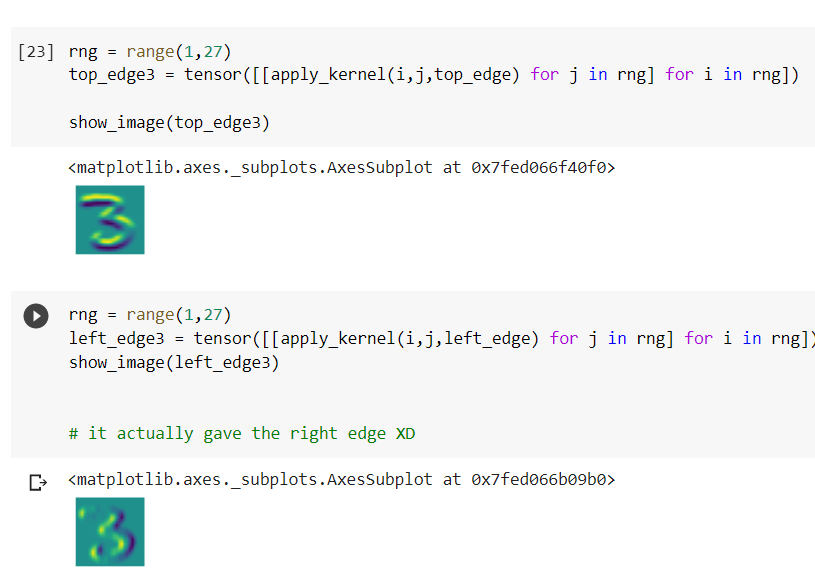
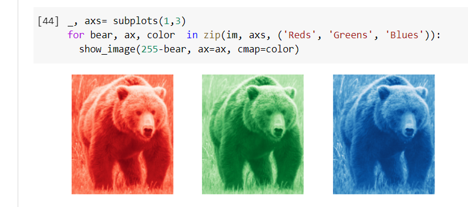

# Deep dive into Convolutions

## Importance

1. It tells us exactly how convolutional operation takes place over a filter.

1. tells about how to design a simple cnn network.

## CNN

CNN filters can be made for edge detections:

Convolution notebook also features cute bears for color convolutions:
