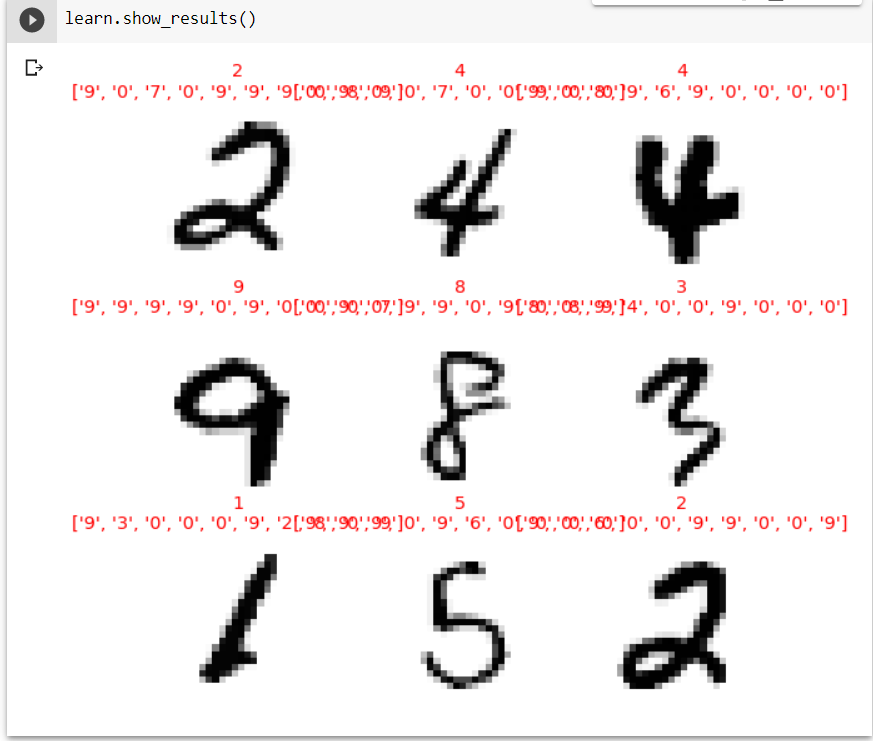

# Deep dive into Convolutions

## Importance

1. It tells us exactly how convolutional operation takes place over a filter.

1. tells about how to design a simple cnn network.

1. tells about how to use hooks to look into training data

1. how 1 cycle training works

## CNN

CNN filters can be made for edge detections:

Convolution notebook also features cute bears for color convolutions:

Simple baseline modelnotebook tells us about how to use hooks and then tells us why it is important to have better batch size, simple one cycle training, batch normalisation

The problem with normal cnn that we make is that due to large number of zeros barely any zeros reach the penultimate layer

### 1 cycle training

1cycle training allows us to use a much higher maximum learning rate than other types of training, which gives two benefits:

By training with higher learning rates, we train faster—a phenomenon Smith named super-convergence.
By training with higher learning rates, we overfit less because we skip over the sharp local minima to end up in a smoother (and therefore more generalizable) part of the loss.

### Batch Normalisation

After normalizing the activations to get some new activation vector y, a batchnorm layer returns gamma*y + beta.

The final result:

But i cant figure out how to make predictions based on the image:

## Summary

We've seen that convolutions are just a type of matrix multiplication, with two constraints on the weight matrix: some elements are always zero, and some elements are tied

These constraints allow us to use far fewer parameters in our model, without sacrificing the ability to represent complex visual features. That means we can train deeper models faster, with less overfitting. 

We've also seen how to interpret the activations of layers in the network to see whether training is going well or not, and how batchnorm helps regularize the training and makes it smoother.

## Questions

1. What is a "feature"?
1. Write out the convolutional kernel matrix for a top edge detector.
1. Write out the mathematical operation applied by a 3×3 kernel to a single pixel in an image.
1. What is the value of a convolutional kernel apply to a 3×3 matrix of zeros?
1. What is "padding"?
1. What is "stride"?
1. Create a nested list comprehension to complete any task that you choose.
1. What are the shapes of the `input` and `weight` parameters to PyTorch's 2D convolution?
1. What is a "channel"?
1. What is the relationship between a convolution and a matrix multiplication?
1. What is a "convolutional neural network"?
1. What is the benefit of refactoring parts of your neural network definition?
1. What is `Flatten`? Where does it need to be included in the MNIST CNN? Why?
1. What does "NCHW" mean?
1. Why does the third layer of the MNIST CNN have `7*7*(1168-16)` multiplications?
1. What is a "receptive field"?
1. What is the size of the receptive field of an activation after two stride 2 convolutions? Why?
1. Run *conv-example.xlsx* yourself and experiment with *trace precedents*.
1. Have a look at Jeremy or Sylvain's list of recent Twitter "like"s, and see if you find any interesting resources or ideas there.
1. How is a color image represented as a tensor?
1. How does a convolution work with a color input?
1. What method can we use to see that data in `DataLoaders`?
1. Why do we double the number of filters after each stride-2 conv?
1. Why do we use a larger kernel in the first conv with MNIST (with `simple_cnn`)?
1. What information does `ActivationStats` save for each layer?
1. How can we access a learner's callback after training?
1. What are the three statistics plotted by `plot_layer_stats`? What does the x-axis represent?
1. Why are activations near zero problematic?
1. What are the upsides and downsides of training with a larger batch size?
1. Why should we avoid using a high learning rate at the start of training?
1. What is 1cycle training?
1. What are the benefits of training with a high learning rate?
1. Why do we want to use a low learning rate at the end of training?
1. What is "cyclical momentum"?
1. What callback tracks hyperparameter values during training (along with other information)?
1. What does one column of pixels in the `color_dim` plot represent?
1. What does "bad training" look like in `color_dim`? Why?
1. What trainable parameters does a batch normalization layer contain?
1. What statistics are used to normalize in batch normalization during training? How about during validation?
1. Why do models with batch normalization layers generalize better?

## Further research

1. What features other than edge detectors have been used in computer vision (especially before deep learning became popular)?
1. There are other normalization layers available in PyTorch. Try them out and see what works best. Learn about why other normalization layers have been developed, and how they differ from batch normalization.
1. Try moving the activation function after the batch normalization layer in `conv`. Does it make a difference? See what you can find out about what order is recommended, and why.