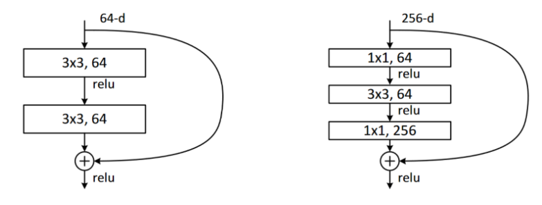

# Residual Network

> [NEEDS REVISITING]:neckbeard:

## Interesting things

1. tells how resnet works form a very low layer of abstraction

The one on the left is resnet, the one on the right is bottlenecked resnet.

## Summary

You have now seen how the models we have been using for computer vision since the first chapter are built, using skip connections to allow deeper models to be trained. Even if there has been a lot of research into better architectures, they all use one version or another of this trick, to make a direct path from the input to the end of the network. When using transfer learning, the ResNet is the pretrained model. In the next chapter, we will look at the final details of how the models we actually used were built from it.

## questionaiire

1. How did we get to a single vector of activations in the CNNs used for MNIST in previous chapters? Why isn't that suitable for Imagenette?
1. What do we do for Imagenette instead?
1. What is "adaptive pooling"?
1. What is "average pooling"?
1. Why do we need `Flatten` after an adaptive average pooling layer?
1. What is a "skip connection"?
1. Why do skip connections allow us to train deeper models?
1. What does <<resnet_depth>> show? How did that lead to the idea of skip connections?
1. What is "identity mapping"?
1. What is the basic equation for a ResNet block (ignoring batchnorm and ReLU layers)?
1. What do ResNets have to do with residuals?
1. How do we deal with the skip connection when there is a stride-2 convolution? How about when the number of filters changes?
1. How can we express a 1×1 convolution in terms of a vector dot product?
1. Create a `1x1 convolution` with `F.conv2d` or `nn.Conv2d` and apply it to an image. What happens to the `shape` of the image?
1. What does the `noop` function return?
1. Explain what is shown in <<resnet_surface>>.
1. When is top-5 accuracy a better metric than top-1 accuracy?
1. What is the "stem" of a CNN?
1. Why do we use plain convolutions in the CNN stem, instead of ResNet blocks?
1. How does a bottleneck block differ from a plain ResNet block?
1. Why is a bottleneck block faster?
1. How do fully convolutional nets (and nets with adaptive pooling in general) allow for progressive resizing?

## Future research

1. Try creating a fully convolutional net with adaptive average pooling for MNIST (note that you'll need fewer stride-2 layers). How does it compare to a network without such a pooling layer?
1. In <<chapter_foundations>> we introduce *Einstein summation notation*. Skip ahead to see how this works, and then write an implementation of the 1×1 convolution operation using `torch.einsum`. Compare it to the same operation using `torch.conv2d`.
1. Write a "top-5 accuracy" function using plain PyTorch or plain Python.
1. Train a model on Imagenette for more epochs, with and without label smoothing. Take a look at the Imagenette leaderboards and see how close you can get to the best results shown. Read the linked pages describing the leading approaches.