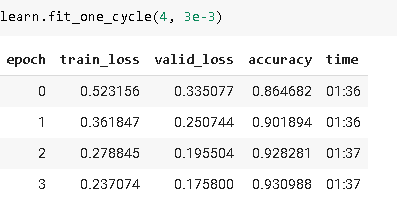

# Arch details

> [NEEDS REVISITING]:neckbeard:

## Summary

Many practitioners, when faced with an overfitting model, start at exactly the wrong end of this diagram. Their starting point is to use a smaller model, or more regularization. Using a smaller model should be absolutely the last step you take, unless training your model is taking up too much time or memory. Reducing the size of your model reduces the ability of your model to learn subtle relationships in your data.

Instead, your first step should be to seek to *create more data*. That could involve adding more labels to data that you already have, finding additional tasks that your model could be asked to solve (or, to think of it another way, identifying different kinds of labels that you could model), or creating additional synthetic data by using more or different data augmentation techniques. Thanks to the development of Mixup and similar approaches, effective data augmentation is now available for nearly all kinds of data.

Once you've got as much data as you think you can reasonably get hold of, and are using it as effectively as possible by taking advantage of all the labels that you can find and doing all the augmentation that makes sense, if you are still overfitting you should think about using more generalizable architectures. For instance, adding batch normalization may improve generalization.

If you are still overfitting after doing the best you can at using your data and tuning your architecture, then you can take a look at regularization. Generally speaking, adding dropout to the last layer or two will do a good job of regularizing your model. However, as we learned from the story of the development of AWD-LSTM, it is often the case that adding dropout of different types throughout your model can help even more. Generally speaking, a larger model with more regularization is more flexible, and can therefore be more accurate than a smaller model with less regularization.

Only after considering all of these options would we recommend that you try using a smaller version of your architecture.

## Questionaire

1. What is the "head" of a neural net?
1. What is the "body" of a neural net?
1. What is "cutting" a neural net? Why do we need to do this for transfer learning?
1. What is `model_meta`? Try printing it to see what's inside.
1. Read the source code for `create_head` and make sure you understand what each line does.
1. Look at the output of `create_head` and make sure you understand why each layer is there, and how the `create_head` source created it.
1. Figure out how to change the dropout, layer size, and number of layers created by `cnn_learner`, and see if you can find values that result in better accuracy from the pet recognizer.
1. What does `AdaptiveConcatPool2d` do?
1. What is "nearest neighbor interpolation"? How can it be used to upsample convolutional activations?
1. What is a "transposed convolution"? What is another name for it?
1. Create a conv layer with `transpose=True` and apply it to an image. Check the output shape.
1. Draw the U-Net architecture.
1. What is "BPTT for Text Classification" (BPT3C)?
1. How do we handle different length sequences in BPT3C?
1. Try to run each line of `TabularModel.forward` separately, one line per cell, in a notebook, and look at the input and output shapes at each step.
1. How is `self.layers` defined in `TabularModel`?
1. What are the five steps for preventing over-fitting?
1. Why don't we reduce architecture complexity before trying other approaches to preventing overfitting?