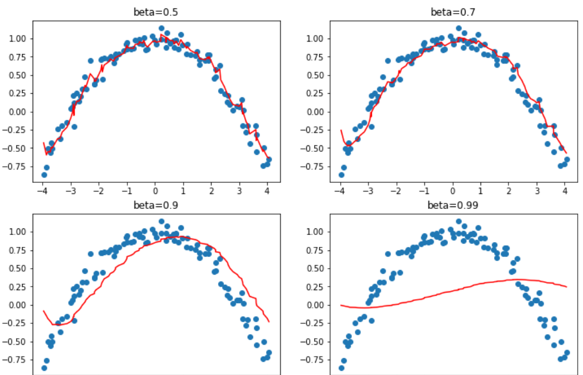

# Accel SGD

Deep dive into training of neural network and different SGD Architecture used

plus knowledge of callbacks.
It also shows us a pipeline for cnn.

## Summary

In this chapter we took a close look at the training loop, explorig differnet variants of SGD and why they can be more powerful. At the time of writing developping new optimizers is a very active area of research, so by the time you read this chapter there may be an addendum on the book's website that presents new variants. Be sure to check out how our general optimizer framework can help you implement new optimizers very quickly.

We also examined the powerful callback system that allows you to customize every bit of the training loop by enabling you to inspect and modify any parameter you like between each step.

## Questionaire

1. What is the equation for a step of SGD, in math or code (as you prefer)?
1. What do we pass to `cnn_learner` to use a non-default optimizer?
1. What are optimizer callbacks?
1. What does `zero_grad` do in an optimizer?
1. What does `step` do in an optimizer? How is it implemented in the general optimizer?
1. Rewrite `sgd_cb` to use the `+=` operator, instead of `add_`.
1. What is "momentum"? Write out the equation.
1. What's a physical analogy for momentum? How does it apply in our model training settings?
1. What does a bigger value for momentum do to the gradients?
1. What are the default values of momentum for 1cycle training?
1. What is RMSProp? Write out the equation.
1. What do the squared values of the gradients indicate?
1. How does Adam differ from momentum and RMSProp?
1. Write out the equation for Adam.
1. Calculate the values of `unbias_avg` and `w.avg` for a few batches of dummy values.
1. What's the impact of having a high `eps` in Adam?
1. Read through the optimizer notebook in fastai's repo, and execute it.
1. In what situations do dynamic learning rate methods like Adam change the behavior of weight decay?
1. What are the four steps of a training loop?
1. Why is using callbacks better than writing a new training loop for each tweak you want to add?
1. What aspects of the design of fastai's callback system make it as flexible as copying and pasting bits of code?
1. How can you get the list of events available to you when writing a callback?
1. Write the `ModelResetter` callback (without peeking).
1. How can you access the necessary attributes of the training loop inside a callback? When can you use or not use the shortcuts that go with them?
1. How can a callback influence the control flow of the training loop.
1. Write the `TerminateOnNaN` callback (without peeking, if possible).
1. How do you make sure your callback runs after or before another callback?

## future research

1. Look up the "Rectified Adam" paper, implement it using the general optimizer framework, and try it out. Search for other recent optimizers that work well in practice, and pick one to implement.
1. Look at the mixed-precision callback with the documentation. Try to understand what each event and line of code does.
1. Implement your own version of ther learning rate finder from scratch. Compare it with fastai's version.
1. Look at the source code of the callbacks that ship with fastai. See if you can find one that's similar to what you're looking to do, to get some inspiration.
