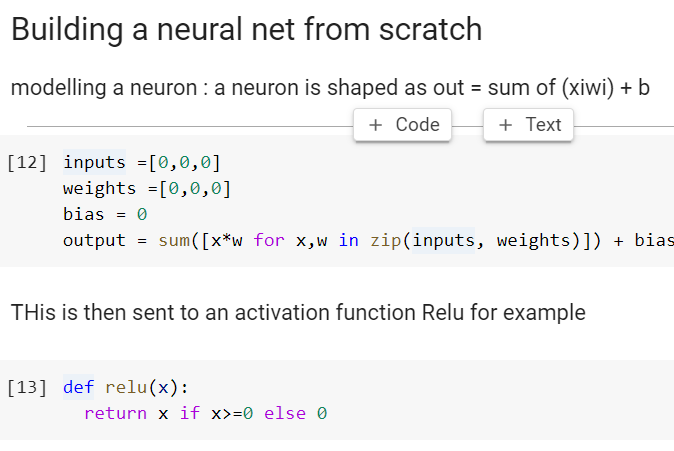

# Creating a neura network from scratch

when you lookat it the basic building block of neural network is just celll and activation function

> [NEEDS REVISITING]:neckbeard:

best chapter to understand the nitty gritty of neural network.

Elementwise operations

1. This chapter fully explains how broadcasting works.

1. We need to scale our matrix so that standard deviation remains one. 1. We can compute the exact value to use mathematically, as illustrated by Xavier Glorot and Yoshua Bengio in ["Understanding the Difficulty of Training Deep Feedforward Neural Networks"](http://proceedings.mlr.press/v9/glorot10a/glorot10a.pdf). The right scale for a given layer is $1/\sqrt{n_{in}}$, where $n_{in}$ represents the number of inputs. At the time Glorot and Bengio wrote their article, the popular activation in a neural net was the hyperbolic tangent (tanh, which is the one they used), and that initialization doesn't account for our ReLU. Fortunately, someone else has done the math for us and computed the right scale for us to use. In ["Delving Deep into Rectifiers: Surpassing Human-Level Performance"](https://arxiv.org/abs/1502.01852) (which we've seen before—it's the article that introduced the ResNet), Kaiming He et al. show that we should use the following scale instead: $\sqrt{2 / n_{in}}$, where $n_{in}$ is the number of inputs of our model. 

A simple model:

using tiff images to train ones own neural network i pytorchs

This is what a full featured pytorch model looks like

## Summary

In this chapter we explored the foundations of deep learning, beginning with matrix multiplication and moving on to implementing the forward and backward passes of a neural net from scratch. We then refactored our code to show how PyTorch works beneath the hood.

Here are a few things to remember:

- A neural net is basically a bunch of matrix multiplications with nonlinearities in between.
- Python is slow, so to write fast code we have to vectorize it and take advantage of techniques such as elementwise arithmetic and broadcasting.
- Two tensors are broadcastable if the dimensions starting from the end and going backward match (if they are the same, or one of them is 1). To make tensors broadcastable, we may need to add dimensions of size 1 with `unsqueeze` or a `None` index.
- Properly initializing a neural net is crucial to get training started. Kaiming initialization should be used when we have ReLU nonlinearities.
- The backward pass is the chain rule applied multiple times, computing the gradients from the output of our model and going back, one layer at a time.
- When subclassing `nn.Module` (if not using fastai's `Module`) we have to call the superclass `__init__` method in our `__init__` method and we have to define a `forward` function that takes an input and returns the desired result.

## questionaire

1. Write the Python code to implement a single neuron.
1. Write the Python code to implement ReLU.
1. Write the Python code for a dense layer in terms of matrix multiplication.
1. Write the Python code for a dense layer in plain Python (that is, with list comprehensions and functionality built into Python).
1. What is the "hidden size" of a layer?
1. What does the `t` method do in PyTorch?
1. Why is matrix multiplication written in plain Python very slow?
1. In `matmul`, why is `ac==br`?
1. In Jupyter Notebook, how do you measure the time taken for a single cell to execute?
1. What is "elementwise arithmetic"?
1. Write the PyTorch code to test whether every element of `a` is greater than the corresponding element of `b`.
1. What is a rank-0 tensor? How do you convert it to a plain Python data type?
1. What does this return, and why? `tensor([1,2]) + tensor([1])`
1. What does this return, and why? `tensor([1,2]) + tensor([1,2,3])`
1. How does elementwise arithmetic help us speed up `matmul`?
1. What are the broadcasting rules?
1. What is `expand_as`? Show an example of how it can be used to match the results of broadcasting.
1. How does `unsqueeze` help us to solve certain broadcasting problems?
1. How can we use indexing to do the same operation as `unsqueeze`?
1. How do we show the actual contents of the memory used for a tensor?
1. When adding a vector of size 3 to a matrix of size 3×3, are the elements of the vector added to each row or each column of the matrix? (Be sure to check your answer by running this code in a notebook.)
1. Do broadcasting and `expand_as` result in increased memory use? Why or why not?
1. Implement `matmul` using Einstein summation.
1. What does a repeated index letter represent on the left-hand side of einsum?
1. What are the three rules of Einstein summation notation? Why?
1. What are the forward pass and backward pass of a neural network?
1. Why do we need to store some of the activations calculated for intermediate layers in the forward pass?
1. What is the downside of having activations with a standard deviation too far away from 1?
1. How can weight initialization help avoid this problem?
1. What is the formula to initialize weights such that we get a standard deviation of 1 for a plain linear layer, and for a linear layer followed by ReLU?
1. Why do we sometimes have to use the `squeeze` method in loss functions?
1. What does the argument to the `squeeze` method do? Why might it be important to include this argument, even though PyTorch does not require it?
1. What is the "chain rule"? Show the equation in either of the two forms presented in this chapter.
1. Show how to calculate the gradients of `mse(lin(l2, w2, b2), y)` using the chain rule.
1. What is the gradient of ReLU? Show it in math or code. (You shouldn't need to commit this to memory—try to figure it using your knowledge of the shape of the function.)
1. In what order do we need to call the `*_grad` functions in the backward pass? Why?
1. What is `__call__`?
1. What methods must we implement when writing a `torch.autograd.Function`?
1. Write `nn.Linear` from scratch, and test it works.
1. What is the difference between `nn.Module` and fastai's `Module`?

## further research

1. Implement ReLU as a `torch.autograd.Function` and train a model with it.
1. If you are mathematically inclined, find out what the gradients of a linear layer are in mathematical notation. Map that to the implementation we saw in this chapter.
1. Learn about the `unfold` method in PyTorch, and use it along with matrix multiplication to implement your own 2D convolution function. Then train a CNN that uses it.
1. Implement everything in this chapter using NumPy instead of PyTorch. 

