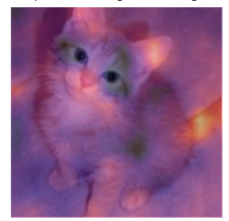

# Class activation app

1. tells us about using hooks 

## Summary

Model interpretation is an area of active research, and we just scraped the surface of what is possible in this brief chapter. Class activation maps give us insight into why a model predicted a certain result by showing the areas of the images that were most responsible for a given prediction. This can help us analyze false positives and figure out what kind of data is missing in our training to avoid them.

## questionaire

1. What is a "hook" in PyTorch?
1. Which layer does CAM use the outputs of?
1. Why does CAM require a hook?
1. Look at the source code of the `ActivationStats` class and see how it uses hooks.
1. Write a hook that stores the activations of a given layer in a model (without peeking, if possible).
1. Why do we call `eval` before getting the activations? Why do we use `no_grad`?
1. Use `torch.einsum` to compute the "dog" or "cat" score of each of the locations in the last activation of the body of the model.
1. How do you check which order the categories are in (i.e., the correspondence of index->category)?
1. Why are we using `decode` when displaying the input image?
1. What is a "context manager"? What special methods need to be defined to create one?
1. Why can't we use plain CAM for the inner layers of a network?
1. Why do we need to register a hook on the backward pass in order to do Grad-CAM?
1. Why can't we call `output.backward()` when `output` is a rank-2 tensor of output activations per image per class?