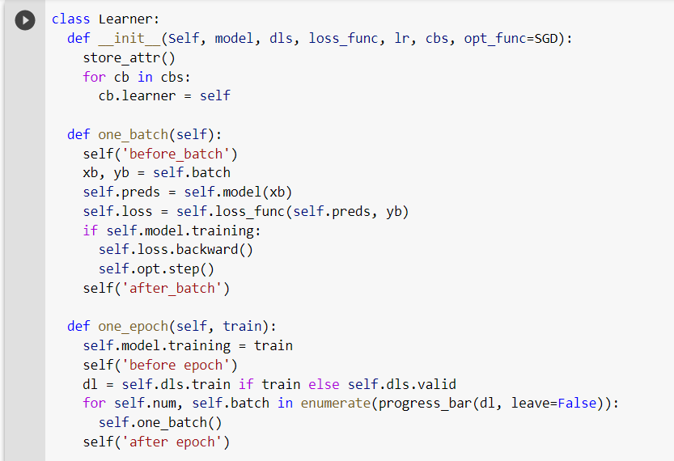
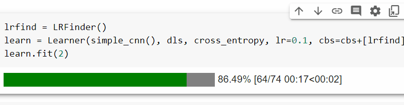
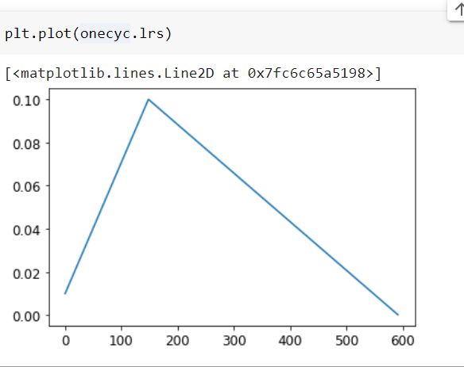

# learner from scratch

Here we work on everything from scratch. very instructive.

> [NEEDS REVISITING]:neckbeard:

we work on Imagenette.

 

we create a datablock, dataloader then
create our own Module and cnnlayer and liniear layer

followed by our own learner.

creating out own learner class

Finding lr rate, it actually works.

One cycle plot

## Summary

We have explored the key concepts of the fastai library are implemented by re-implementing them in this chapter. Since it's mostly full of code, you should definitely try to experiment with it by looking at the corresponding notebook on the book's website. Now that you know how it's built, as a next step be sure to check out the intermediate and advanced tutorials in the fastai documentation to learn how to customize every bit of the library.

## Questionaire

> tip: Experiments: For the questions here that ask you to explain what some function or class is, you should also complete your own code experiments.

1. What is `glob`?
1. How do you open an image with the Python imaging library?
1. What does `L.map` do?
1. What does `Self` do?
1. What is `L.val2idx`?
1. What methods do you need to implement to create your own `Dataset`?
1. Why do we call `convert` when we open an image from Imagenette?
1. What does `~` do? How is it useful for splitting training and validation sets?
1. Does `~` work with the `L` or `Tensor` classes? What about NumPy arrays, Python lists, or pandas DataFrames?
1. What is `ProcessPoolExecutor`?
1. How does `L.range(self.ds)` work?
1. What is `__iter__`?
1. What is `first`?
1. What is `permute`? Why is it needed?
1. What is a recursive function? How does it help us define the `parameters` method?
1. Write a recursive function that returns the first 20 items of the Fibonacci sequence.
1. What is `super`?
1. Why do subclasses of `Module` need to override `forward` instead of defining `__call__`?
1. In `ConvLayer`, why does `init` depend on `act`?
1. Why does `Sequential` need to call `register_modules`?
1. Write a hook that prints the shape of every layer's activations.
1. What is "LogSumExp"?
1. Why is `log_softmax` useful?
1. What is `GetAttr`? How is it helpful for callbacks?
1. Reimplement one of the callbacks in this chapter without inheriting from `Callback` or `GetAttr`.
1. What does `Learner.__call__` do?
1. What is `getattr`? (Note the case difference to `GetAttr`!)
1. Why is there a `try` block in `fit`?
1. Why do we check for `model.training` in `one_batch`?
1. What is `store_attr`?
1. What is the purpose of `TrackResults.before_epoch`?
1. What does `model.cuda` do? How does it work?
1. Why do we need to check `model.training` in `LRFinder` and `OneCycle`?
1. Use cosine annealing in `OneCycle`.

