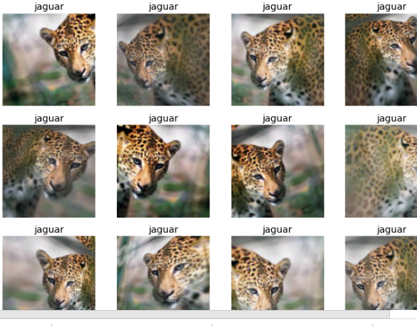
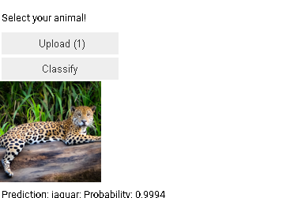
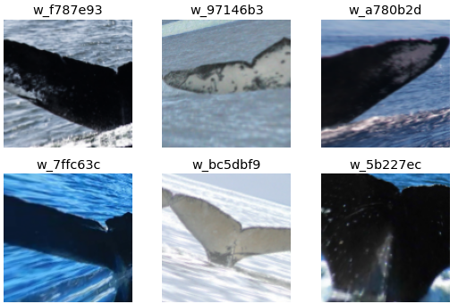
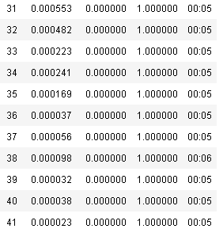

# Observations

1. In segementation we try ans classify every pixel to the object it belongs to

2.  for tabular data we generally use gradient boosting or text

3. Downloading data through console bar
urls=Array.from(document.querySelectorAll('.rg_i')).map(el=> el.hasAttribute('data-src')?el.getAttribute('data-src'):el.getAttribute('data-iurl'));
window.open('data:text/csv;charset=utf-8,' + escape(urls.join('\n')));

4. Datablock API for loading dataloaders

5. Creating a leopard, jaguar, cheetah classifier
    Data Augmentation:
    
6. Using ipywidgets in notebook itself:
    

7.  Homework

    a. Use it on an image of your choice
         still have to submit.

        kannad mnist :
        need to edit it to v4 version

    b. deploy using flask
    c. start a blog

