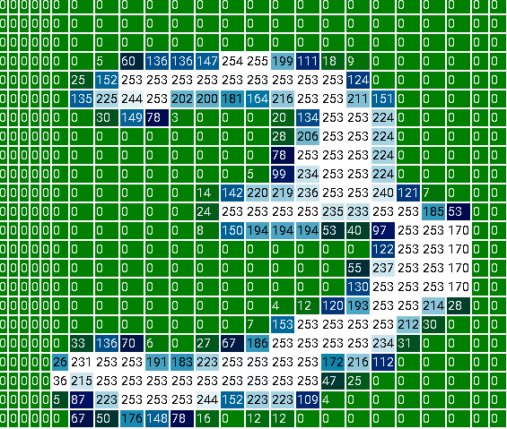
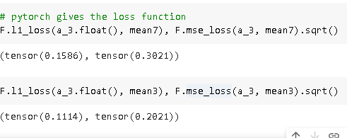
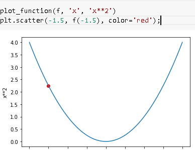
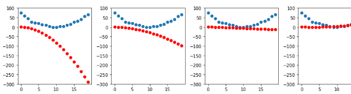

# MNIST basics

Training a digit classifier

https://colab.research.google.com/drive/1MybjxDCbLLJCVQR5Ahu552VqDRJosHFG#scrollTo=bptSpUapoHgH

https://colab.research.google.com/github/fastai/fastbook/blob/master/04_mnist_basics.ipynb#scrollTo=Y3vljyfChrB_

### Aim of the chapter
1. to understand the roles of array and tensors in broadcasting and using them expressively

2. We will learn stohastic gradient descent by updating the weights automatically

3. We will also describe the math the neural network is doinf

4. Role of mini batches

There's one guaranteed way to fail, and that's to stop trying. We've seen that the only consistent trait amongst every fast.ai student that's gone on to be a world-class practitioner is that they are all very tenacious.

Here we are using the python imaging library (PIL) which is the widely used Python package for opening, manipulating and viewing images.

to see the image we need to convert it into a Numpy array or a pytorch tensor

some operations in pytorch we need to case to integer and float types. Since we be needing this later, we will also cast our stacked tensor to float

Generally when images are floats the picel values are expected to be between 0 and also devide by 255
Since we'll be needing this later, we'll also cast our stacked tensor to float now. Casting in PyTorch is as simple as typing the name of the type you wish to cast to, and treating it as a method.

Rank is the number of axes in a tensor while shape is the size of each axis of tensor

Here mse stands for mean squared error, and l1 refers to the standard mathematical jargon for mean absolute value (in math it's called the L1 norm).
: Intuitively, the difference between L1 norm and mean squared error (MSE) is that the latter will penalize bigger mistakes more heavily than the former (and be more lenient with small mistakes).

For our simple avergaing model the loss:

Numpy and pytorch array they both are wrapper function that help you deal with array efficiently

Take another look at our function mnist_distance, and you'll see we have there the subtraction (a-b). The magic trick is that PyTorch, when it tries to perform a simple subtraction operation between two tensors of different ranks, will use broadcasting. That is, it will automatically expand the tensor with the smaller rank to have the same size as the one with the larger rank. Broadcasting is an important capability that makes tensor code much easier to write.

After broadcasting so the two argument tensors have the same rank, PyTorch applies its usual logic for two tensors of the same rank: it performs the operation on each corresponding element of the two tensors, and returns the tensor result

PyTorch doesn't actually copy mean3 1,010 times. It pretends it were a tensor of that shape, but doesn't actually allocate any additional memory
It does the whole calculation in C (or, if you're using a GPU, in CUDA, the equivalent of C on the GPU), tens of thousands of times faster than pure Python (up to millions of times faster on a GPU!).

Finally, our function calls mean((-1,-2)). The tuple (-1,-2) represents a range of axes. In Python, -1 refers to the last element, and -2 refers to the second-to-last. So in this case, this tells PyTorch that we want to take the mean ranging over the values indexed by the last two axes of the tensor. The last two axes are the horizontal and vertical dimensions of an image. After taking the mean over the last two axes, we are left with just the first tensor axis, which indexes over our images, which is why our final size was (1010). In other words, for every image, we averaged the intensity of all the pixels in that image.

But how are we calculating accuracy this way ?

One drawback of pixel based model is that we cannot use learning

lets use SGD because learning

Instead of trying to find the similarity between an image and an "ideal image," we could instead look at each individual pixel and come up with a set of weights for each one, such that the highest weights are associated with those pixels most likely to be black for a particular category. For instance, pixels toward the bottom right are not very likely to be activated for a 7, so they should have a low weight for a 7, but they are likely to be activated for an 8, so they should have a high weight for an 8. 

Here we are assuming that x is the image, represented as a vector—in other words, with all of the rows stacked up end to end into a single long line. And we are assuming that the weights are a vector w. If we have this function, then we just need some way to update the weights to make them a little bit better. With such an approach, we can repeat that step a number of times, making the weights better and better, until they are as good as we can make them.

We want to find the specific values for the vector w that causes the result of our function to be high for those images that are actually 8s, and low for those images that are not. Searching for the best vector w is a way to search for the best function for recognising 8s.

Initialize the weights.
For each image, use these weights to predict whether it appears to be a 3 or a 7.
Based on these predictions, calculate how good the model is (its loss).
Calculate the gradient, which measures for each weight, how changing that weight would change the loss
Step (that is, change) all the weights based on that calculation.
Go back to the step 2, and repeat the process.
Iterate until you decide to stop the training process (for instance, because the model is good enough or you don't want to wait any longer).

### Calculating gradients

For any function we can calculate irs derivative. The derivative is another function. It calculates the change, rather than the value. For instance, the derivative of the quadratic function at the value 3 tells us how rapidly the function changes at the value 3. More specifically, you may recall that gradient is defined as rise/run, that is, the change in the value of the function, divided by the change in the value of the parameter. When we know how our function will change, then we know what we need to do to make it smaller. This is the key to machine learning: having a way to change the parameters of a function to make it smaller. Calculus provides us with a computational shortcut, the derivative, which lets us directly calculate the gradients of our functions.

One important thing to be aware of is that our function has lots of weights that we need to adjust, so when we calculate the derivative we won't get back one number, but lots of them—a gradient for every weight. But there is nothing mathematically tricky here; you can calculate the derivative with respect to one weight, and treat all the other ones as constant, then repeat that for each other weight. This is how all of the gradients are calculated, for every weight.

pytorch has a gradient function

Notice the special method requires_grad_? That's the magical incantation we use to tell PyTorch that we want to calculate gradients with respect to that variable at that value. It is essentially tagging the variable, so PyTorch will remember to keep track of how to compute gradients of the other, direct calculations on it that you will ask for.

a: This API might throw you off if you're coming from math or physics. In those contexts the "gradient" of a function is just another function (i.e., its derivative), so you might expect gradient-related APIs to give you a new function. But in deep learning, "gradients" usually means the value of a function's derivative at a particular argument value. 

