# MNIST basics

Training a digit classifier

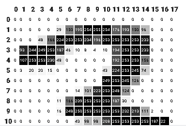


https://colab.research.google.com/drive/1MybjxDCbLLJCVQR5Ahu552VqDRJosHFG#scrollTo=bptSpUapoHgH

https://colab.research.google.com/github/fastai/fastbook/blob/master/04_mnist_basics.ipynb#scrollTo=Y3vljyfChrB_

### Aim of the chapter

1. to understand the roles of array and tensors in broadcasting and using them expressively

2. We will learn stohastic gradient descent by updating the weights automatically

3. We will also describe the math the neural network is doinf

4. Role of mini batches


There's one guaranteed way to fail, and that's to stop trying. We've seen that the only consistent trait amongst every fast.ai student that's gone on to be a world-class practitioner is that they are all very tenacious.


Here we are using the python imaging library (PIL) which is the widely used Python package for opening, manipulating and viewing images.

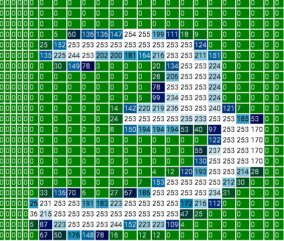

to see the image we need to convert it into a Numpy array or a pytorch tensor

some operations in pytorch we need to case to integer and float types. Since we be needing this later, we will also cast our stacked tensor to float

Generally when images are floats the picel values are expected to be between 0 and also devide by 255
Since we'll be needing this later, we'll also cast our stacked tensor to float now. Casting in PyTorch is as simple as typing the name of the type you wish to cast to, and treating it as a method.

Rank is the number of axes in a tensor while shape is the size of each axis of tensor

Here mse stands for mean squared error, and l1 refers to the standard mathematical jargon for mean absolute value (in math it's called the L1 norm).
: Intuitively, the difference between L1 norm and mean squared error (MSE) is that the latter will penalize bigger mistakes more heavily than the former (and be more lenient with small mistakes).

For our simple avergaing model the loss:
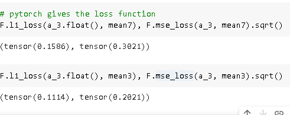

Numpy and pytorch array they both are wrapper function that help you deal with array efficiently

Take another look at our function mnist_distance, and you'll see we have there the subtraction (a-b). The magic trick is that PyTorch, when it tries to perform a simple subtraction operation between two tensors of different ranks, will use broadcasting. That is, it will automatically expand the tensor with the smaller rank to have the same size as the one with the larger rank. Broadcasting is an important capability that makes tensor code much easier to write.

After broadcasting so the two argument tensors have the same rank, PyTorch applies its usual logic for two tensors of the same rank: it performs the operation on each corresponding element of the two tensors, and returns the tensor result

PyTorch doesn't actually copy mean3 1,010 times. It pretends it were a tensor of that shape, but doesn't actually allocate any additional memory
It does the whole calculation in C (or, if you're using a GPU, in CUDA, the equivalent of C on the GPU), tens of thousands of times faster than pure Python (up to millions of times faster on a GPU!).

Finally, our function calls mean((-1,-2)). The tuple (-1,-2) represents a range of axes. In Python, -1 refers to the last element, and -2 refers to the second-to-last. So in this case, this tells PyTorch that we want to take the mean ranging over the values indexed by the last two axes of the tensor. The last two axes are the horizontal and vertical dimensions of an image. After taking the mean over the last two axes, we are left with just the first tensor axis, which indexes over our images, which is why our final size was (1010). In other words, for every image, we averaged the intensity of all the pixels in that image.

But how are we calculating accuracy this way ?


One drawback of pixel based model is that we cannot use learning

lets use SGD because learning

Instead of trying to find the similarity between an image and an "ideal image," we could instead look at each individual pixel and come up with a set of weights for each one, such that the highest weights are associated with those pixels most likely to be black for a particular category. For instance, pixels toward the bottom right are not very likely to be activated for a 7, so they should have a low weight for a 7, but they are likely to be activated for an 8, so they should have a high weight for an 8. 

Here we are assuming that x is the image, represented as a vector—in other words, with all of the rows stacked up end to end into a single long line. And we are assuming that the weights are a vector w. If we have this function, then we just need some way to update the weights to make them a little bit better. With such an approach, we can repeat that step a number of times, making the weights better and better, until they are as good as we can make them.

We want to find the specific values for the vector w that causes the result of our function to be high for those images that are actually 8s, and low for those images that are not. Searching for the best vector w is a way to search for the best function for recognising 8s.

Initialize the weights.
For each image, use these weights to predict whether it appears to be a 3 or a 7.
Based on these predictions, calculate how good the model is (its loss).
Calculate the gradient, which measures for each weight, how changing that weight would change the loss
Step (that is, change) all the weights based on that calculation.
Go back to the step 2, and repeat the process.
Iterate until you decide to stop the training process (for instance, because the model is good enough or you don't want to wait any longer).

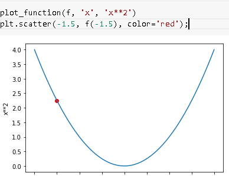

### Calculating gradients

For any function we can calculate irs derivative. The derivative is another function. It calculates the change, rather than the value. For instance, the derivative of the quadratic function at the value 3 tells us how rapidly the function changes at the value 3. More specifically, you may recall that gradient is defined as rise/run, that is, the change in the value of the function, divided by the change in the value of the parameter. When we know how our function will change, then we know what we need to do to make it smaller. This is the key to machine learning: having a way to change the parameters of a function to make it smaller. Calculus provides us with a computational shortcut, the derivative, which lets us directly calculate the gradients of our functions.

One important thing to be aware of is that our function has lots of weights that we need to adjust, so when we calculate the derivative we won't get back one number, but lots of them—a gradient for every weight. But there is nothing mathematically tricky here; you can calculate the derivative with respect to one weight, and treat all the other ones as constant, then repeat that for each other weight. This is how all of the gradients are calculated, for every weight.


pytorch has a gradient function

Notice the special method requires_grad_? That's the magical incantation we use to tell PyTorch that we want to calculate gradients with respect to that variable at that value. It is essentially tagging the variable, so PyTorch will remember to keep track of how to compute gradients of the other, direct calculations on it that you will ask for.

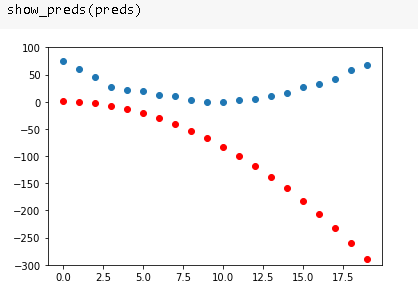

a: This API might throw you off if you're coming from math or physics. In those contexts the "gradient" of a function is just another function (i.e., its derivative), so you might expect gradient-related APIs to give you a new function. But in deep learning, "gradients" usually means the value of a function's derivative at a particular argument value. 

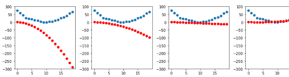

after 140 iterations:

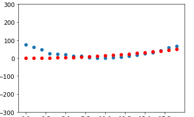

SGD summary:

To summarize, at the beginning, the weights of our model can be random (training from scratch) or come from a pretrained model (transfer learning). In the first case, the output we will get from our inputs won't have anything to do with what we want, and even in the second case, it's very likely the pretrained model won't be very good at the specific task we are targeting. So the model will need to learn better weights.

We begin by comparing the outputs the model gives us with our targets (we have labeled data, so we know what result the model should give) using a loss function, which returns a number that we want to make as low as possible by improving our weights. To do this, we take a few data items (such as images) from the training set and feed them to our model. We compare the corresponding targets using our loss function, and the score we get tells us how wrong our predictions were. We then change the weights a little bit to make it slightly better.

To find how to change the weights to make the loss a bit better, we use calculus to calculate the gradients. (Actually, we let PyTorch do it for us!) Let's consider an analogy. Imagine you are lost in the mountains with your car parked at the lowest point. To find your way back to it, you might wander in a random direction, but that probably wouldn't help much. Since you know your vehicle is at the lowest point, you would be better off going downhill. By always taking a step in the direction of the steepest downward slope, you should eventually arrive at your destination. We use the magnitude of the gradient (i.e., the steepness of the slope) to tell us how big a step to take; specifically, we multiply the gradient by a number we choose called the learning rate to decide on the step size. We then iterate until we have reached the lowest point, which will be our parking lot, then we can stop.

All of that we just saw can be transposed directly to the MNIST dataset, except for the loss function. Let's now see how we can define a good training objective.
### loss function

So, we need to choose a loss function. The obvious approach would be to use accuracy, which is our metric, as our loss function as well. In this case, we would calculate our prediction for each image, collect these values to calculate an overall accuracy, and then calculate the gradients of each weight with respect to that overall accuracy.

Unfortunately, we have a significant technical problem here. The gradient of a function is its slope, or its steepness, which can be defined as rise over run—that is, how much the value of the function goes up or down, divided by how much we changed the input. We can write this in mathematically as: (y_new - y_old) / (x_new - x_old). This gives us a good approximation of the gradient when x_new is very similar to x_old, meaning that their difference is very small. But accuracy only changes at all when a prediction changes from a 3 to a 7, or vice versa. The problem is that a small change in weights from x_old to x_new isn't likely to cause any prediction to change, so (y_new - y_old) will almost always be 0. In other words, the gradient is 0 almost everywhere.

sigmoid to get values between 0 and 1

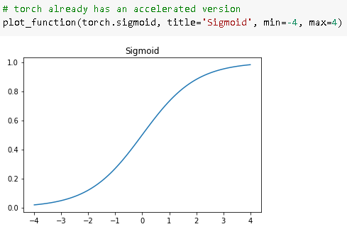

The key difference is that the metric is to drive human understanding and the loss is to drive automated learning. To drive automated learning, the loss must be a function that has a meaningful derivative. It can't have big flat sections and large jumps, but instead must be reasonably smooth. This is why we designed a loss function that would respond to small changes in confidence level. This requirement means that sometimes it does not really reflect exactly what we are trying to achieve, but is rather a compromise between our real goal, and a function that can be optimized using its gradient. The loss function is calculated for each item in our dataset, and then at the end of an epoch the loss values are all averaged and the overall mean is reported for the epoch.

Now that we have a loss function that is suitable for driving SGD, we can consider some of the details involved in the next phase of the learning process, which is to change or update the weights based on the gradients. This is called an optimization step.

### mini batch

As we saw in our discussion of data augmentation in <>, we get better generalization if we can vary things during training. One simple and effective thing we can vary is what data items we put in each mini-batch. Rather than simply enumerating our dataset in order for every epoch, instead what we normally do is randomly shuffle it on every epoch, before we create mini-batches. PyTorch and fastai provide a class that will do the shuffling and mini-batch collation for you, called DataLoader.

### Dataloader

As we saw in our discussion of data augmentation in <>, we get better generalization if we can vary things during training. One simple and effective thing we can vary is what data items we put in each mini-batch. Rather than simply enumerating our dataset in order for every epoch, instead what we normally do is randomly shuffle it on every epoch, before we create mini-batches. PyTorch and fastai provide a class that will do the shuffling and mini-batch collation for you, called DataLoader.

For training a model, we don't just want any Python collection, but a collection containing independent and dependent variables (that is, the inputs and targets of the model). A collection that contains tuples of independent and dependent variables is known in PyTorch as a Dataset. 

### using a neural network

That's it! All we have in `simple_net` is two linear classifiers with a `max` function between them.

Here, `w1` and `w2` are weight tensors, and `b1` and `b2` are bias tensors; that is, parameters that are initially randomly initialized, just like we did in the previous section:

The key point about this is that w1 has 30 output activations (which means that w2 must have 30 input activations, so they match). That means that the first layer can construct 30 different features, each representing some different mix of pixels. You can change that 30 to anything you like, to make the model more or less complex.

That little function res.max(tensor(0.0)) is called a rectified linear unit, also known as ReLU. We think we can all agree that rectified linear unit sounds pretty fancy and complicated... But actually, there's nothing more to it than res.max(tensor(0.0))—in other words, replace every negative number with a zero. This tiny function is also available in PyTorch as F.relu:

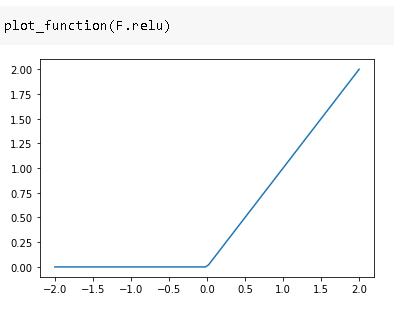

Congratulations: you now know how to create and train a deep neural network from scratch! We've gone through quite a few steps to get to this point, but you might be surprised at how simple it really is.

Now that we are at this point, it is a good opportunity to define, and review, some jargon and key concepts.

A neural network contains a lot of numbers, but they are only of two types: numbers that are calculated, and the parameters that these numbers are calculated from. This gives us the two most important pieces of jargon to learn:

- Activations:: Numbers that are calculated (both by linear and nonlinear layers)
- Parameters:: Numbers that are randomly initialized, and optimized (that is, the numbers that define the model)

We will often talk in this book about activations and parameters. Remember that they have very specific meanings. They are numbers. They are not abstract concepts, but they are actual specific numbers that are in your model. Part of becoming a good deep learning practitioner is getting used to the idea of actually looking at your activations and parameters, and plotting them and testing whether they are behaving correctly.

Our activations and parameters are all contained in *tensors*. These are simply regularly shaped arrays—for example, a matrix. Matrices have rows and columns; we call these the *axes* or *dimensions*. The number of dimensions of a tensor is its *rank*. There are some special tensors:

- Rank zero: scalar
- Rank one: vector
- Rank two: matrix

A neural network contains a number of layers. Each layer is either *linear* or *nonlinear*. We generally alternate between these two kinds of layers in a neural network. Sometimes people refer to both a linear layer and its subsequent nonlinearity together as a single layer. Yes, this is confusing. Sometimes a nonlinearity is referred to as an *activation function*.

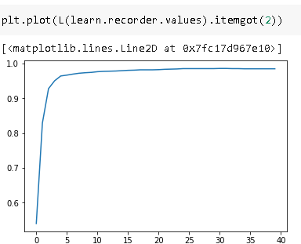

<<dljargon1>> summarizes the key concepts related to SGD.

```asciidoc
[[dljargon1]]
.Deep learning vocabulary
[options="header"]
|=====
| Term | Meaning
|ReLU | Function that returns 0 for negative numbers and doesn't change positive numbers.
|Mini-batch | A smll group of inputs and labels gathered together in two arrays. A gradient descent step is updated on this batch (rather than a whole epoch).
|Forward pass | Applying the model to some input and computing the predictions.
|Loss | A value that represents how well (or badly) our model is doing.
|Gradient | The derivative of the loss with respect to some parameter of the model.
|Backard pass | Computing the gradients of the loss with respect to all model parameters.
|Gradient descent | Taking a step in the directions opposite to the gradients to make the model parameters a little bit better.
|Learning rate | The size of the step we take when applying SGD to update the parameters of the model.
|=====
```

## working with all mnist

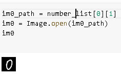

Am not able to create a validation set 
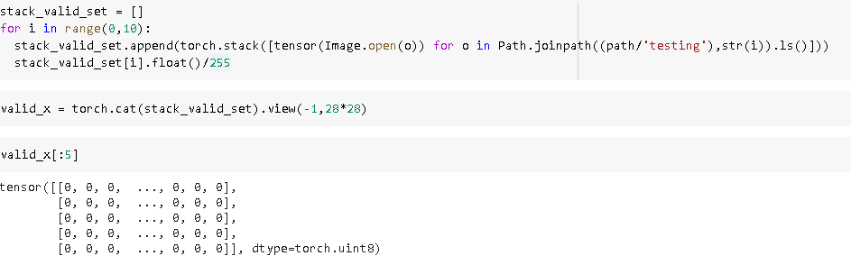


Now this error in train
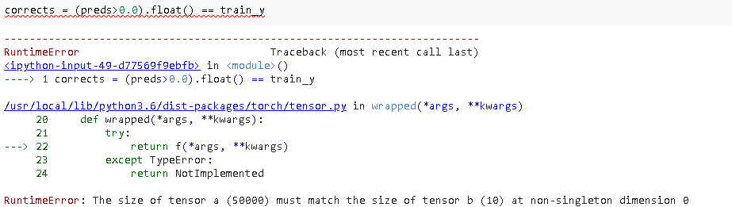

Solving that now I dont know the correct way of predictions
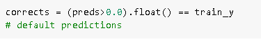

All mnist finally able to run learner
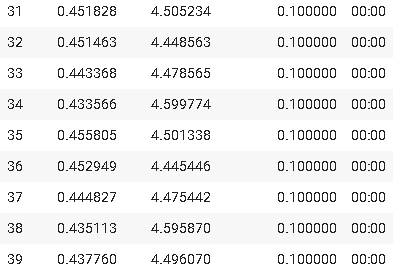

### Homework

1. TGS salt at kaggle, segmentation algorithm

2. create a corelation table between manual and the api based function used in the notebook

3. [if(i%2==0):i*2 i for i in array]

4. Create your own implementation of Learner from scratch, based on the training loop shown in this chapter.

5. Complete all the steps in this chapter using the full MNIST datasets (that is, for all digits, not just 3s and 7s). This is a significant project and will take you quite a bit of time to complete! You'll need to do some of your own research to figure out how to overcome some obstacles you'll meet on the way.

## questionaire

1. How is a grayscale image represented on a computer? How about a color image?

by rows and columsn indicating the range of values from 0 to 255. color image through a tuple.

1. How are the files and folders in the `MNIST_SAMPLE` dataset structured? Why?

& and 3 are given in respective folde rso that it is easy to work with them.

1. Explain how the "pixel similarity" approach to classifying digits works.

we merge all the tensors together and find the mean of all values at each location, then we find to distance of new image from the prediction to find the value

1. What is a list comprehension? Create one now that selects odd numbers from a list and doubles them.

[2*x if x%2!=0 else x for x in num]

1. What is a "rank-3 tensor"?

it means it has 3 dimensions, for examplea n array of 2d images

1. What is the difference between tensor rank and shape? How do you get the rank from the shape?

shape gives you dimension while rank gives you size of shape

1. What are RMSE and L1 norm?

Root mean square is l2 norm where we square the loss and then squareroot.

L1 is simple minus of the loss.

1. How can you apply a calculation on thousands of numbers at once, many thousands of times faster than a Python loop?

Use tensors and use broadcasting

1. Create a 3×3 tensor or array containing the numbers from 1 to 9. Double it. Select the bottom-right four numbers.

new_array = tensor((torch.randn(1,1,9)*10))
(new_array*2)[0][0][-4:]

1. What is broadcasting?

using same operator on enitre array

1. Are metrics generally calculated using the training set, or the validation set? Why?

validation set as metrics are values that matter to us human beings while training requires loss function

1. What is SGD?

Stochastic gradient descent

1. Why does SGD use mini-batches?

because using it on entire dataset would take up lot of memory and one one by one it would be too slow.

1. What are the seven steps in SGD for machine learning?
    > get the data
    > define your loss, optimisation and metrics,
    > train
    > validate
    > make changes
    > retrain
    > go back to validate

    (these aren'tthe seven steps but I like them)

1. How do we initialize the weights in a model?

by using tensor(torch.randn(size,1)*std)

1. What is "loss"?

it the differnce between prediciton and targets.

1. Why can't we always use a high learning rate?

because it may take big leaps and miss minima altogether.

1. What is a "gradient"?

slope of function d/dx which tells us which step to follow to reach downhill.

1. Do you need to know how to calculate gradients yourself?

no we have require_grads() from pytorch, though it would be nice to know. but I always was bad at maths.

1. Why can't we use accuracy as a loss function?

because it is difficult to use in case when there is onnly small changes in pixel

1. Draw the sigmoid function. What is special about its shape?

it givesa smooth `S` between 0 and 1

1. What is the difference between a loss function and a metric?

metric is for humans, loss for the machines.

1. What is the function to calculate new weights using a learning rate?

loss.backward()

1. What does the `DataLoader` class do?

its a way for us to get mini batches

1. Write pseudocode showing the basic steps taken in each epoch for SGD.

make prediction using linear1 or any function
find the loss of the function
make sure loss uses requires_grad_ parameters
then use loss.backward
update weights.data by multiplying it with weights.grad * learning rate
put the weights.grad to zero
this completes one epoch on batch

1. Create a function that, if passed two arguments `[1,2,3,4]` and `'abcd'`, returns `[(1, 'a'), (2, 'b'), (3, 'c'), (4, 'd')]`. What is special about that output data structure?
1. What does `view` do in PyTorch?
1. What are the "bias" parameters in a neural network? Why do we need them?
1. What does the `@` operator do in Python?
1. What does the `backward` method do?
1. Why do we have to zero the gradients?
1. What information do we have to pass to `Learner`?
1. Show Python or pseudocode for the basic steps of a training loop.
1. What is "ReLU"? Draw a plot of it for values from `-2` to `+2`.
1. What is an "activation function"?
1. What's the difference between `F.relu` and `nn.ReLU`?
1. The universal approximation theorem shows that any function can be approximated as closely as needed using just one nonlinearity. So why do we normally use more?