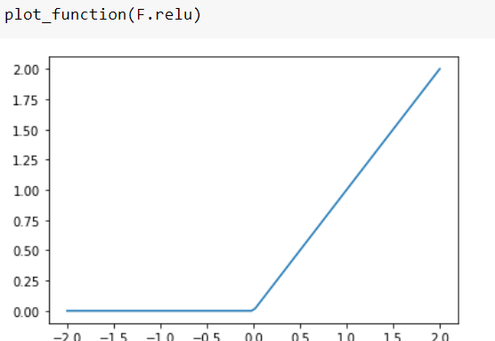

# Chapter 4

the familiar 3:

The mean of all seven tensors:

why to use tensors than normal array because they are fast

Numpy and pytorch tensor vaies that that pytorch tenorshoud have same basic type for all basic arrays.

Pytorch structures aremade for GPU, and can automatically find derivatives.

metric is for calculating how good a model is

broadcasting does mean using extra memory

wrong classification by mean model:

Illustrative function to use SGD

gradient desent after 10020 steps

The key difference is that the metric is to drive human understanding and the loss is to drive automated learning. To drive automated learning, the loss must be a function that has a meaningful derivative. 

since we can;t apply the loss calculation and update on a single set nor on a big dataset, we take mini batches.

The validation accuracy drop then increases sure is a mystery.

There was no mystery I was just using previously trained weight values, then wehn I trained it again the weight value changed.

RELU:

That little function res.max(tensor(0.0)) is called a rectified linear unit, also known as ReLU. We think we can all agree that rectified linear unit sounds pretty fancy and complicated... But actually, there's nothing more to it than res.max(tensor(0.0))—in other words, replace every negative number with a zero.

By "virtue" of universal approximation theram neural net acn predict anything

