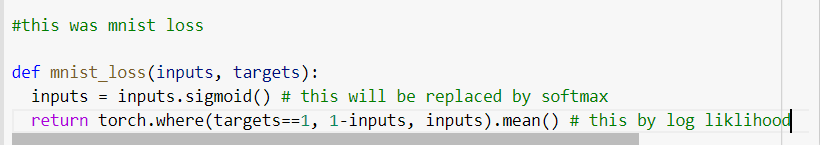
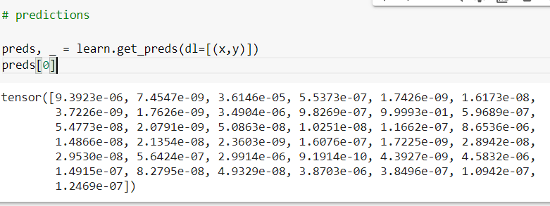
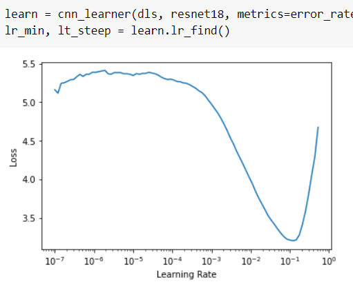
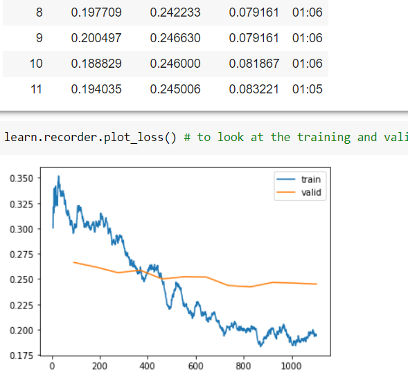

# Pet breeds classification

So you are doing fastai course

What? its been months ?

This chapter gives a way ot make sense of multi value prediction

Through cross entropy loss

    When we first take the softmax, and then the log likelihood of that, that combination is called cross-entropy loss. In PyTorch, this is available as nn.CrossEntropyLoss (which, in practice, actually does log_softmax and then nll_loss)

    which consists of softmax

    softmax is the multi-category equivalent of sigmoid—we have to use it any time we have more than two categories and the probabilities of the categories must add to 1, and we often use it even when there are just two categories, just to make things a bit more consistent. We could create other functions that have the properties that all activations are between 0 and 1, and sum to 1; however, no other function has the same relationship to the sigmoid function, which we've seen is smooth and symmetric.

    and log liklihood

    Through F.nll_loss followedby taking log of the number. Taking the mean of the positive or negative log of our probabilities (depending on whether it's the correct or incorrect class) gives us the negative log likelihood loss. In PyTorch, nll_loss assumes that you already took the log of the softmax, so it doesn't actually do the logarithm for you.

Explanation for learning rate

    What do we do to find the perfect learning rate—not too high, and not too low? In 2015 the researcher Leslie Smith came up with a brilliant idea, called the learning rate finder. His idea was to start with a very, very small learning rate, something so small that we would never expect it to be too big to handle. We use that for one mini-batch, find what the losses are afterwards, and then increase the learning rate by some percentage (e.g., doubling it each time). Then we do another mini-batch, track the loss, and double the learning rate again. We keep doing this until the loss gets worse, instead of better. This is the point where we know we have gone too far. We then select a learning rate a bit lower than this point. Our advice is to pick either:

    One order of magnitude less than where the minimum loss was achieved (i.e., the minimum divided by 10)
    The last point where the loss was clearly decreasing
    The learning rate finder computes those points on the curve to help you.

    to find the lr:

    

When we call the fine_tune method fastai does two things:

Trains the randomly added layers for one epoch, with all other layers frozen
Unfreezes all of the layers, and trains them all for the number of epochs requested

discriminative learning rates

 The first layer learns very simple foundations, like edge and gradient detectors; these are likely to be just as useful for nearly any task. The later layers learn much more complex concepts, like "eye" and "sunset," which might not be useful in your task at all (maybe you're classifying car models, for instance). So it makes sense to let the later layers fine-tune more quickly than earlier layers.

 