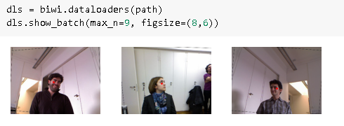
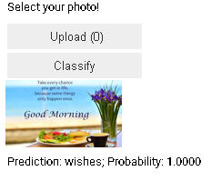
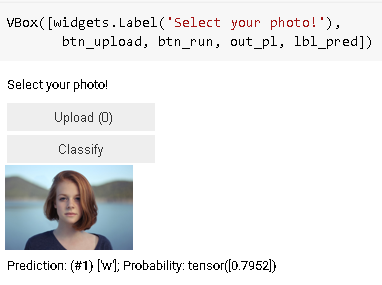

# Multi label classification

## implementation standpoint

1. Uses pascal dataset
1. show how to import form a csv file, beautifully.
1. Uses biwi dataset for regression

## Books mentioned

1. Python for data analysis
2. Loss function : <http://cs229.stanford.edu/notes/cs229-notes1.pdf>

## About chapter

Multi-label classification refers to the problem of identifying the categories of objects in images that may not contain exactly one type of object. There may be more than one kind of object, or there may be no objects at all in the classes that you are looking for.

Uses PASCAL dataset:

## clarification on Datablock

How do we convert from a DataFrame object to a DataLoaders object? We generally suggest using the data block API for creating a DataLoaders object, where possible, since it provides a good mix of flexibility and simplicity. Here we will show you the steps that we take to use the data blocks API to construct a DataLoaders object in practice, using this dataset as an example.

As we have seen, PyTorch and fastai have two main classes for representing and accessing a training set or validation set:

Dataset:: A collection that returns a tuple of your independent and dependent variable for a single item
DataLoader:: An iterator that provides a stream of mini-batches, where each mini-batch is a tuple of a batch of independent variables and a batch of dependent variable

On top of these, fastai provides two classes for bringing your training and validation sets together:

Datasets:: An object that contains a training Dataset and a validation Dataset
DataLoaders:: An object that contains a training DataLoader and a validation DataLoader
Since a DataLoader builds on top of a Dataset and adds additional functionality to it (collating multiple items into a mini-batch), it’s often easiest to start by creating and testing Datasets, and then look at DataLoaders after that’s working.

Also uses biwi dataset for regression

### About softmax

softmax, as we saw, requires that all predictions sum to 1, and tends to push one activation to be much larger than the others (due to the use of exp); however, we may well have multiple objects that we're confident appear in an image, so restricting the maximum sum of activations to 1 is not a good idea. By the same reasoning, we may want the sum to be less than 1, if we don't think any of the categories appear in an image.

### nll_loss

nll_loss, as we saw, returns the value of just one activation: the single activation corresponding with the single label for an item. This doesn't make sense when we have multiple labels.

## clasrification loss function version of pytorch

nn.CrossEntropyLoss for single-label classification
nn.BCEWithLogitsLoss for multi-label classification
nn.MSELoss for regression

F.binary_cross_entropy and its module equivalent nn.BCELoss calculate cross-entropy on a one-hot-encoded target, but do not include the initial sigmoid. Normally for one-hot-encoded targets you'll want F.binary_cross_entropy_with_logits (or nn.BCEWithLogitsLoss), which do both sigmoid and binary cross-entropy in a single function, as in the preceding example.

The equivalent for single-label datasets (like MNIST or the Pet dataset), where the target is encoded as a single integer, is F.nll_loss or nn.NLLLoss for the version without the initial softmax, and F.cross_entropy or nn.CrossEntropyLoss for the version with the initial softmax.

## Homework

1. it would be a great exercise for you to go back to your image classifier application, and try to retrain it using the multi-label technique, then test it by passing in an image that is not of any of your recognized classes.

1. Go back to chapter 1 and start over with multi label on bear.

whatsapp image classifier:

Multi label ?

