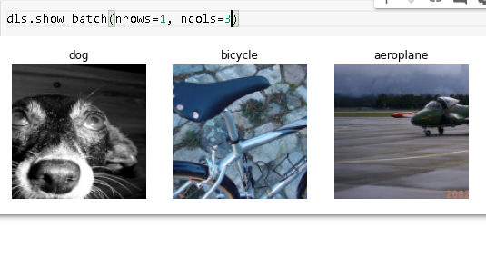

# Multi label classification

## implementation standpoint

1. Uses pascal dataset
1. show how to import form a csv file, beautifully.

## Books mentioned

1. Python for data analysis

## About chapter

Multi-label classification refers to the problem of identifying the categories of objects in images that may not contain exactly one type of object. There may be more than one kind of object, or there may be no objects at all in the classes that you are looking for.

Uses PASCAL dataset:

## clarification on Datablock

How do we convert from a DataFrame object to a DataLoaders object? We generally suggest using the data block API for creating a DataLoaders object, where possible, since it provides a good mix of flexibility and simplicity. Here we will show you the steps that we take to use the data blocks API to construct a DataLoaders object in practice, using this dataset as an example.

As we have seen, PyTorch and fastai have two main classes for representing and accessing a training set or validation set:

Dataset:: A collection that returns a tuple of your independent and dependent variable for a single item
DataLoader:: An iterator that provides a stream of mini-batches, where each mini-batch is a tuple of a batch of independent variables and a batch of dependent variable

On top of these, fastai provides two classes for bringing your training and validation sets together:

Datasets:: An object that contains a training Dataset and a validation Dataset
DataLoaders:: An object that contains a training DataLoader and a validation DataLoader
Since a DataLoader builds on top of a Dataset and adds additional functionality to it (collating multiple items into a mini-batch), it’s often easiest to start by creating and testing Datasets, and then look at DataLoaders after that’s working.

## Homework

1. it would be a great exercise for you to go back to your image classifier application, and try to retrain it using the multi-label technique, then test it by passing in an image that is not of any of your recognized classes.
