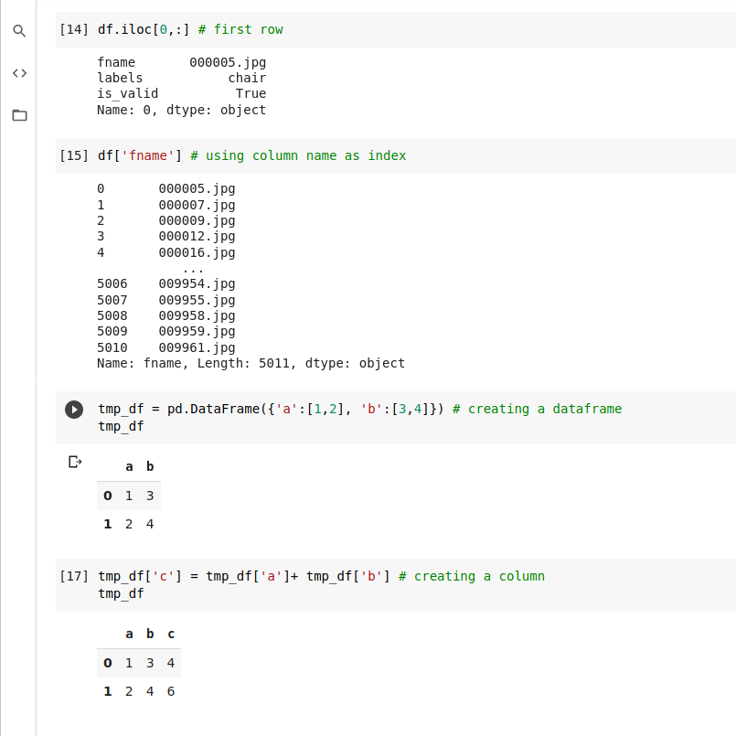
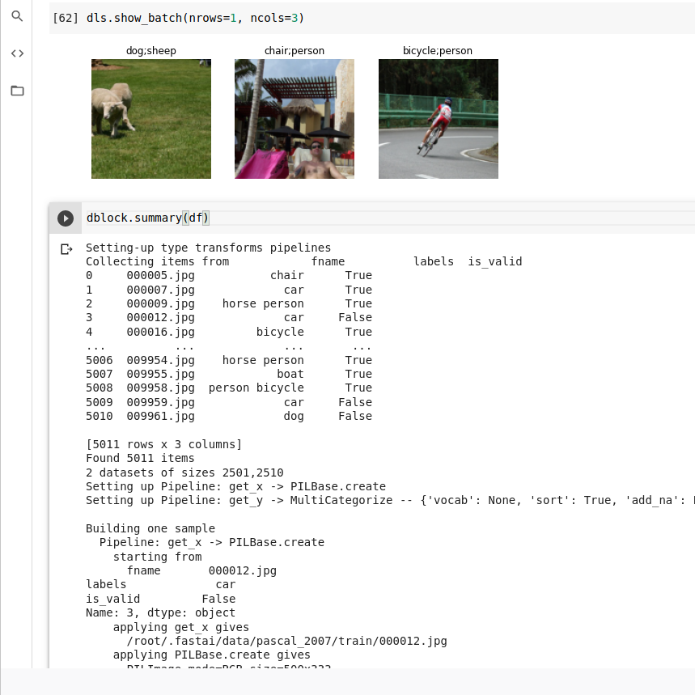

# Multilabel classification

Working with pandas

Creating a dataloader out of a datablock.

The discussion on loss function continued from chapter 5
since we have one hot encoding therefore we cannot use nll_loss or softmax diretly

softmax as we saw requires taht all predictions be sum to 1, and tends to push one activation to be much larger than the other ( due to ht euse of exp)

However in this case we have multiple objects that we are confident about so restricting the maximum sum of activations to 1 is not a good idea.

nll_loss returns the value of only one activation, single activation corresponding to the single label for an itme this doesn't make sense when we have multple items

binary_cross_entropy is mnist_loss with log

