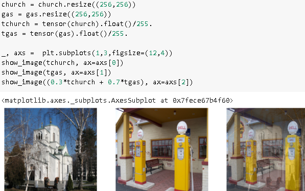

# Working with imagenette

## Objectives

We will look at what normalization is, a powerful data augmentation technique called mixup, the progressive resizing approach and test time augmentation. To show all of this, we are going to train a model from scratch (not using transfer learning) using a subset of ImageNet called Imagenette.

## unique points

1. shows how to change the learn object after training
1. gives explanation on how to read a research paper
1. Tells aout normalisation, and why normalisation statistics for differnet model is passed along with the normalisation.
1. tells inspirational story of someone employed in navy research organisation who created progressive resizing.
1. tells about test size resizing
1. how mixup was implemented, how to mix images in fastai

Mixup in notebook:

## Questions

1. What is the difference between ImageNet and Imagenette?When is it better to experiment on one versus the other?
One is a bigger version of the other.

1. What is normalization?
noramlising the pixel images with images with mean and standard deviation between 0 and 1.

1. Why didn't we have to care about normalization when using a pretrained model?
because we were using cnnlearner

1. What is progressive resizing?
starting with a small image and progressively finetuning it into a bigger image.

1. Implement progressive resizing in your own project. Did it help?
did not try. will try it with one of the kaggle dataset.

1. What is test time augmentation? How do you use it in fastai?
test time augmentation means no cropping during training but only during validation. Not clear on how to use it. it averages prediction over the cropped images.

1. Is using TTA at inference slower or faster than regular inference? Why?
It is slower because of additional processing required.

1. What is Mixup? How do you use it in fastai?
Mixup is a way to mix images to create new images . care should be taken to appropriately devide labels as well.

1. Why does Mixup prevent the model from being too confident?
because it gets harder to train and two labels per image is selected.

1. Why does training with Mixup for five epochs end up worse than training without Mixup?
because mixup is naturally designed to work with sigmoid function.

1. What is the idea behind label smoothing?
because the labels should not e ahard 0 or 1 but a number close to 0 and 1

1. What problems in your data can label smoothing help with?
it can help with model being too confident about its predictions.

1. When using label smoothing with five categories, what is the target associated with the index 1?
0.99

1. What is the first step to take when you want to prototype quick experiments on a new dataset?
create a quick working model

### Further Research

1. Use the fastai documentation to build a function that crops an image to a square in each of the four corners, then implement a TTA method that averages the predictions on a center crop and those four crops. Did it help? Is it better than the TTA method of fastai?
1. Find the Mixup paper on arXiv and read it. Pick one or two more recent articles introducing variants of Mixup and read them, then try to implement them on your problem.
1. Find the script training Imagenette using Mixup and use it as an example to build a script for a long training on your own project. Execute it and see if it helps.
1. Read the sidebar "Label Smoothing, the Paper", look at the relevant section of the original paper and see if you can follow it. Don't be afraid to ask for help!

work on malaria dataset next.
