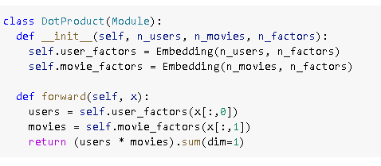
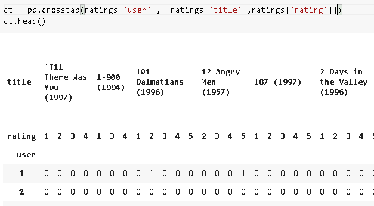

# Collborative filtering

What netflix uses for its movie recommendations, basically.

## Important stuff

1. It tells how embedding works. It is a just a representation of of aone hot encoded matrix for creating a lookup table.

2. It lso shows how to create our own model in pytorch for collaborative filtering

3. tells about weight decay and embedding distance

## Creating our own model

Thismodel is very basic replication of dotproduct through replication. but atleast its our own.



## questions

1. What problem does collaborative filtering solve?

Recommending stuff to peoplw

1. How does it solve it?

through gradient descent it tries to find out latent factors that influence the user choice

1. Why might a collaborative filtering predictive model fail to be a very useful recommendation system?

because it depends on the kind of userbase it has and that will introduce inherent biases

1. What does a crosstab representation of collaborative filtering data look like?

it will have user on left and movies on top with the random initialised latent factors

1. Write the code to create a crosstab representation of the MovieLens data (you might need to do some web searching!).

okay.


1. What is a latent factor? Why is it "latent"?

it is not visible on the surface

1. What is a dot product? Calculate a dot product manually using pure Python with lists.

okay


1. What does `pandas.DataFrame.merge` do?

performs join operation
Inner joins is the most common of join. An inner join combines two DataFrames based on a join key and returns a new DataFrame that contains only those rows that have matching values in both of the original DataFrames.

1. What is an embedding matrix?

a look up table, a dictionary

1. What is the relationship between an embedding and a matrix of one-hot-encoded vectors?

 Embedding: Multiplying by a one-hot-encoded matrix, using the computational shortcut that it can be implemented by simply indexing directly. This is quite a fancy word for a very simple concept. The thing that you multiply the one-hot-encoded matrix by (or, using the computational shortcut, index into directly) is called the embedding matrix

1. Why do we need `Embedding` if we could use one-hot-encoded vectors for the same thing?

space complexity

1. What does an embedding contain before we start training (assuming we're not using a pretained model)?

random mess

1. Create a class (without peeking, if possible!) and use it.

okay

```python
class CC():
    def __init__(self):
        print("initialised")
```

1. What does `x[:,0]` return?

users list.

1. Rewrite the `DotProduct` class (without peeking, if possible!) and train a model with it.

hmm okay.
will do this and also look at embedding.

1. What is a good loss function to use for MovieLens? Why? 
1. What would happen if we used cross-entropy loss with MovieLens? How would we need to change the model?
1. What is the use of bias in a dot product model?
1. What is another name for weight decay?
1. Write the equation for weight decay (without peeking!).
1. Write the equation for the gradient of weight decay. Why does it help reduce weights?
1. Why does reducing weights lead to better generalization?
1. What does `argsort` do in PyTorch?
1. Does sorting the movie biases give the same result as averaging overall movie ratings by movie? Why/why not?
1. How do you print the names and details of the layers in a model?
1. What is the "bootstrapping problem" in collaborative filtering?
1. How could you deal with the bootstrapping problem for new users? For new movies?
1. How can feedback loops impact collaborative filtering systems?
1. When using a neural network in collaborative filtering, why can we have different numbers of factors for movies and users?
1. Why is there an `nn.Sequential` in the `CollabNN` model?
1. What kind of model should we use if we want to add metadata about users and items, or information such as date and time, to a collaborative filtering model?

### Further Research

1. Take a look at all the differences between the `Embedding` version of `DotProductBias` and the `create_params` version, and try to understand why each of those changes is required. If you're not sure, try reverting each change to see what happens. (NB: even the type of brackets used in `forward` has changed!)
1. Find three other areas where collaborative filtering is being used, and find out what the pros and cons of this approach are in those areas.
1. Complete this notebook using the full MovieLens dataset, and compare your results to online benchmarks. See if you can improve your accuracy. Look on the book's website and the fast.ai forum for ideas. Note that there are more columns in the full dataset—see if you can use those too (the next chapter might give you ideas).
1. Create a model for MovieLens that works with cross-entropy loss, and compare it to the model in this chapter.
