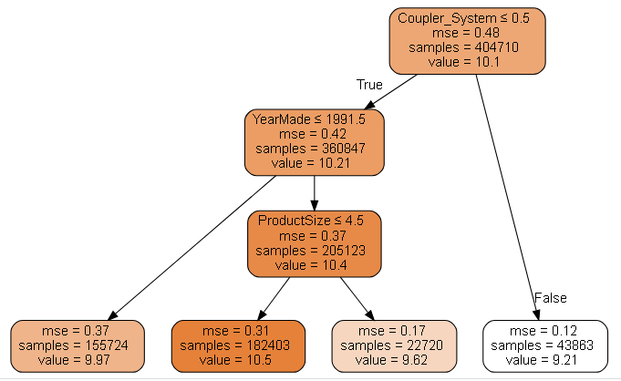
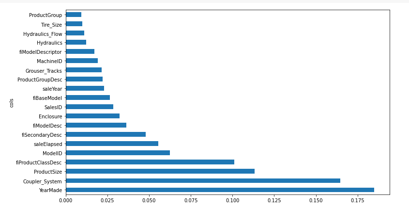
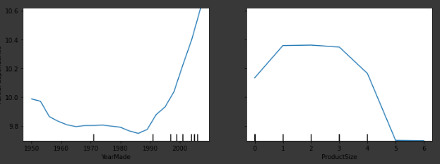
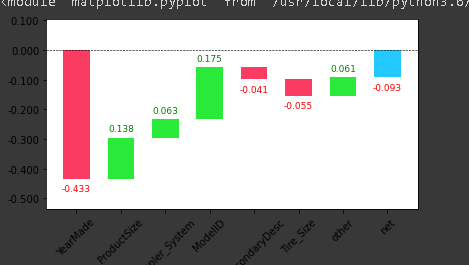
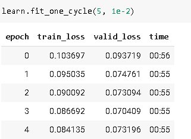
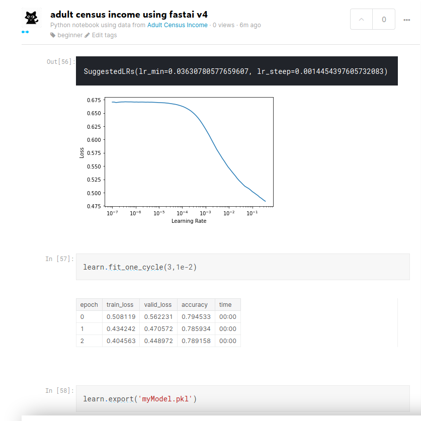
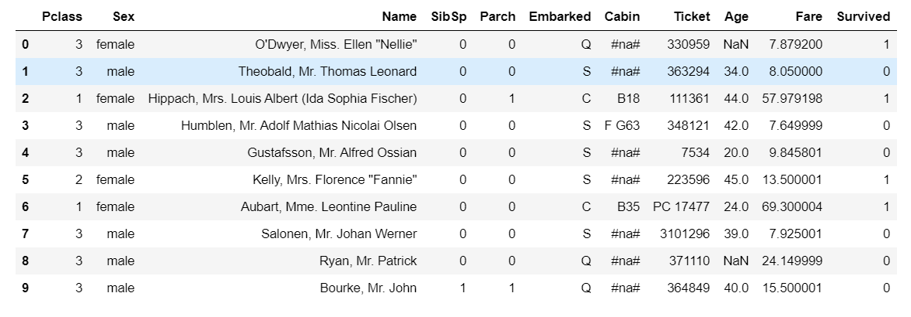
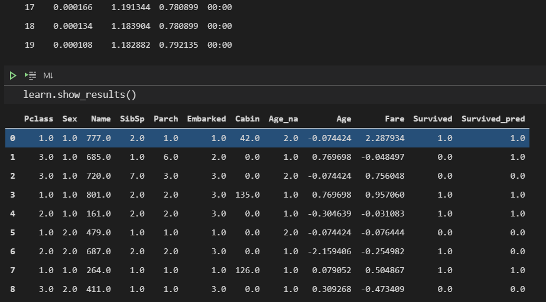

# Tabular data

## about the chapter

Random forests are the easiest to train, because they are extremely resilient to hyperparameter choices and require very little preprocessing. They are very fast to train, and should not overfit if you have enough trees. But they can be a little less accurate, especially if extrapolation is required, such as predicting future time periods.

Gradient boosting machines in theory are just as fast to train as random forests, but in practice you will have to try lots of different hyperparameters. They can overfit, but they are often a little more accurate than random forests.

Neural networks take the longest time to train, and require extra preprocessing, such as normalization; this normalization needs to be used at inference time as well. They can provide great results and extrapolate well, but only if you are careful with your hyperparameters and take care to avoid overfitting.

## important stuff

1. Tells us how to handle string as categorical variable and number as continous variable in tabular data.

1. Tells how to use kaggle api to download data form kaggle

1. handling dates using fastai

1. TabularPandas for missing data and strings and TabularProc - categorify and fillmising

1. How to create a validation set form dataframe through a condition

1. Lots of trips and tricks regarding tabular data

## about the problem

1. Entity embedding and how they are equivalent to  a linear layer. They provide meaningful information spatialy. Google play store uses the same algorithm.

1. Vast number of machine learning problems can be handled through ensemble of decision trees or multilayered neural network

1. for decision trees we will be using scikit-learn, as it doesn't require stuff like matrix multiplication

### Algo for decision trees

1. Loop through each column of the dataset in turn.
1. For each column, loop through each possible level of that column in turn.
1. Try splitting the data into two groups, based on whether they are greater than or less than that value (or if it is a categorical variable, based on whether they are equal to or not equal to that level of that categorical variable).
1. Find the average sale price for each of those two groups, and see how close that is to the actual sale price of each of the items of equipment in that group. That is, treat this as a very simple "model" where our predictions are simply the average sale price of the item's group.
1. After looping through all of the columns and all the possible levels for each, pick the split point that gave the best predictions using that simple model.
1. We now have two different groups for our data, based on this selected split. Treat each of these as separate datasets, and find the best split for each by going back to step 1 for each group.
1. Continue this process recursively, until you have reached some stopping criterion for each group—for instance, stop splitting a group further when it has only 20 items in it.

Removing redundant features in Random forest

Partial features

Waterfall model

neural net accuracy

working on my tabular data

Working on kaggle titanic data

Titanic learner

Still don't know how to predict on the data.
issue:
<https://forums.fast.ai/t/single-prediction-on-new-data-from-tabular-data-learner/28792>

Running the tabular playground notebook at:
<https://www.kaggle.com/c/tabular-playground-series-jan-2021/overview/evaluation>

## questionaire

1. What is a continuous variable?

A variable whose values can lie in continuos numeric range

1. What is a categorical variable?

A variable whose values are discrete
and /or non numerical

1. Provide two of the words that are used for the possible values of a categorical variable.

levels or classes or embeddings

1. What is a "dense layer"?

These are called linear layers and they help in converting given input to an output based on weights and biases.

an embedding layer is exactly equivalent to placing an ordinary linear layer after every one-hot-encoded input layer. The authors used the diagram in <> to show this equivalence. Note that "dense layer" is a term with the same meaning as "linear layer," and the one-hot encoding layers represent inputs.

1. How do entity embeddings reduce memory usage and speed up neural networks?

entity emband using embeddingseddings are nothing but  look up tables and they are ususally better than one hot encoding

Entity embedding not only reduces memory usage and speeds up neural networks compared with one-hot encoding, but more importantly by mapping similar values close to each other in the embedding space it reveals the intrinsic properties of the categorical variables... [It] is especially useful for datasets with lots of high cardinality features, where other methods tend to overfit... As entity embedding defines a distance measure for categorical variables it can be used for visualizing categorical data and for data clustering.

1. What kinds of datasets are entity embeddings especially useful for?

sparse dataset with lots of categorical values with large cardinalities.

And indeed, that is a pretty good rule of thumb for complex unstructured data like images, sounds, natural language text, and so forth. 

1. What are the two main families of machine learning algorithms?

Neural networks and Random forests

Ensembles of decision trees (i.e., random forests and gradient boosting machines), mainly for structured data (such as you might find in a database table at most companies)
Multilayered neural networks learned with SGD (i.e., shallow and/or deep learning), mainly for unstructured data (such as audio, images, and natural language)

1. Why do some categorical columns need a special ordering in their classes? How do you do this in Pandas?

it is required in ordinal categories, it refers too strings that have similar natural ordering. 

we do it by

`sizes = 'Large', 'Medium', 'Small'`
`df['ProductSize'] =df['ProductSize'].astype("category")`
`df['ProductSize'].cat.set_categories(sizes,ordered=True, inplace=True)`

1. Summarize what a decision tree algorithm does.

A decision tree algorithm looks at various columns and suggests the best split between the columns such taht if we do prediction on the average sale price based on the split it should be close to the actual dependent categorical variable. (thhis is taken as measurement of information gain)
we repeat it for all columns

1. Why is a date different from a regular categorical or continuous variable, and how can you preprocess it to allow it to be used in a model?

Since date data is especiallly improtant based on the modle you are building (like its matters if its a holiday or not) we need to handle date so that it is in the right format

in fastai it is handled through:

`df = add_datepart(df, 'saledate)`

1. Should you pick a random validation set in the bulldozer competition? If no, what kind of validation set should you pick?

validation set should be based on time as it is a time series, so it should be continuosu in time, in here we have used all the data after 2011 as the validation set

1. What is pickle and what is it useful for?

pickle is a storage format model for weights and parameters. t is useful to store the modle for future use

`save_pickle(path, model)`
`model = load_pickle(path)`

1. How are `mse`, `samples`, and `values` calculated in the decision tree drawn in this chapter?

By traversing the tree we find mse is the mean squared error at a node (difference between predicted and actual squared), samples is total samples under consideration (datapoints) and value is the prediction based on the split.

1. How do we deal with outliers, before building a decision tree?

best way is to add datapoints somewhere in the middle, ater on we also discover that we can find outliers through random forests.

1. How do we handle categorical variables in a decision tree?

Categorical variables are traditionally handled through using oen hot encoding but it is seen that using embeddings speed up the model.

1. What is bagging?

bagging is predicting using multiple classifiers and then taking the average of those values

 Bagging predictors is a method for generating multiple versions of a predictor and using these to get an aggregated predictor. The aggregation averages over the versions... The multiple versions are formed by making bootstrap replicates of the learning set and using these as new learning sets. Tests… show that bagging can give substantial gains in accuracy. The vital element is the instability of the prediction method. If perturbing the learning set can cause significant changes in the predictor constructed, then bagging can improve accuracy.

1. What is the difference between `max_samples` and `max_features` when creating a random forest?

max_samples are the row values while max_features (0.5 means takes half of the columns) are the column values.

1. If you increase `n_estimators` to a very high value, can that lead to overfitting? Why or why not?

`n_estimators` defines the number of trees we want, it will not lead to over fitting as different classifiers will have their own biases and will be evened out when considered equally

1. In the section "Creating a Random Forest", just after <<max_features>>, why did `preds.mean(0)` give the same result as our random forest?

because random forest is alsodoing the same thing - taking aaverage from the prediction of classifiers

1. What is "out-of-bag-error"?

when training random forest when a tree uses a subset of data then the data not in used is taken as validation set.

1. Make a list of reasons why a model's validation set error might be worse than the OOB error. How could you test your hypotheses?

Because the validation set for instance of a time series will have differnet values altogether.  this can be tested through

`r_mse(m.oob_prediction_,y)`

1. Explain why random forests are well suited to answering each of the following question:
   - How confident are we in our predictions using a particular row of data?

   one way is to use standard deviation of prediction accross trees. As we will soon see.

   - For predicting with a particular row of data, what were the most important factors, and how did they influence that prediction?
   - Which columns are the strongest predictors?
   - How do predictions vary as we vary these columns?
1. What's the purpose of removing unimportant variables?
1. What's a good type of plot for showing tree interpreter results?
1. What is the "extrapolation problem"?
1. How can you tell if your test or validation set is distributed in a different way than your training set?
1. Why do we make `saleElapsed` a continuous variable, even although it has less than 9,000 distinct values?
1. What is "boosting"?
1. How could we use embeddings with a random forest? Would we expect this to help?
1. Why might we not always use a neural net for tabular modeling?

## further research

1. Try building a decision tree classifier form scratch
1. Pick a competition on Kaggle with tabular data (current or past) and try to adapt the techniques seen in this chapter to get the best possible results. Compare your results to the private leaderboard.
1. Implement the decision tree algorithm in this chapter from scratch yourself, and try it on the dataset you used in the first exercise.
1. Use the embeddings from the neural net in this chapter in a random forest, and see if you can improve on the random forest results we saw.
1. Explain what each line of the source of `TabularModel` does (with the exception of the `BatchNorm1d` and `Dropout` layers).

