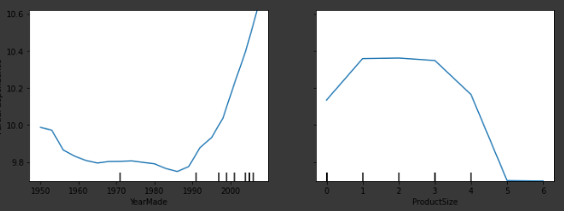
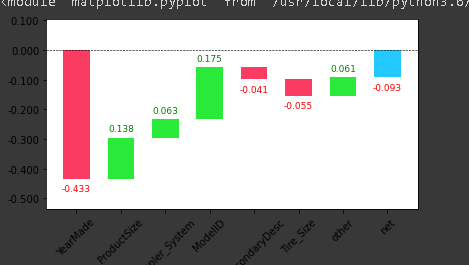

# Tabular data

## important stuff

1. Tells us how to handle string as categorical variable and number as continous variable in tabular data.

1. Tells how to use kaggle api to download data form kaggle

1. handling dates using fastai

1. TabularPandas for missing data and strings and TabularProc - categorify and fillmising

1. How to create a validation set form dataframe through a condition

1. Lots of trips and tricks regarding tabular data

## about the problem

1. Entity embedding and how they are equivalent to  a linear layer. They provide meaningful information spatialy. Google play store uses the same algorithm.

1. Vast number of machine learning problems can be handled through ensemble of decision trees or multilayered neural network

1. for decision trees we will be using scikit-learn, as it doesn't require stuff like matrix multiplication

### Algo for decision trees

1. Loop through each column of the dataset in turn.
1. For each column, loop through each possible level of that column in turn.
1. Try splitting the data into two groups, based on whether they are greater than or less than that value (or if it is a categorical variable, based on whether they are equal to or not equal to that level of that categorical variable).
1. Find the average sale price for each of those two groups, and see how close that is to the actual sale price of each of the items of equipment in that group. That is, treat this as a very simple "model" where our predictions are simply the average sale price of the item's group.
1. After looping through all of the columns and all the possible levels for each, pick the split point that gave the best predictions using that simple model.
1. We now have two different groups for our data, based on this selected split. Treat each of these as separate datasets, and find the best split for each by going back to step 1 for each group.
1. Continue this process recursively, until you have reached some stopping criterion for each group—for instance, stop splitting a group further when it has only 20 items in it.

Removing redundant features in Random forest

Partial features

Waterfall model

## further research

1. Try building a decision tree classifier form scratch
