Continuous variables are numerical data that can be fed onto the model, directly

The Categorical variables contain a number of discrete levels such as "mobile ID". For categorical variables we use something called entity embedding.

Entity embedding is equivalent to placing a dense layer linear layer after one hot encoding inputs

We provide fundamentally categorical values about the entities, and the e,bedding learnt by model defines a distance between them

The raw categorical data is first transformed into an embedding before it reacts with continous input data

If you are not using neiral network then you are using
1. ensemble of decision trees for structured data
1. Multilayerd neural networks learned with SGD for unstructured data like audio, images ad natural language

We use ensemble of decision trees for tabular model unless -
    1. There are some high cardinality categorical variables that are very important and cannotbe discarded

    2. Somecolumns havve plain text data that are best understoodby deep learning

we will be using scikit learn for decision trees, along with pandas and numpy

Fornow lets do the notebook part in kaggle.
Will come back and try the API with another dataset.

Workbook-
https://colab.research.google.com/github/fastai/fastbook/blob/master/09_tabular.ipynb#scrollTo=jo3ZZbfGQyHJ

My kernel-
https://www.kaggle.com/fanbyprinciple/fastai-v4-walkthrough-bluebook-for-bulldozers/edit/run/50349595

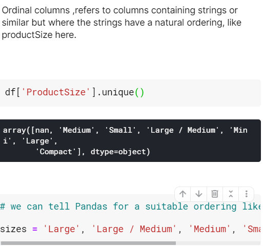

Creating a rudimentary decision tree from scratch:

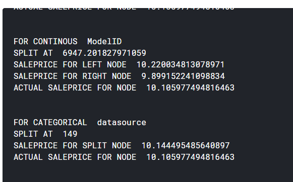

Using add datepart in fastai

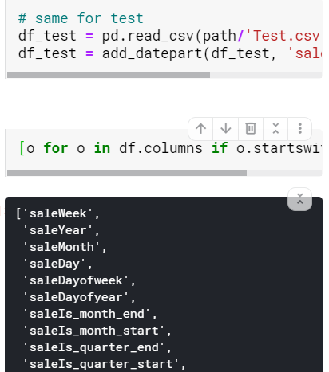

Creating a decisiontree based on the model

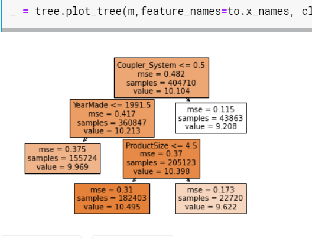

Looking at decision tree through dtreeviz
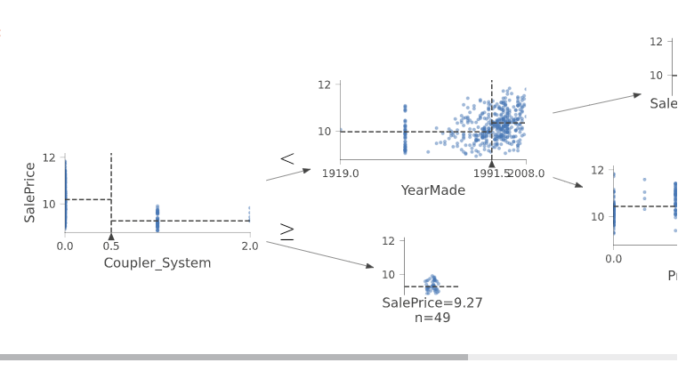

Looking at random forest classifier
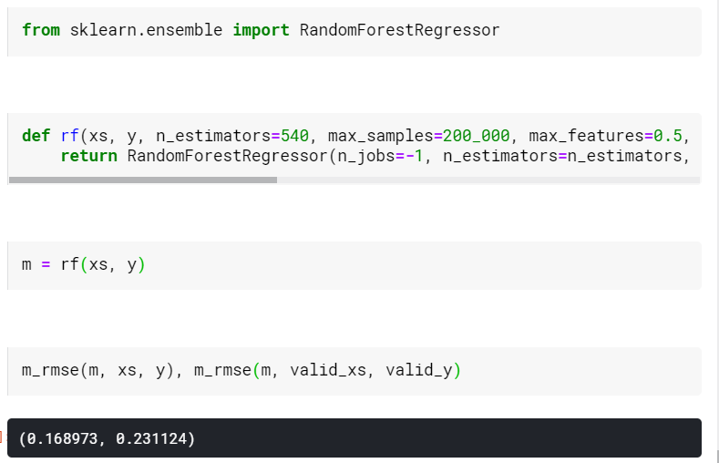

Looking at confidence by various ensembles of trees
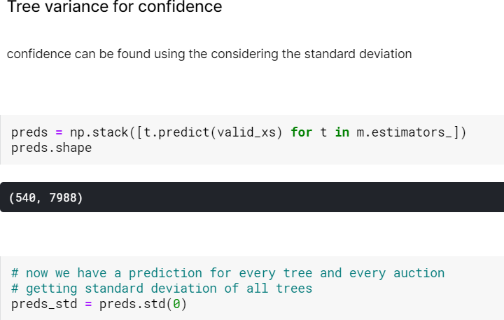

Looking at feature importance
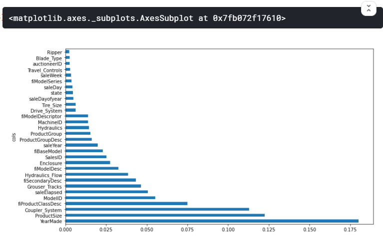

Looking how similar are the parameters
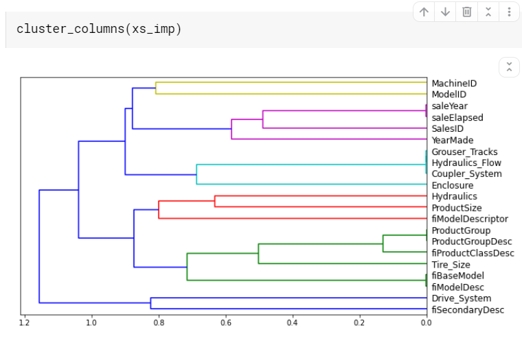

Looking at the max_counts of a column value
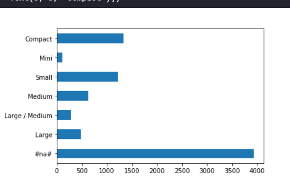

Individual prediction
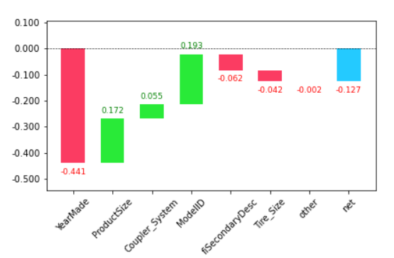

Extrapolation problem of random forest, it cannot predict outside the domain
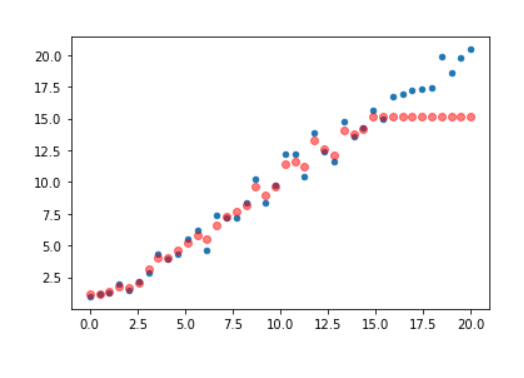

Using neural network:
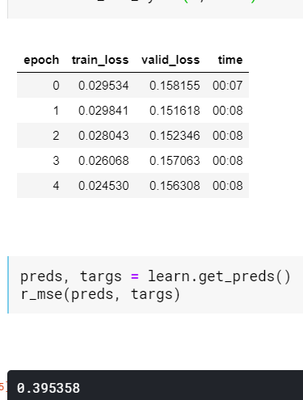

Post completion look at :
https://www.kaggle.com/c/malware-classification/data

