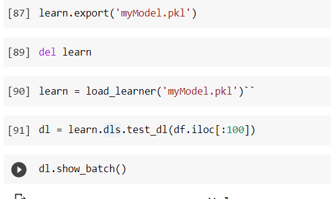
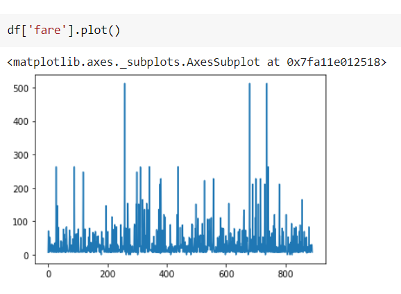
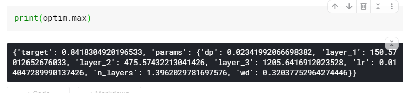

# Muellerz a walk with fastai

## inference on adult dataset

https://github.com/muellerzr/Practical-Deep-Learning-for-Coders-2.0/tree/master/Tabular%20Notebooks

Can we use it on some other kaggle kernel?

Intro to pandas

Bayesian Optimisation

